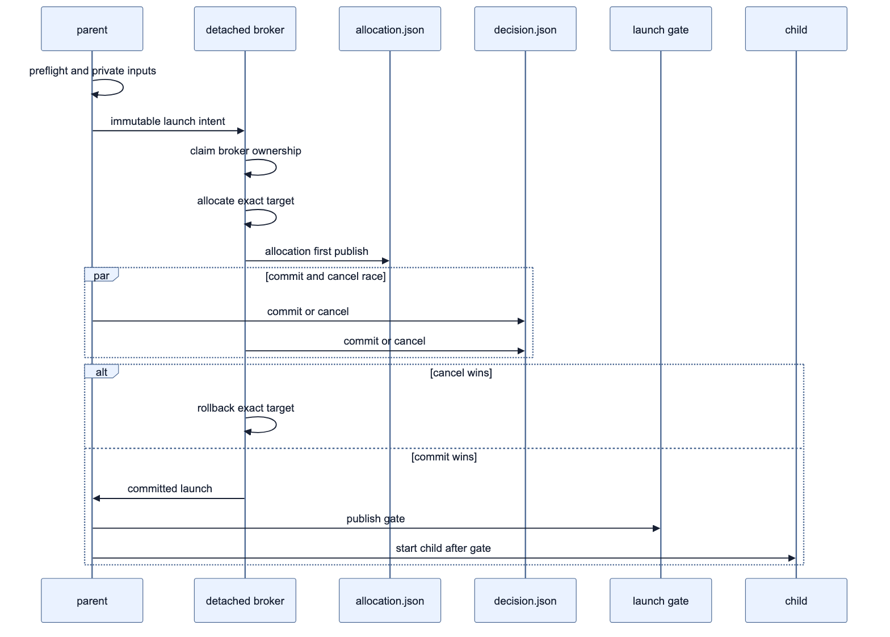

# cmux/tmux 기반 실제 Pi TUI 설계 및 구현

> **상태:** 정적 harness, unit, package 검증 기준은 실행 가능 **GO**다. live cmux crash/reaper E2E는 2026-07-20, live tmux crash/reaper E2E는 2026-07-21 각각 별개의 최종 harness run으로 **PASS**했다. platform zombie의 liveness 판정은 parser/reaper 단위 테스트가 별도로 보장된다.
>
> **Authority:** interactive pane layout 구현도 완료됐다. 배치 정책, coordinator/broker 책임 분리와 live layout smoke 증거는 [다중 subagent interactive pane layout 설계](./interactive-pane-layout-design.md)가 authoritative하다.

이 문서는 subagent 실행 화면을 legacy Zellij JSONL/FIFO renderer에서 실제 Pi TUI로 전환한 설계와 현재 구현을 기록한다. 파일명은 최초 cmux 설계에서 유래했지만, 현재 구현은 cmux와 tmux를 같은 interactive-pane lifecycle로 지원한다.

## 1. 결론

현재 terminal mode는 다음 세 가지다.

```ts
export type TerminalMode = "inline" | "cmux-pane" | "tmux-pane";
```

자동 선택 우선순위는 다음과 같다.

```text
CMUX_WORKSPACE_ID + CMUX_SURFACE_ID → cmux-pane
TMUX + TMUX_PANE                   → tmux-pane
그 외                              → inline
```

`cmux-pane`과 `tmux-pane`은 같은 실행 모델을 사용한다.

- 별도 terminal pane/surface에서 실제 interactive `pi` 실행
- child stdout을 부모 결과 channel로 사용하지 않음
- native Pi session JSONL에서 assistant message와 usage 수집
- child bridge extension이 lifecycle state와 typed completion sidecar 기록
- 기본 `one-shot` child는 `agent_settled`에서 정상 종료하고, 제한된 `handoff` child는 `/subagent-return`까지 유지
- parent lease와 startup reaper로 orphan 정리
- parent session shutdown과 명시적 취소에서 Escape 후 pane 종료

Zellij 지원은 제거했다. 함께 삭제된 구성은 다음과 같다.

- `zellij-pane` terminal mode와 환경 감지
- `zellij action new-pane/list-panes/close-pane` lifecycle
- FIFO 생성과 JSONL pipe consumer
- child JSON stdout을 사람이 읽는 텍스트로 바꾸던 pane renderer
- Zellij wrapper/temp artifact/janitor 코드
- Zellij 전용 lifecycle, FIFO, renderer 테스트

## 2. 전환 배경

### 2.1 기존 Zellij 방식의 한계

기존 Zellij pane은 실제 Pi TUI가 아니었다.

```text
parent extension
  ├─ FIFO reader
  ├─ zellij pane
  │   └─ wrapper
  │       └─ pi --mode json -p ...
  │           ├─ raw JSONL → FIFO → parent
  │           └─ raw JSONL → pane renderer → terminal text
  └─ status file / pane polling
```

이 구조는 다음 문제가 있었다.

1. child editor, dialogs, widgets, tool UI를 사용할 수 없다.
2. 동일한 JSON event를 parent parser와 pane renderer가 각각 해석한다.
3. FIFO open/close와 partial line drain이 별도 failure mode를 만든다.
4. pane 종료와 wrapper status를 조합해 semantic completion을 추정해야 한다.
5. Zellij 전용 temp artifact와 janitor가 lifecycle을 복잡하게 만든다.
6. cmux 구현과 lifecycle을 공유하기 어렵다.

### 2.2 새 방식의 원칙

terminal multiplexer는 화면과 PTY만 관리한다. 결과와 completion은 Pi가 이미 제공하는 durable artifact를 사용한다.

```text
terminal backend = pane 생성 / 조회 / Escape / 종료
result channel    = child session JSONL
control channel   = state / completion / parent lease sidecar
```

이 분리로 cmux와 tmux의 차이는 terminal command에만 남는다.

## 3. 전체 구조

```text
runAgent()
  ├─ inline
  │   └─ pi --mode json -p
  │       └─ stdout JSONL → processPiJsonLine()
  │
  └─ interactive pane
      ├─ preflight: available runtime / backend / broker entrypoint
      ├─ detached one-shot launch broker
      ├─ backend: cmux | tmux
      ├─ private run directory 생성
      ├─ fresh child session 생성
      ├─ wrapper 생성
      ├─ 실제 interactive pi 실행
      ├─ session JSONL incremental tail
      ├─ lifecycle event wake-up 뒤 durable completion sidecar 검증
      └─ pane 종료 및 artifact 정리

interactive child pi
  ├─ normal Pi TUI
  ├─ child-bridge extension
  │   ├─ lifecycle state 기록
  │   ├─ parent lease 검사
  │   ├─ agent_settled → completion 기록
  │   └─ ctx.shutdown()
  └─ native session JSONL
```

핵심 파일은 다음과 같다.

| 파일 | 책임 |
|---|---|
| `src/runtime/interactive-pane.ts` | backend-neutral contract와 cmux/tmux adapter binding |
| `src/runtime/interactive-layout.ts` | process-global coordinator, strict `auto`/`split` policy 해석, cmux placement 직렬화와 exact allocation adopt/release |
| `src/runtime/pane-launch-broker.mjs` | Node built-in만 사용하는 detached V2 allocation·commit broker와 tmux staged-gate verifier |
| `src/runtime/cmux.ts` | cmux command, split parsing, inspect, Escape, close |
| `src/runtime/tmux.ts` | tmux identity, split, inspect, Escape, kill-pane |
| `src/runtime/runner.ts` | 공통 interactive runner, active-run registry, stale reaper |
| `src/runtime/run-protocol.ts` | launch/state/completion/lease artifact schema와 안전한 IO |
| `src/runtime/session-tail.ts` | child session JSONL incremental reader |
| `src/runtime/child-bridge.ts` | child Pi lifecycle extension |
| `src/core/types.ts` | terminal mode와 자동 감지 |
| `index.ts` | session start/shutdown integration |

## 4. Backend-neutral contract

`src/runtime/interactive-pane.ts`는 다음 의미의 contract를 제공한다.

```ts
interface InteractivePaneBackend {
  mode: "cmux-pane" | "tmux-pane";
  availabilityError(env?): string | null;
  launch(options): Promise<InteractivePaneHandle>;
  inspect(handle): Promise<InteractivePaneSnapshot | undefined>;
  interrupt(handle): Promise<boolean>;
  close(handle): Promise<boolean>;
}
```

handle은 backend identity를 보존하는 discriminated union이다.

```ts
type InteractivePaneHandle =
  | { mode: "cmux-pane"; native: CmuxSurfaceHandle }
  | { mode: "tmux-pane"; native: TmuxPaneHandle };
```

snapshot 의미는 두 backend에서 동일하다.

```ts
interface InteractivePaneSnapshot {
  exists: boolean;
  exited?: boolean;
}
```

공통 runner는 backend command 문법이나 ID 형식을 알 필요가 없다. launch record를 쓸 때만 discriminant를 사용해 backend identity를 직렬화한다.

## 5. cmux backend

### 5.1 환경 identity

현재 V2는 `CMUX_WORKSPACE_ID`와 `CMUX_SURFACE_ID`에서 앞뒤 공백을 먼저 제거한 값이 모두 canonical UUID일 때만 cmux mode를 선택한다. trim한 두 값은 `/^[0-9a-f]{8}-[0-9a-f]{4}-[1-5][0-9a-f]{3}-[89ab][0-9a-f]{3}-[0-9a-f]{12}$/i`를 통과해야 하며, trim 뒤 부분 값·`*_ref`·malformed 값은 identity가 아니다. workspace만 있거나 surface만 있거나 UUID가 malformed이면 자동 감지는 tmux 조건을 다시 평가한 뒤 inline으로 처리한다. cmux와 tmux identity가 모두 유효하면 cmux를 우선한다.

`win32`에서는 `getDefaultTerminalModeFromEnv()`가 환경 값과 무관하게 `inline`을 반환한다. 명시적으로 `cmux-pane` 또는 `tmux-pane`을 요청한 경우에도 backend `availabilityError()`는 Windows interactive backend unavailable 오류를 반환한다. 따라서 Windows에서 intent, allocation 또는 broker spawn을 시작하지 않는다.

### 5.2 Direct control-v2 production allocation

`cmux.ts`의 기존 domain command vocabulary는 `cmux-control-adapter.mjs`가 strict v2 RPC로만 번역한다. production 기본값에는 cmux binary spawn이나 CLI fallback이 없다. `auto`에서 root 첫 allocation은 `surface.split`, 뒤 root sibling과 nested descendant는 검증된 pane 대상 `surface.create`를 사용한다.

```text
surface.split { workspace_id, surface_id, direction: "right", type: "terminal", focus: false }
surface.create { workspace_id, pane_id, type: "terminal", working_directory, focus: false }
```

response의 `workspace_id`, `surface_id`, `pane_id`는 canonical UUID여야 한다. pinned 0.64.20이 반환하는 known `window_id`, `*_ref`, `type` routing metadata는 type을 검증한 뒤 authority 결과에서 버리고 UUID만 사용한다. unknown field, 누락/비정규 ID 또는 cross-workspace response는 추측 close 없이 실패한다.

Production V2에서는 detached broker가 선택된 strict placement의 canonical target identity를 allocation authority로 durable publish한다. `cmux-split`(root 첫 `auto` allocation 또는 `split` 호환 모드)만 empty split을 만들고, `cmux-new-surface`는 이미 검증된 shared/source pane에 surface를 만든다. `new-split`이 처음 여는 shell은 cmux backend의 피할 수 없는 잔여 상태다. **durable commit 전에는** 이 shell에 run directory, wrapper, task, child session, child command 또는 socket capability authority를 전달하지 않는다. 이 초기 shell이 pre-shell 단계에서 추가로 hardened되었다고 주장하지 않는다. commit 및 parent gate 뒤에만 parent가 같은 control generation에서 sanitized `surface.respawn`을 실행한다. PTY에 명령을 입력하지 않으므로 wrapper 실행 명령줄이 화면에 echo되지 않는다.

```text
surface.respawn { workspace_id, surface_id, command: "exec '<wrapper-path>'", focus: false }
```

구현은 wrapper 경로를 POSIX shell-quote하고 `surface.respawn`은 loader/preload 변수들을 제거한 `env`를 거쳐 explicit `/bin/bash` wrapper를 실행한다. literal `\n`, `\r`, `\t`가 포함된 경로는 위험한 `\` + `n`/`r`/`t` 인접을 POSIX shell quote boundary(`\'n'` 등)로 나누어 command text에서도 경로를 정확히 보존한다. Production broker는 allocation 응답 뒤 cancel winner를 읽거나 rollback하기 전에 canonical target을 `allocation.json`에 durable publish한다.

### 5.3 lifecycle command

| 동작 | control-v2 method |
|---|---|
| 조회/absence | global `system.tree` |
| 실행 제출 | `surface.respawn` |
| 정상 중단 요청 | `surface.send_key` (`key: "escape"`) |
| 강제 종료 | `surface.close` |

Production `surface.respawn` 실패는 committed parent lifecycle이 durable exact allocation만 close하고 target absence를 다시 확인한다. absence를 확인하지 못하면 recovery metadata를 retain한다.

## 6. tmux backend

### 6.1 환경 identity

`tmux-pane`은 다음 값이 모두 있을 때 선택한다.

- `TMUX`: `<socket-path>,<server-pid>,<session-index>` 형식
- `TMUX_PANE`: `/^%(?:0|[1-9][0-9]*)$/` 형식의 canonical stable pane ID

adapter는 `TMUX` 문자열의 **오른쪽 끝 두** comma-delimited field(`,<server-pid>,<session-index>`)만 제거하고 남은 접두부 전체를 socket path로 보존한다. 따라서 socket path 자체에 comma가 있어도 보존하며, socket이 기록되면 모든 후속 command에 `tmux -S <socket>`을 사용한다. 이로써 default socket과 다른 server에서도 정확한 parent server를 제어한다.

### 6.2 Direct adapter unit path와 production staged allocation

아래 command는 `tmux.ts` direct adapter의 legacy/unit path다. 이 **legacy/direct adapter만** `pane_id<TAB>pane_pid` 두 필드 출력을 사용한다. layout-aware production path는 `split`과 `auto` 모두 strict four-field pipe 출력을 사용하며, `auto`는 같은 session에 detached `new-window -d -P`를 child별로 생성해 parent window를 split하지 않는다. wrapper는 direct adapter의 pane 생성 command에 직접 전달한다.

```text
tmux [-S <socket>] split-window \
  -h -d -P -F '#{pane_id}\t#{pane_pid}' \
  -t <source-pane-id> \
  -c <cwd> \
  "exec '<wrapper-path>'"
```

표기에서 `\t`는 tmux에 전달되는 하나의 literal tab(U+0009)이며, 두 문자 `\`와 `t`를 전달한다는 뜻이 아니다.

옵션 의미는 다음과 같다.

- `-h`: 현재 pane 오른쪽에 split
- `-d`: 새 pane으로 focus를 이동하지 않음
- `-P -F '#{pane_id}\t#{pane_pid}'`: legacy/direct adapter의 stable pane ID, **literal tab**, pane PID를 stdout으로 반환
- `-t`: 현재 `TMUX_PANE`을 정확한 split 기준으로 사용
- `-c`: child 작업 디렉터리 지정

legacy/direct adapter 반환값은 pane ID를 `/^%(?:0|[1-9][0-9]*)$/`, pane PID를 양의 정수로 모두 검증한다. 따라서 canonical tmux pane `%0`도 허용하며, 임의 text, tab 누락 또는 불완전한 ID/PID는 launch 실패로 처리한다.

Production layout-aware V2 broker는 `tmux-split`의 `split-window`과 `tmux-new-window`의 `new-window -d -P` 모두에서 `-P -F '#{session_id}|#{window_id}|#{pane_id}|#{pane_pid}'`를 사용한다. strict output은 `session_id|window_id|pane_id|pane_pid` 네 필드가 모두 유효해야 하며, `tmux-split`은 source request와 같은 session/window, `tmux-new-window`는 요청 session과 새 window를 재검증한다. 두 placement 모두 source/socket·server·session 또는 source-pane identity를 intent와 재검증한다. child pane의 lifecycle은 verifier 대기 중 `idle`, 완전한 committed gate 및 winning pane/server fingerprint 검증 뒤 wrapper `exec`부터 `running`이다. 즉 gate 전에는 child를 시작하지 않는다.

### 6.3 lifecycle command

| 동작 | command |
|---|---|
| 조회 | `tmux list-panes -a -F '#{pane_id}\t#{pane_dead}\t#{pane_title}\t#{pane_pid}'` |
| 정상 중단 요청 | `tmux send-keys -t <pane-id> Escape` |
| 강제 종료 | `tmux kill-pane -t <pane-id>` |

조회는 terminal screen을 scrape하지 않는다. 전체 pane 목록의 stable ID, `pane_dead`, `pane_pid`를 비교한다. launch 시에는 `display-message -p '#{pid}'`로 inherited `TMUX`의 server PID도 검증한다. interrupt/close는 tmux server의 `if-shell -F -t <pane>` 안에서 server PID와 pane PID 조건을 다시 평가한 뒤 `send-keys`/`kill-pane`을 실행한다. 따라서 server 재시작 뒤 재사용된 `%N`이 무관한 pane을 가리켜도 종료하지 않는다. stable tmux 3.7b control transport에서는 이 guarded `if-shell`의 top-level 응답과 선택된 branch 응답을 모두 기다린다. false branch도 고정 `display-message -p -l pi-subagent-guard-noop`으로 비어 있지 않게 하며, 이 정확한 guarded 구조가 아니면 두 번째 응답을 추측하지 않는다. 두 response block은 하나의 original command deadline과 aggregate line/byte bound를 공유하고, 첫 block만 받은 상태에서는 다음 queued command를 dispatch하지 않는다; block 오류·EOF·timeout은 mutation을 unknown으로 남기며 replay하지 않는다.

### 6.4 cmux와의 의미 차이 제거

공통 runner에서 다음 전이는 동일하다.

- launch 실패 → 실행 오류
- inspect 일시 실패 → 제한 횟수 재시도
- pane missing/dead before completion → 실행 오류
- completion 발견 → final session drain 후 pane close
- parent abort → Escape, grace period, close
- stale lease → orphan completion 기록 후 close

## 7. Interactive child 실행

### 7.1 Pi 버전

interactive pane 모드는 Pi `0.80.10` 이상을 요구한다. 이유는 첫 turn이 완전히 안정화된 시점을 나타내는 `agent_settled` lifecycle event가 필요하기 때문이다.

runner는 interactive launch 전에 Pi version을 확인하고 cache한다. 버전을 해석할 수 없거나 최소 버전보다 낮으면 해당 실행을 오류로 반환한다. interactive mode를 선택한 뒤 조용히 inline으로 fallback하지 않는다.

### 7.2 child argument

interactive child에는 다음을 넣지 않는다.

- `--mode json`
- `-p` / `--print`
- `--no-session`

대신 다음을 전달한다.

```text
pi
  --session <child-session.jsonl>
  --extension <child-bridge.ts>
  [model/thinking/tools flags]
  [--append-system-prompt <file>]
  @<task-file>
```

stdout/stderr는 terminal PTY에 직접 붙는다. `|`, `tee`, FIFO, renderer가 없다. tmux server의 오래된 global environment에 의존하지 않도록 parent가 계산한 child environment를 run directory의 private `0600` shell artifact로 전달하고 wrapper가 source 직후 삭제한다. 이 artifact에는 `PROVIDER_API_KEY_ENV_VAR_MAP`의 documented provider key(예: `AWS_BEARER_TOKEN_BEDROCK`, `RADIUS_API_KEY`), Azure base/resource/version/deployment map, Cloudflare account/gateway, Bedrock의 AWS profile/access/session/region·default region/ECS container·IRSA/cache·proxy flags, Vertex project/location/application credentials, `PI_CACHE_RETENTION`, `HTTP(S)_PROXY`/`ALL_PROXY`/`NO_PROXY`의 대소문자 variant, CA/certificate 변수(`SSL_CERT_FILE`, `SSL_CERT_DIR`, `NODE_EXTRA_CA_CERTS`, `REQUESTS_CA_BUNDLE`, `CURL_CA_BUNDLE`)만 allowlist로 담긴다. 이 값들은 broker environment·argv·evidence/log에 넣지 않으며 임의 환경 변수도 전달하지 않는다. 전체 목록은 [configuration](./configuration.md#interactive-provider-환경-전달)을 따른다. `TMUX`, `TMUX_PANE`, `CMUX_*`, `PWD` 같은 pane identity/cwd 값은 제외해 새 terminal이 주입한 값을 보존한다.

### 7.3 fresh child session

모든 interactive run은 version-3 child session header를 새로 만든다.

```json
{
  "type": "session",
  "version": 3,
  "id": "<new-child-session-id>",
  "timestamp": "<ISO timestamp>",
  "cwd": "<effective cwd>",
  "parentSession": "<parent-session-file>"
}
```

`spawn`은 header만 가진 session에서 시작한다. `fork`는 새 header 뒤에 부모 snapshot의 header를 제외한 entry를 복사한다. 부모 session ID/header를 child session의 ID로 재사용하지 않는다.

## 8. V2 run protocol

### 8.1 적용 범위와 V1 경계

V2는 detached one-shot broker가 pane allocation과 commit 전 rollback을 소유하는 production 경로다. 기존 direct adapter 경로는 legacy/V1 launch record 단위 테스트와 호환성·비교를 위해 남아 있지만, production interactive launch는 broker를 사용한다.

`state.json`과 `parent-lease.json`의 schema는 V1(`version: 1`) 그대로다. V2 run에서 이 파일들은 child lifecycle 및 parent liveness를 전달할 뿐, allocation·ownership 또는 cleanup target authority가 아니다. V2 authority는 아래 immutable artifact 조합으로만 결정한다.

### 8.2 저장 위치, 권한, artifact

기본 root는 `${TMPDIR}/pi-subagent-runs-<uid>/`이며 `PI_SUBAGENT_RUN_STATE_DIR`로 override할 수 있다. root/run directory는 `0700`, JSON·입력 artifact는 `0600`, wrapper는 `0700`이다. root에는 immutable non-secret `state-root-marker.json`, 각 run에는 immutable non-secret `run-directory-marker.json`을 `0600` regular file로 no-replace publish하고 file/directory fsync 뒤 strict schema·owner·mode·no-symlink을 검증한다. 빈 trusted root만 marker 초기화가 가능하다. marker 없는 nonempty legacy/custom/default root 및 marker 없는 child directory는 보수적으로 quarantine/ignore하며 reaper가 inspect, execute cleanup 또는 recursive delete하지 않는다. symlink, 다른 UID 소유, 안전하지 않은 ancestor를 거부한다. raw provider error나 API key는 durable artifact에 기록하지 않는다.

| artifact | writer | 성격과 용도 |
|---|---|---|
| `launch-intent.json` | parent | immutable; source identity, child session 및 broker 실행 authority |
| `broker-claim.json` | broker | immutable; nonce를 가진 첫 broker만 allocation할 수 있게 하는 claim fence |
| `allocation.json` | broker | immutable; allocation 직후의 exact cmux/tmux target authority |
| `decision.json` | parent 또는 broker | immutable; cancel 또는 commit 중 하나만 first-writer-wins로 확정 |
| `launch.json` | broker | immutable; commit 뒤 parent-owned launch record |
| `launch.gate` | parent | immutable; committed launch 뒤 child start를 허가하는 one-way gate |
| `broker-status.json` | broker 또는 parent | replaceable; polling/diagnostic용이며 cleanup authority가 아님 |
| `residual-risk.json` | broker | immutable; 안전하게 rediscover할 수 없는 allocation 불확실성을 retained risk로 표시 |
| `detached-ownership.json` | parent promotion | public immutable user-detachment authority; `pi-subagent.detached-ownership.schema.json` v1에 맞는 allocation SHA-256 binding과 completion mode를 기록하고 reaper target mutation을 제외 |
| `user-ownership.json` | legacy | 이전 marker의 read-only compatibility 경로; 새 promotion은 이 형식을 publish하지 않음 |
| `state.json` | child bridge | **V1 replaceable** lifecycle state |
| `parent-lease.json` | parent | **V1 replaceable** parent liveness lease |
| `complete.json` | bridge/reaper/committed parent | immutable terminal outcome; valid existing winner를 변경하지 않음 |
| `child-session.jsonl` | Pi | assistant result/usage tail source |
| task/prompt/private env/wrapper | parent | secret launch input; terminal cleanup 때 삭제 |

Immutable JSON은 정확히 하나의 UTF-8 object와 마지막 `\n`이며, same-directory exclusive temp write, file `fsync`, `link(temp, final)` no-replace publish를 사용한다. `EEXIST`는 기존 valid winner를 읽는 패배이고 malformed existing authority는 quarantine/recovery-blocking으로 남긴다. status·lease만 synced temp+rename으로 replace할 수 있다. directory `fsync`는 best effort다.

이 권한·no-replace 규칙은 다른 UID, 경로 경쟁과 우발적 교체에 대한 filesystem 안전성이다. managed child는 parent와 cooperative same-UID peer이므로 malicious same-UID code의 관찰·변조를 막는 OS sandbox가 아니다. 이 경계는 immutable public `detached-ownership.json` durable promotion marker에도 적용된다. hostile child 저항에는 별도 UID 또는 mandatory MAC sandbox와 좁은 IPC가 필요하며, 없으면 managed mode와 durable promotion을 사용하지 않는다.

### 8.3 V2 schema

모든 parser는 unknown field, cross-run path, run ID/backend mismatch, non-finite timestamp, 잘못된 canonical ID를 거부한다. cmux ID는 canonical UUID, tmux pane ID는 `/^%(?:0|[1-9][0-9]*)$/`여야 한다.

legacy V2 intent/allocation record는 layout key가 **전혀 없는** 별도 exact branch이며 `split` placement로 해석한다. layout-aware intent/allocation은 backend/source/container/target binding을 모두 만족하는 strict discriminated union(`LayoutModeV2`, backend별 container type, `LayoutPlacementRequestV2`, `LayoutAllocationFieldsV2`)이어야 한다. 이 union의 정확한 branch와 binding 규칙은 [다중 subagent interactive pane layout 설계 10.1절](./interactive-pane-layout-design.md#101-backward-compatible-strict-v2-layout-schema-migration)이 authoritative하며, 전체 base field·legacy branch·모든 parser 조건의 canonical source는 [`src/runtime/run-protocol.ts`](../src/runtime/run-protocol.ts)다. commit path는 this-run `allocation.json` 및 planned `launch.json`의 exact absolute path여야 하고, launch에는 `ownership: "parent-owned"`가 필요하다. `state.json`과 `parent-lease.json`은 V2로 재정의하지 않으며 앞서 설명한 V1 schema/replaceable write를 유지한다.

특히 preflight에서 runtime/backend/entrypoint를 찾지 못하거나 실행할 수 없으면 **artifact-free pre-artifact error**다. parent는 task, prompt, session, lease, `broker-status.json`, intent를 만들거나 broker를 spawn하지 않고 interactive 실행 오류를 반환한다. 따라서 obsolete `runtime-unavailable` status variant는 V2 contract에 없다.

### 8.4 Runtime/backend resolver와 bootstrap

Broker entrypoint는 package `files`의 `src/**/*`에 포함되는 `src/runtime/pane-launch-broker.mjs`다. plain `.mjs`는 Node built-in만 사용하므로 Bun 또는 Node에서 실행할 수 있고, TypeScript loader·project-relative development path·`process.execPath` 가정을 사용하지 않는다.

Runtime resolver 순서는 다음과 같다.

1. `PI_SUBAGENT_BROKER_RUNTIME`: 비어 있지 않으면 그 executable을 사용한다.
2. 그 외 `PATH`의 `bun`.
3. 그 다음 `PATH`의 `node`.

cmux production lifecycle은 identified app의 authenticated control socket v2를 직접 사용하며 `CMUX_BUNDLED_CLI_PATH` 또는 `PATH`의 cmux CLI를 resolve하거나 fallback하지 않는다. tmux만 `PATH`의 `tmux`를 사용한다. 빈 설정값은 미설정과 같아서 fallback을 유지한다. resolver는 regular file인지와 실행 가능한지만 확인하고 `realpath`로 얻은 canonical absolute path를 intent에 기록한다. symlink, shebang/script, project-local path, user-owned 또는 writable ancestor, macOS application path는 provenance·owner·ancestor·native magic·codesign 정책으로 거부하지 않는다. interactive executable `PATH`는 사용자가 명시적으로 선택한 trust boundary다. broker spawn과 parent lifecycle은 선택한 runtime, concrete interpreter, broker entrypoint 및 해당 backend의 full executable generation을 재검증하며, reaper도 기록된 backend/control authority generation이 달라지면 사용하지 않는다.

Broker 및 backend command는 resolver가 사용한 명시적 `PATH`, `HOME`, `TMPDIR`, `TERM`과 현재 backend identity에 필요한 `CMUX_*` 또는 `TMUX*`만 가진 최소 환경으로 시작한다. 이 PATH 보존은 선택된 `#!/usr/bin/env bun|node` runtime/backend shim이 같은 interpreter를 찾도록 하기 위한 것이며, `NODE_OPTIONS`, `NODE_PATH`, `BUN_OPTIONS`, shell loader hook과 임의 proxy/auth 환경은 replay하지 않는다. broker의 working directory는 private run directory다. tmux 3.7의 다중 argv `split-window` 형태로 `/usr/bin/env -i ... <broker runtime> <args>`를 직접 exec하므로 사용자가 구성한 `default-shell`은 staged verifier 시작에 전혀 실행되지 않는다. native `env`가 tmux server 환경을 지운 뒤에만 Bun/Node 또는 script interpreter가 시작한다. verifier는 exec로 보존된 자신의 PID가 immutable allocation의 pane PID와 같은지 확인하고 exact socket/server/pane topology를 재검증한 뒤, wrapper에 검증된 `TMUX`/`TMUX_PANE`만 명시적으로 제공한다. wrapper는 private explicit environment를 source한 뒤 삭제하고, 새 pane이 주입한 multiplexer identity/cwd는 덮어쓰지 않는다.

Windows에서는 automatic mode가 `inline`이며 명시적 cmux/tmux backend는 unavailable 오류를 반환한다. intent/allocation/broker spawn을 시작하지 않는다.

### 8.5 Allocation-first broker sequence



_2x PNG · [SVG](./diagram/broker-allocation-sequence.svg) · [Mermaid source](./diagram/broker-allocation-sequence.mmd)_

1. Parent preflight가 성공한 뒤 private inputs와 V1 state/lease를 준비하고 immutable intent를 publish한다. broker는 `detached: true`, `stdio: "ignore"`, `unref()`로 spawn된다.
2. Broker는 valid intent와 decision 부재를 확인하고 immutable `broker-claim.json`을 먼저 publish한다. 이 claim fence가 duplicate broker의 allocation을 막는다. 이어 `ready` status를 쓴다.
3. Broker가 strict placement를 allocation한다. cmux root 첫 `auto` allocation과 `split` 호환 모드는 empty split을 만들고, 이후 root sibling/nested `auto` allocation은 검증된 pane에 exact `new-surface`를 만든다. layout-aware tmux `split`과 `auto`는 각각 `split-window -P`와 same-session `new-window -d -P`에서 strict `session_id|window_id|pane_id|pane_pid` 응답으로 staged gate verifier를 직접 실행한다. tmux는 placement에 필요한 socket, server, session 또는 source pane identity를 재검증한다.
4. **Allocation command 응답을 받은 뒤, cancel winner를 읽거나 rollback하기 전에 broker는 exact `allocation.json`을 immutable publish한다.** cancel이 이미 있었어도 durable exact authority를 먼저 남기므로 rollback 실패/중단은 reaper가 복구할 수 있다. canonical identity를 얻지 못한 cmux 응답 또는 invalid tmux allocation 응답은 `residual-risk.json`과 `possible-unrecorded-allocation` status로 retained risk가 된다.
5. Broker와 parent는 `decision.json`의 commit/cancel을 경쟁해 publish한다. cancel winner면 broker는 durable exact target만 rollback하고 launch/gate/respawn/child start를 만들지 않는다. commit winner면 ownership은 즉시 parent로 넘어간다; broker는 `launch.json`, `committed` status를 publish한 뒤 종료한다.
6. Parent는 commit과 allocation을 읽자마자 exact handle을 active registry에 넣는다. `launch.json`이 보일 때까지 reconcile한 다음 gate를 publish한다. cmux는 이 gate 뒤 parent가 sanitized `surface.respawn` RPC를 실행한다. tmux staged verifier는 gate, intent, allocation, committed launch, own pane/server fingerprint를 검증한 경우에만 wrapper를 exec한다. invalid/missing gate는 최대 30초 대기 후 child 없이 exit한다.

`ready`는 success authority가 아니다. `decision.json(kind: "commit")`은 `launch.json`보다 먼저 보일 수 있으며, 이때도 parent가 cleanup ownership을 받는다. Broker decision timeout은 spawn 뒤 시작하는 **총 30초** window다. 그 안에서 `ready` 또는 decision이 처음 5초 안에 보이지 않으면 parent는 ready-timeout cancel을 시도한다. 이는 5초 후 별도의 30초 window를 추가하는 두 단계 timeout이 아니다.

### 8.6 구현에서 확인한 보호 경계

다음은 source와 단위 테스트에서 직접 확인한 구현 경계다. 이는 live multiplexer, packaged install 또는 crash-point acceptance의 통과 증거가 아니다.

| 경계 | 확인된 구현 동작 | 직접 근거 |
|---|---|---|
| artifact-free preflight | runtime/backend/entrypoint를 찾지 못하거나 실행할 수 없으면 `prepareRunArtifactPaths()`보다 먼저 오류를 반환한다. | `src/runtime/runner.ts`, `test/runtime/runner-interactive.test.ts` |
| broker claim·risk | first-writer-wins `broker-claim.json` 뒤에만 allocation하고, canonical allocation response를 얻지 못하면 `residual-risk.json`/status를 retain한다. | `src/runtime/pane-launch-broker.mjs`, `test/runtime/pane-launch-broker.test.ts` |
| allocation-first cancel | allocation 응답 뒤 `allocation.json`을 먼저 publish하고 cancel winner는 그 exact target만 rollback한다. | `src/runtime/pane-launch-broker.mjs`, `test/runtime/pane-launch-broker.test.ts` |
| executable resolver | user PATH/override에서 symlink와 env-shebang을 포함한 selected runtime command와 concrete interpreter를 별도로 기록하고, wrapper publication과 broker spawn/lifecycle 전에 runtime·interpreter·entrypoint·해당 backend의 full generation을 다시 확인한다. | `src/runtime/runner.ts`, `src/runtime/pane-launch-broker.mjs`, `test/runtime/pane-launch-broker.test.ts` |
| tmux bootstrap | private broker cwd, `env -i`, private shell home 및 allowlisted shell로 staged verifier를 시작한다. | `src/runtime/pane-launch-broker.mjs`, `test/runtime/pane-launch-broker.test.ts` |
| capability/environment | broker는 최소 환경만 사용한다. raw cmux capability/password는 broker·child 환경이나 artifact에 전달하지 않으며, allowlisted provider/proxy 설정은 private child environment script에서만 복원하고 wrapper가 source 뒤 삭제한다. transient lifecycle capability는 별도 `0600` token artifact에서 bridge가 읽고 첫 connect 전에 unlink한다. | `src/runtime/runner.ts`, `src/runtime/lifecycle-socket.ts`, `test/runtime/runner-auth.test.ts` |
| cross-mode binding | allocation, launch, gate는 같은 terminal mode의 complete dependency chain이어야 한다. | `src/runtime/run-protocol.ts`, `test/runtime/run-protocol.test.ts` |

### 8.7 Artifact dependency matrix와 failure handling

| artifact state | command/cleanup rule |
|---|---|
| intent only | known target 없음; stale이면 secret input만 정리 |
| intent + cancel, no allocation | target command/child start 금지 |
| intent + allocation, no decision | broker가 생존하면 broker만 진행; stale reaper는 exact allocation만 recovery 대상으로 사용 |
| allocation + cancel, no launch/gate | broker/reaper는 durable exact target rollback만 수행; child start 금지 |
| allocation + commit, no launch | parent/reaper ownership; exact target reconcile·close 가능, child start 금지 |
| allocation + commit + launch, no gate | parent/reaper ownership; exact target close 가능, child start 금지 |
| allocation + commit + launch + gate | child start 가능; normal lifecycle 적용 |
| `residual-risk.json` 또는 matching possible-unrecorded status | target absence를 주장하거나 public cmux rediscovery/close하지 않음; non-secret diagnostic을 retain |
| invalid/inconsistent V2 authority | command target으로 쓰지 않고 quarantine; secret input만 제거 |

Dependency validation은 commit에 allocation을 요구하고, launch/gate에는 allocation+commit을 요구하며, cancel과 launch/gate의 조합을 거부한다. Reaper는 V2-exclusive pathname이 있으면 V1 fallback을 하지 않고, descendant-first로 처리한다. fresh parent lease는 PID와 OS-issued start identity가 일치하고 runnable일 때만 defer 근거가 된다. Linux `/proc/<pid>/stat`의 `Z`와 Darwin `ps stat`의 `Z*` zombie는 matching start identity여도 runnable이 아니므로 cleanup을 막지 않는다. 이 platform zombie liveness 규칙은 parser/reaper 단위 테스트로 직접 검증하며, live crash/reaper E2E는 실제 fixture의 absent 또는 zombie 관측과 exact reaper 결과를 별도로 증명한다. stale ready broker PID만 defer 근거가 될 수 있으며 committed/failed PID는 재사용되어도 cleanup을 막지 않는다.

cmux recovery는 V2의 durable canonical workspace/surface UUID와 immutable source binding이 모두 있을 때만 사용한다. V1 cmux record에는 이 source authority가 없으므로 reaper가 interrupt/close하지 않고 quarantine·retain한다. tmux recovery는 stored socket, server PID, pane ID, pane PID fingerprint가 모두 일치할 때만 interrupt/close한다. cleanup 뒤 exact target absence가 확인되지 않으면 non-secret authority/recovery metadata를 retain하고 `orphaned` completion을 create-if-absent로 시도한다. target absence가 확인되면 secret input을 삭제하고 diagnostic retention 정책에 따라 나중에 directory를 정리한다.

Public cmux API로 allocation response 이전에 생긴 surface를 안전히 rediscover할 수 없으므로, broker-alone crash가 allocation response와 durable record 사이에 발생하면 residual risk가 의도된 결과다. multiplexer unavailable/hung, durable write와 rollback이 모두 계속 실패하는 경우에는 bounded cleanup/absence 보장을 주장하지 않는다.

## 9. Child bridge, completion, parent lifecycle

`src/runtime/child-bridge.ts`는 protocol 환경 변수가 있을 때만 동작한다. parent는 child session 생성 직후 private `(dev, ino)` identity를 capture하고, child는 `agent_settled` 또는 abnormal terminal flow에서 completion fence를 publish한 뒤 parent ACK를 거쳐 `CompletionRecordV3`를 publish한다. `agent_end`만으로는 completion을 만들지 않는다.

Bridge, committed parent, startup reaper는 `complete.json`의 경쟁 writer이며 첫 valid immutable completion이 winner다. child와 parent terminal 경로만 이 fence/ACK를 run별 result-mutation FIFO에 직렬화하고, startup reaper는 이 fence/ACK를 사용하지 않는 별도 no-fence 경로에서 parent·broker·child owner의 quiescence 또는 exact-dead proof를 재확인한 뒤에만 observer record를 publish한다. incremental `onUpdate`/preview는 advisory일 뿐이며, authoritative result와 assistant/tool/summary usage는 검증된 final replay에서만 확정된다.

startup reaper는 observer record를 publish한 뒤에도 legacy boundary-less failure를 포함한 모든 immutable winner의 child session transcript를 즉시 삭제하지 않고 보존하며, `diagnosticRetentionSeconds`(기본 60분) 기준 run-retention 정책이 만료된 뒤에야 별도로 정리를 예약한다(`src/runtime/runner.ts:2383-2391`의 `preserveCompletionSession`/`scheduleRetentionCleanup` 및 `src/runtime/runner.ts:1770-1777`의 기본 retention 상수).

completion fence/ACK 순서, `CompletionRecordV3` strict schema(성공/child-failure/observer-failure union과 capability 협상), boundary-less failure 처리, prefix replay 한도(`64 MiB`/`8 MiB`/`100,000` entry)와 tree-wide permit·process-local scheduler slot 구분의 authoritative 설명은 [Interactive subagent runtime 성능 개선 설계 6.4절](./interactive-runtime-performance-design.md#64-completionrecordv3-migration과-순서)을 따른다. child bridge memory-only socket heartbeat의 약 12초 stale 판정은 같은 문서 [6.5절](./interactive-runtime-performance-design.md#65-disconnect와-heartbeat)을 따른다. 이와 별개로 child bridge의 parent-lease 감시는 약 2초 주기로 lease를 갱신하고 약 12초 stale threshold로 부모의 비정상 종료를 판정하며, 이 parent-lease 값의 근거는 [설정의 cmux pane](./configuration.md#cmux-pane)과 `src/runtime/run-protocol.ts`의 `DEFAULT_PARENT_LEASE_RENEW_MS`/`DEFAULT_PARENT_LEASE_STALE_MS`다.

## 10. cmux/tmux production paths

- **cmux:** broker는 strict placement의 exact immutable source/workspace/pane 관계와 control-v2 canonical UUID response만 allocation authority로 사용하고 durable allocation/commit/launch를 만든다. parent gate 뒤 같은 socket/app generation의 `surface.respawn`을 실행한다. known `*_ref`는 검증 후 버리고 unknown/malformed response와 cross-workspace/pane response는 residual risk이며 rollback authority가 아니다.
- **tmux:** layout-aware broker는 `tmux-split`의 `split-window -P`와 `tmux-new-window`의 `new-window -d -P`에서 strict `session_id|window_id|pane_id|pane_pid` response로 allocation한다. staged verifier는 gate validation뿐 아니라 session/window binding, own pane ID/PID, server PID, socket fingerprint를 확인한다. Parent/reaper interrupt/kill도 winning fingerprint에 묶여 pane ID reuse를 종료하지 않는다.

### 10.1 현재 구현의 추가 correctness 경계

- cmux lifecycle 명령 전에는 strict global tree에서 exact surface UUID를 다시 찾는다. stored workspace는 provenance 검증에 쓰지만 lookup을 제한하지 않으므로, surface가 workspace를 옮겨도 현재 canonical workspace/surface 쌍으로만 lifecycle을 수행한다.
- broker는 allocation 전의 complete global topology를 source authority와 novelty baseline으로 함께 기록한다. 새 target은 source와 alias가 아니고 pre-mutation topology에 없다는 증거가 있어야 하며, 그렇지 않으면 target을 adopt·rollback하지 않고 residual risk로 남긴다.
- tmux staged verifier는 allocated pane process가 runtime을 직접 실행한 경우 또는 한 겹의 non-`exec` wrapper가 만든 직접 child인 경우만 PID/PPID로 허용한다. 그 뒤에도 exact socket, server PID, pane ID, pane PID fingerprint를 모두 재검증한다.
- tmux topology와 pane 목록은 모든 row를 strict하게 parse한다. malformed·duplicate·unrelated ambiguity는 absence나 mutation authority가 아니며, source pane ID와 같은 response는 PID가 달라도 alias로 거부한다.

직접 근거는 `src/runtime/cmux.ts`, `src/runtime/pane-launch-broker.mjs` 및 `test/runtime/cmux.test.ts`, `test/runtime/tmux.test.ts`, `test/runtime/pane-launch-broker.test.ts`다.

## 11. 구현 검증 상태

`bun test --pass-with-no-tests`의 현재 unit scope에는 `test/runtime/pane-launch-broker.test.ts`, `test/runtime/run-protocol.test.ts`, `test/runtime/interactive-reaper.test.ts`, `test/runtime/runner-interactive.test.ts`가 포함된다. 표의 **부분**은 assertion 또는 mock/process 단위의 직접 증거는 있지만, 실제 parent→broker→backend 전체 흐름, live backend, crash point 또는 packaged install 증거가 없다는 뜻이다.

| 항목 | 구현 | 단위 테스트 상태 | live backend | package/acceptance |
|---|---:|---:|---:|---:|
| one-shot broker의 intent/nonce/runtime/backend authority | ✓ | 부분 — authority parser·reject 경로 | — | — |
| broker claim fence와 residual risk | ✓ | 부분 — allocation process/risk 경로는 확인, duplicate-claim race full-flow는 직접 미검증 | — | — |
| allocation-first durable authority와 cancel rollback | ✓ | 부분 — mock backend process에서 exact allocation/rollback 확인, live cancellation 미검증 | — | — |
| cmux allocation → commit/gate → sanitized respawn | ✓ | 부분 — adapter·verifier 단위, parent full-flow 미검증 | — | — |
| layout-aware tmux `session_id|window_id|pane_id|pane_pid`, staged gate/fingerprint verifier | ✓ | 부분 — args/schema/mock process 단위, live gate lifecycle 미검증 | — | — |
| tmux `auto` detached same-session window layout과 exact cleanup | ✓ | 부분 — layout/protocol/adapter 단위 범위 | PASS — 2026-07-20 limited smoke | 3 top-level + parent/2 nested; 상세 evidence는 [`interactive-pane-layout-design.md` 19절](./interactive-pane-layout-design.md#19-live-layout-smoke-기록) |
| V2/V3 dependency matrix, completion fence/replay, reaper transcript retention | ✓ | ✓ — protocol, bridge, tail, runner/reaper 단위 범위 | — | — |
| artifact-free executable preflight와 minimal bootstrap | ✓ | 부분 — resolver/minimal-env 단위, full invocation의 artifact-free 관찰 미검증 | — | — |
| deterministic parent `SIGKILL` pre-allocation checkpoint | ✓ — harness-only argv+environment gate 뒤 ready에서 broker SIGSTOP | 부분 — fixture/checkpoint safety guards | cmux/tmux PASS | cmux `accept-929d0c06-51a6-45ca-8bfb-098d719e8171`; tmux `accept-e6670112-84e7-4e1a-8a3f-95f77a5bc3df` |
| cmux/tmux live probe, exact target absence, unrelated target preservation | ✓ — fail-closed teardown assertions | 부분 — fixture/unit 범위; zombie liveness는 parser/reaper 단위 검증 | cmux/tmux PASS | 두 backend 모두 target absent, source/sentinel preserved, cleanup true |
| packaged tarball install, exact extension import/register, broker bootstrap | ✓ | ✓ — strict mock registration probe | — | PASS — retained source-bound package evidence: [`acceptance:package` package script](../package.json)이 14개 flag, tool `subagent` 1회 등록, bounded `pi.events` dashboard/aggregate channel, 두 public schema(`pi-subagent.schema.json`, `pi-subagent.detached-ownership.schema.json`) 포함을 검증함 (not fresh run; not Pi session/live acceptance) |
| Windows forced-inline behavior | ✓ | ✓ — platform argument unit test | — | — |

`—`는 미실행 또는 미확인이다. 이 표의 구현·단위 테스트 표시는 전체 acceptance 통과 선언이 아니다. 특히 abnormal completion boundary/fence 변경은 현재 focused unit·fake-adapter E2E 범위이며 **cmux/tmux live acceptance를 아직 주장하지 않는다.** 기본 및 focused 검증 명령은 다음과 같다.

```bash
bun run check
bun test --pass-with-no-tests
bun run ci
bun pm pack --dry-run

bun test test/runtime/completion-v3.test.ts
bun test test/runtime/session-tail.test.ts
bun test test/runtime/run-protocol.test.ts
bun test test/runtime/child-bridge.test.ts
bun test test/runtime/runner-interactive.test.ts
bun test test/runtime/interactive-reaper.test.ts
bun test test/runtime/tree-permit-authority.test.ts
bun test test/integration/fake-adapter-runner.e2e.test.ts
```

## 12. Acceptance runbook

> **상태:** static harness/unit/package 기준은 실행 가능 **GO**이며 package harness는 isolated tarball의 exact extension import/register와 broker bootstrap을 **PASS**로 기록했다. live cmux crash/reaper E2E는 run `accept-929d0c06-51a6-45ca-8bfb-098d719e8171`, live tmux는 run `accept-e6670112-84e7-4e1a-8a3f-95f77a5bc3df`로 **PASS**했다. platform zombie-specific behavior는 parser/reaper 단위 테스트 범위이며 두 live mode는 명시적 환경 gate 없이는 절대로 mutation하지 않는다.

이 runbook의 acceptance 실행은 수동 pane/surface/PID 조작이 아니라 `test/acceptance/live-harness.ts`만 사용한다. harness는 private `0700` root를 만들고 broker에 production-minimal environment와 private cwd만 전달한다. raw child output, provider credential, private environment는 evidence나 console에 기록하지 않는다.

### 12.1 Non-mutating inspection

```bash
bun run acceptance:dry-run
```

이 명령은 다음의 모든 read-only check를 순서대로 실행한다. 어떤 check도 backend, pane 또는 tarball을 만들지 않는다.

1. `test/acceptance/live-harness.ts tmux --dry-run` — tmux live harness의 required gate를 출력한다.
2. `test/acceptance/live-harness.ts cmux --dry-run` — cmux live harness의 required gate를 출력한다.
3. `test/acceptance/live-harness.ts package --dry-run` — package harness의 required gate를 출력한다.
4. `test/acceptance/cmux-layout-phase0.ts --dry-run` — cmux layout Phase 0 harness의 live gate를 출력한다.
5. `title:live:dry-run` — tmux와 cmux title smoke의 required gate를 mutation 없이 출력한다.
6. `test/acceptance/performance-phase0.ts --dry-run` — M0 local benchmark runtime을 preflight하고 mutation 없는 schema template를 출력한다.
7. `test/acceptance/performance-phase0.ts --verify` — 저장된 `test/fixtures/transport-performance-phase0-baseline.json`이 완전한 measured local evidence schema인지 검증한다.
8. `benchmark:phase0:live:preflight` — schema v4 live tier plan/runtime을 preflight한다.
9. `benchmark:phase0:live:routine:verify` — routine fixture의 current-source schema/tier binding을 검증한다.
10. `benchmark:phase0:live:concurrency:verify` — concurrency fixture의 current-source schema/tier binding을 검증한다.
11. `test/acceptance/reaper-performance.ts --dry-run` — Phase 7 reaper benchmark runtime을 preflight하고 mutation 없는 schema template를 출력한다.
12. `test/acceptance/reaper-performance.ts --verify` — 저장된 `test/fixtures/reaper-performance-baseline.json`이 완전한 measured local evidence schema인지 검증한다.

따라서 `bun run acceptance:dry-run`은 provider 호출이나 fixture mutation 없이 routine 및 concurrency의 current-source evidence를 각각 검증한다. 두 source verifier가 모두 성공해야 하며, aggregate `bun run benchmark:phase0:live:verify`도 같은 두 fixture의 current-source binding을 요구한다.

schema v4 provider-live contract는 `routine-v1`(15 active-1 cells/15 children)과 `cmux-concurrency-16-v1`(cmux short-response active-16 한 cell/16 children)으로 분리된다. 반복 capture에서 관찰한 총시간은 각각 5~6분과 약 8.2분이며 SLA가 아니다. record는 `PI_SUBAGENT_PHASE0_LIVE=1`, `PI_SUBAGENT_PHASE0_LIVE_RECORD=1`, `--execute-live`, tier별 `--ack-provider-child-runs=15|16`를 요구하고, concurrency에는 `PI_SUBAGENT_PHASE0_LIVE_CMUX16=1`과 `--ack-cmux-active-runs=16`도 요구한다. evidence schema는 v4, checkpoint schema는 v3이다. routine의 intentional `--max-cells=1..15` prefix checkpoint만 resume할 수 있으며 provider cell 전 claim/terminalization으로 one-use가 된다. concurrency partial resume과 automatic retry는 없으며 concurrency record는 명시적 수동 실행만 허용한다. 문서 변경 뒤에는 네 source-bound fixture를 다시 생성한 후 routine과 concurrency의 current-source verifier를 모두 통과해야 최종 source 검증이 완료된다.

### 12.2 Live tmux control V3 (PASS — 2026-07-21)

다른 tmux server나 user pane 안에서 실행할 필요가 없다. harness가 `-f /dev/null` isolated stable-3.7b-minimum server, source pane, 그리고 자체 소유 sentinel pane을 생성한다. source/sentinel의 canonical `(pane_id, pane_pid)` pair를 기록·재검증하고, finally에서 그 isolated server만 종료한다. 현재 harness는 immutable transport gate와 V3 predecessor digest chain, detached broker allocation과 staged verifier, notification-triggered exact snapshot, adversarial multi-argv environment canary, stale reaper close/absence, source·sentinel 보존 및 socket/server restart generation rejection을 검증한다. 350ms steady-state process sampling에서 periodic status command와 recurring short-lived tmux process가 모두 0인지도 실제 counter/process sample로 확인한다.

```bash
PI_SUBAGENT_LIVE_TMUX=1 bun run acceptance:tmux -- --keep
```

`SIGKILL`은 일반 crash-point에서는 fixture parent PID에만 사용한다. 예외적으로 final teardown에서 allocation·decision 부재와 stopped identity가 모두 재검증된 pre-allocation broker만 직접 SIGKILL할 수 있다. broker는 explicit acceptance argv와 `PI_SUBAGENT_ACCEPTANCE_HARNESS=1`이 모두 있을 때 ready를 publish한 직후 allocation 전에 SIGSTOP한다. signal 직전에 immutable intent의 `runId`/parent PID/start time, ready status의 broker PID/runId, allocation·decision 부재와 broker OS state(`ps -o state=`에 `T`)를 함께 다시 확인한다. fixture parent만 SIGKILL한 뒤 broker의 PID/start/command/**stopped** identity를 즉시 다시 확인한 경우에만 SIGCONT를 보낸다. allocation response-before-record broker kill은 재현하지 않는다.

### 12.3 Live cmux (PASS — 2026-07-20)

현재 cmux connection 안에서 실행하되, **current workspace/surface를 disposable로 선언할 필요가 없다.** `CMUX_WORKSPACE_ID`와 `CMUX_SURFACE_ID`는 cmux가 주입한 canonical UUID여야 하며 harness는 이를 caller identity로 기록하고, 시작 전·final teardown 후 canonical topology에서 존재를 재검증한다. caller workspace/surface에는 split, respawn, close를 전혀 수행하지 않는다.

harness는 private `0700` root와 UUID를 포함한 unique workspace name을 만들고 stable cmux `0.64.20` 이상 JSON CLI로 isolated workspace를 생성한다.

```text
cmux --json --id-format both new-workspace --name <unique-harness-name> --cwd <private-root> --focus false
```

새 workspace 명령은 exit code나 response 형식과 무관하게 항상 canonical `tree --all`에서 **exact unique harness name**을 재조정한다. 정확히 하나의 canonical match만 cleanup authority가 되며, nonzero 응답 뒤에도 그 match가 있으면 회수한다. recovery/create 직후에는 sentinel split, fixture spawn, respawn보다 먼저 caller의 workspace/pane/surface ID와 하나라도 겹치는지 확인한다. sentinel response가 acceptance source의 pane/surface 또는 caller의 workspace/pane/surface와 겹쳐도 같은 command gate를 즉시 hard-stop한 뒤 실패·retain하므로 finally를 포함해 이후 cmux command를 보내지 않는다. cmux에는 publication barrier가 없으므로 zero match는 성공·nonzero 응답 모두에서 not-created 증거가 아니라 unresolved다. teardown에서도 exact name을 다시 재조정하되, cleanup 대상을 추측하지 않고 failure, nonzero, retained evidence가 된다.

```bash
PI_SUBAGENT_LIVE_CMUX=1 bun run acceptance:cmux -- --keep
```

harness는 production `inspectCanonicalCmuxSurfaceTree`와 canonical `tree --all`로 topology를 판독한다. malformed·incomplete response는 `unknown`이며 absence 증거가 아니다. ref, index, user-supplied sentinel ID, 또는 broad name search는 authority가 아니다.

```text
cmux --json --id-format both tree --workspace <canonical-workspace-uuid>
cmux --json --id-format both tree --all
```

reaper 단계의 best-effort exact cleanup 대상은 intent source binding과 acceptance workspace binding을 모두 통과한 recorded allocation target뿐이다. 다른 workspace allocation, caller workspace/surface/pane identity 또는 malformed authority는 unresolved residual로 기록하며 harness가 close하지 않는다. reaper 직전에는 killed fixture가 실제로 `absent` 또는 `zombie`임을 evidence에 기록하고, reaper 결과의 `reaped`에 exact acceptance run ID가 있어야 하며 그 run이 `skipped` 또는 `invalid`이면 PASS가 아니다. source와 harness-owned sentinel은 reaper cleanup 대상이 아니며, target absence와 acceptance source/sentinel preservation을 모두 확인해야 PASS다. final teardown은 먼저 full canonical `tree --all`에서 모든 workspace/pane/surface link와 모든 entity type에 걸친 UUID 전역 유일성을 검증하고, recorded workspace UUID와 exact unique name이 하나이며 그 workspace가 recorded pane/surface 하나만 가진 singleton이고 caller의 모든 UUID와 교차 타입까지 disjoint임을 증명한다. 그 증명 뒤에만 exact `close-workspace --workspace <UUID>`를 한 번 보내고 즉시 full canonical tree에서 workspace UUID의 부재를 재검증한다. extra pane/surface, malformed topology, name mismatch, duplicate/cross-type UUID 또는 caller overlap이면 어떤 close도 보내지 않고 failure와 evidence retention으로 끝난다. caller workspace/surface/pane은 close 대상이 아니다. cmux 0.64.20에는 topology 조건부 atomic close가 없으므로, 이 무작위 고유 이름의 harness-owned workspace에 다른 same-user process가 preflight와 close 사이 의도적으로 surface를 추가하지 않는 것이 live acceptance의 명시적 동시성 경계다.

### 12.4 Package harness (PASS)

Bun `1.3.14`에서는 help에 두 flag가 보여도 `bun pm pack --destination ... --filename ...` 조합은 실패한다. [`acceptance:package` package script](../package.json)가 실행하는 harness는 verified form인 `bun pm pack --destination <private-pack-root> --quiet`를 쓰고 정확히 하나의 `.tgz`를 찾는다. 별도 private install root에서 그 tarball의 exact `index.ts`를 import하고 strict Proxy ExtensionAPI mock으로 현재 14개 flag와 tool `subagent` 1회 등록, bounded `pi.events`의 dashboard/aggregate channel만을 확인한다. 또한 `pi-subagent.schema.json`과 `pi-subagent.detached-ownership.schema.json`이 tarball에 있는지 검사한다. 이 retained source-bound package import/register **PASS**는 fresh package run이나 full Pi session/live acceptance가 아닌 pack/install/import/register와 broker fail-closed bootstrap의 좁은 smoke다.

```bash
PI_SUBAGENT_PACKAGE_ACCEPTANCE=1 bun run acceptance:package -- --keep
```

실행 증거(비밀/child output 없음)는 실행한 machine의 private retained evidence root에만 남긴다. 이 file은 `timestamp`, Bun version, tarball SHA-256, source worktree identifier(`gitHead`와 dirty flag), exact installed extension/broker path, `pack/install/import/register` 결과와 `brokerBootstrap: failed-closed-exit-2`를 기록한다. **PASS 범위는 full Pi session/live acceptance가 아닌 source-bound pack/install/exact-module-import/register smoke뿐이다.**

### 12.5 Evidence and teardown

`--keep`가 있으면 harness가 private `evidence.json` 경로만 출력하고 evidence root를 남긴다. tmux와 cmux live crash/reaper E2E는 reaper 직전에 fixture의 실제 `absent` 또는 `zombie` terminal state를 evidence에 기록하고, 해당 exact run ID가 `reaped`에 없거나 `skipped`/`invalid`이면 failed다. 이는 platform zombie liveness parser/reaper 단위 테스트와 별개의 live backend 증거다. `--keep` 없이 실행하면 harness는 private root를 삭제하기 **전** mode/outcome/runId/target absence/preservation/cleanup만 담은 redacted summary를 출력한다. cleanup을 증명하지 못하거나 allocation이 unresolved/unrecorded이면 outcome은 failed이고 root/evidence를 강제로 retain하며 nonzero exit한다. finally는 launch timeout 뒤에도 durable allocation을 반복해서 읽는다. pre-allocation checkpoint가 allocation·decision 부재, broker identity와 OS stopped state로 증명된 경우에만 broker를 **SIGCONT 없이 SIGKILL**한다. non-stopped identity-known broker는 bounded wait로 exit, durable exact allocation, residual risk 또는 terminal status를 기다리고 allocation은 exact-clean한다. broker가 계속 살아 있거나 allocation이 unrecorded/risk 상태이면 root/evidence를 retain하고 backend teardown을 완료하지 않는다; blind kill하지 않는다. tmux `list-panes` nonzero는 unknown이므로 target absence/PASS 증거가 아니고, isolated tmux server는 PID·socket·endpoint 모두의 absence가 확인되어야 한다. cmux는 recorded target과 final teardown의 harness-owned sentinel exact canonical absence를 확인해야 한다. successful cmux sentinel create 뒤 response를 parse하지 못하면 possible residual로 retain하며 PASS를 주장하지 않는다. tmux server, cmux source surface, 또는 user workspace/sentinel을 수동 close/kill하지 않는다. 격리 tmux server의 recorded PID 부재와 exact endpoint 연결 실패를 모두 확인한 뒤에도 private acceptance root의 exact `tmux.sock` inode만 남으면, owned socket type·UID·root mode를 검증하고 그 stale inode만 unlink한 후 PID·endpoint·path 부재를 다시 확인한다.

| Scenario | Result | Evidence |
|---|---|---|
| package pack/install/import/register/broker bootstrap | PASS — retained source-bound smoke; [`acceptance:package` package script](../package.json)이 14개 flag, tool `subagent` 1회 등록, bounded dashboard/aggregate event bus와 두 public schema 포함을 검증함 (not a fresh package run; not Pi session/live) | local retained evidence root |
| tmux fixture parent crash/reaper | PASS | run `accept-e6670112-84e7-4e1a-8a3f-95f77a5bc3df`; target absent, source/sentinel preserved, target/server cleanup true |
| cmux self-isolated workspace fixture parent crash/reaper | PASS | run `accept-929d0c06-51a6-45ca-8bfb-098d719e8171`; redacted live summary: target/source/sentinel/workspace/caller checks all true |
| broker response-before-record kill | NOT RUN (intentionally excluded; only pre-allocation broker SIGSTOP is exercised) | — |

## 13. Layout 완료 상태와 운영상 제한

- interactive run의 기본 `completion`은 parent-owned `one-shot`이며 첫 정상 `agent_settled` 뒤 child를 닫는다. `handoff`는 정확히 하나의 background `agent`/`task` interactive invocation에서만 허용되고, settled child를 `/subagent-return` 전까지 유지한다.
- `--subagent-pane-layout auto|split`과 `PI_SUBAGENT_PANE_LAYOUT`은 CLI > 환경 변수 > 기본 `auto` 순으로 해석된다. 값은 정확히 소문자 `auto` 또는 `split`이어야 하며 resolved policy는 child에 상속된다.
- `auto`에서 cmux root sibling은 process-global coordinator가 직렬화해 새 오른쪽 shared pane 하나의 surface를 공유한다. nested descendant는 정확한 source pane에 surface로 쌓인다. tmux는 child별 같은-session detached window를 사용한다.
- `split`은 cmux/tmux 모두 child별 기존 오른쪽 split을 유지하는 명시적 호환 모드다.
- coordinator는 process-local placement state만 가진다. detached V2 broker가 유일한 pre-commit allocator이고 strict layout record를 durable publish한다. cmux와 tmux는 서로 독립된 process-local abort-aware FIFO topology lock으로 source preflight·allocation·gate handoff와 exact close/absence inspection을 각각 직렬화한다. session shutdown generation/gate fence는 그대로 유지한다.
- lifecycle은 child의 exact surface/pane만 Escape·close/kill한다. cmux shared pane, tmux window/session 또는 caller container를 넓게 닫지 않는다.
- cmux/tmux backend launch 실패 시 inline으로 자동 fallback하지 않으며 diagnostic retention 시간은 사용자 설정으로 노출하지 않는다.

cmux와 tmux live layout smoke의 기록·제한 범위는 [다중 subagent interactive pane layout 설계](./interactive-pane-layout-design.md#19-live-layout-smoke-기록)를 따른다. 두 layout smoke는 2026-07-20에 **PASS**했고 production wrapper의 실제 initial/lifecycle title smoke도 2026-07-23 tmux와 cmux에서 **PASS**했지만, title 형식 변경 전 historical evidence다. 현재 agent/depth/run base와 `queued` barrier를 사용하는 title smoke는 harness만 갱신됐으며 live 재실행 통과를 주장하지 않는다. deterministic fake-adapter full `runAgent` E2E는 completion/cancel/external close/shutdown/reload를 검증하며, opt-in manual `workflow_dispatch` live CI가 tmux와 명시적 self-hosted cmux job을 제공한다. `completion: "handoff"`와 public detached ownership schema도 구현됐다. 후속 검토 후보는 configurable pane direction/size와 실패 session retention 설정이다. Linux/macOS private lifecycle socket, strict `CompletionRecordV3`, healthy cmux inspect polling 제거 및 gated `tmux -C` control transport는 구현됐으며, schema v4 two-tier Phase 0 live capture와 최종 source verification은 [`interactive-runtime-performance-design.md`](./interactive-runtime-performance-design.md)를 따른다. 완료 capture는 관찰됐지만, 문서 변경 뒤에는 source-bound fixture를 재생성하고 두 current-source verifier를 모두 통과하기 전까지 현재 fixture를 최종 검증으로 주장하지 않는다. socket event는 hint이고 durable completion, 약 2초 lease 및 exact-target cleanup authority는 유지된다.
