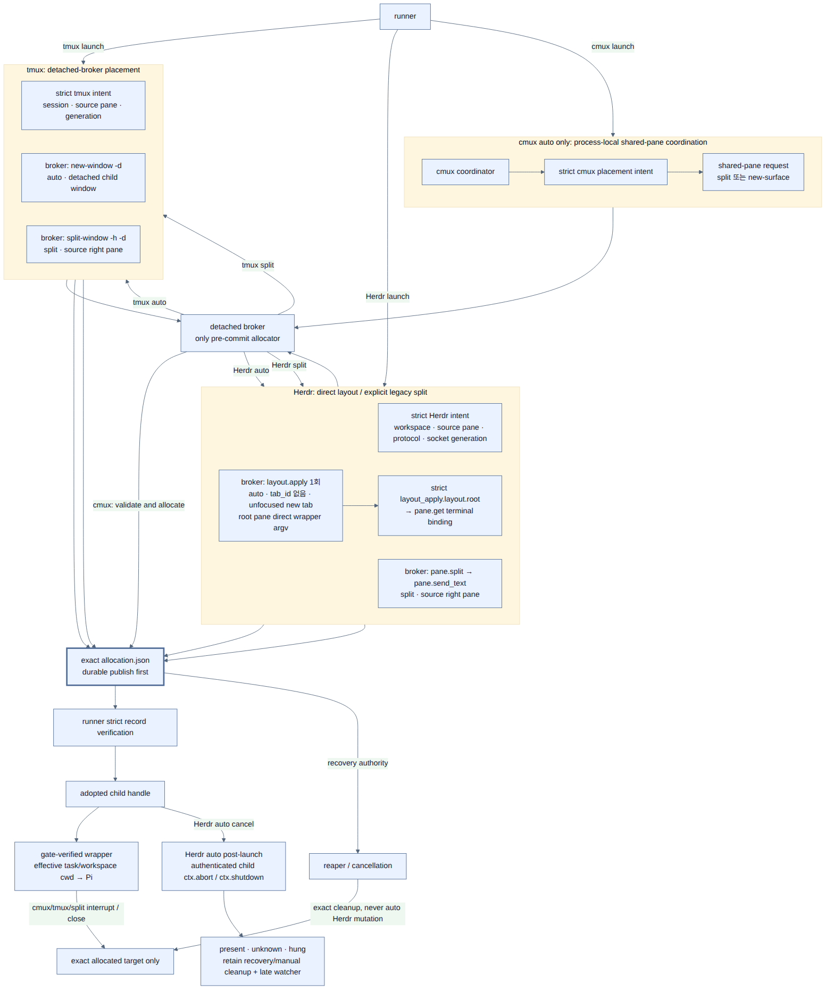

# 설정

이 패키지는 Pi의 GitHub 패키지 설치 방식으로 사용할 수 있습니다.

## GitHub 패키지로 설치

사용자 수준 Pi 설정 파일(`~/.pi/agent/settings.json`)에 설치하려면 다음 명령을 실행합니다.

```bash
pi install git:github.com/spi-ca/pi-subagent
```

Pi는 설정에 다음과 같은 패키지 항목을 추가하고 저장소를 `~/.pi/agent/git/github.com/spi-ca/pi-subagent` 아래에 클론합니다.

```json
{
  "packages": ["git:github.com/spi-ca/pi-subagent"]
}
```

프로젝트 수준 설정(`.pi/settings.json`)에 설치하려면 `-l`을 사용합니다.

```bash
pi install -l git:github.com/spi-ca/pi-subagent
```

특정 태그나 커밋으로 고정하려면 ref를 붙입니다.

```bash
pi install git:github.com/spi-ca/pi-subagent@<tag-or-commit>
```

## `pi-subagent.json` 파일 설정

호출 크기·동시성·백그라운드 정책의 열한 가지 `SubagentLimits`는 별도 JSON 파일로 설정할 수 있습니다. 전역 파일은 `~/.pi/agent/pi-subagent.json`이며 `PI_CODING_AGENT_DIR` 등으로 활성 agent directory가 바뀌면 해당 `getAgentDir()`의 `pi-subagent.json`을 사용합니다. 프로젝트 파일은 현재 세션 `ctx.cwd` 기준 `.pi/pi-subagent.json`입니다.

전역 파일은 항상 후보로 읽지만, 프로젝트 파일은 Pi가 프로젝트를 신뢰됨으로 보고할 때만 읽습니다. 신뢰되지 않은 프로젝트의 파일은 로드하지 않습니다. 임의의 `.pi/pi-subagent.json`만으로는 신뢰 확인이 나타나지 않을 수 있으므로, `/trust` 또는 일반적인 신뢰된 프로젝트 흐름으로 신뢰를 먼저 부여하세요. `/trust`로 새 신뢰 결정을 저장한 경우에는 Pi를 다시 시작해야 합니다.

각 설정 키는 다음 우선순위로 독립적으로 해석됩니다. CLI 값은 raw `process.argv`를 다시 검색하지 않고 Pi가 extension flag parsing을 끝낸 뒤 제공하는 `pi.getFlag()`만 authoritative source로 사용하므로 `--` 뒤 positional token을 플래그로 오인하지 않습니다.

```text
CLI > 환경 변수 > 신뢰된 프로젝트 파일 > 전역 파일 > 내장 기본값
```

파일이 없으면 warning 없이 건너뜁니다. 파일에 없는 키는 다음 낮은 우선순위로 내려갑니다. 읽을 수 없거나 안전하지 않은 파일, malformed JSON, JSON object가 아닌 루트, 알 수 없는 키, 또는 잘못된 값은 warning을 내고 해당 파일 또는 키를 무시해 낮은 우선순위를 사용합니다. 파일은 최대 65536바이트의 regular file이어야 하고 final symlink를 허용하지 않으며, open 전후 file identity가 달라지면 거부합니다. 신뢰된 프로젝트 설정은 `.pi`를 canonicalize한 뒤 canonical `ctx.cwd` 안에 남아 있어야 하므로 프로젝트 밖을 가리키는 symlink `.pi`는 읽지 않습니다.

`pi-subagent.schema.json`은 패키지 루트의 JSON Schema이며 배포 파일에 포함됩니다. 선택적인 문자열 `$schema` 키는 에디터가 이 로컬 schema 파일을 연결하는 데 쓸 수 있지만, 확장은 이를 해석하거나 schema URL을 요청하지 않습니다. 전체 JSON 예시와 키별 0 의미는 [호출 및 백그라운드 한계](#호출-및-백그라운드-한계)를 참고하세요.

구성 파일은 `session_start`에서 읽으므로 `/reload`, 새 세션, `/resume`, `/fork`에서 다시 적용됩니다. 이 갱신은 현재 Pi process의 process-local scheduler에 적용됩니다. Linux/macOS에서 이미 생성·adopt한 durable tree permit authority의 `maxActive`는 root Pi process 수명 동안 고정되므로, 같은 tree의 nested child는 reload 뒤에도 authority가 정한 cap을 채택합니다. Linux/macOS의 tree-wide cap을 바꾸려면 새 root Pi process에서 새 tree를 시작해야 합니다. Windows는 durable tree authority를 만들지 않고 process-local scheduling으로 fallback하므로 `maxActive` reload도 현재 process의 scheduler에만 적용됩니다. CLI 인수 변경은 Pi를 재시작해야 합니다. 이 파일은 `subagent` 도구의 `agent`/`task`, `tasks`, `chain`, `action` 호출 형태나 선택 `background` 필드를 추가·변경하지 않습니다.

`maxActive`는 파일 설정에 포함됩니다. `--subagent-max-depth`, `--subagent-prevent-cycles`/`--no-subagent-prevent-cycles`, `--subagent-pane-layout`과 해당 환경 변수는 파일로 설정할 수 없습니다. depth/cycle은 위임 의미 정책이고 pane layout은 terminal topology 선택이므로 CLI/환경 변수 전용으로 유지합니다. broker/runtime path, transport/socket/process identity, run artifact path, lease/lifecycle/reaper cadence와 recovery authority는 내부 또는 child 전달용이며 JSON 키로 노출하지 않습니다.

## 위임 보호 장치

이 확장은 기본적으로 깊이와 순환 방지를 적용합니다. Linux/macOS에서는 process-local queue와 durable tree-wide active cap도 적용하며, Windows는 tree-wide hard cap을 지원하지 않고 process-local scheduling으로 fallback합니다.

### 깊이 제한

`--subagent-max-depth`는 하위 에이전트가 다른 하위 에이전트에게 다시 위임할 수 있는 깊이를 제어합니다.

- 기본값: `5`
- 메인 에이전트는 깊이 `0`에서 시작합니다.
- `currentDepth < maxDepth`인 동안 위임할 수 있습니다.
- 기본 깊이에서는 `0`, `1`, `2`, `3`, `4` 깊이가 위임할 수 있고, `5` 깊이는 위임할 수 없습니다.

다음 중 하나로 설정합니다.

- CLI 플래그: `--subagent-max-depth <n>`
- 환경 변수: `PI_SUBAGENT_MAX_DEPTH=<n>`

`n`은 0 이상의 safe integer여야 합니다. CLI > 환경 변수 > 기본값 순으로 해석하며, 잘못된 값은 warning 후 다음 우선순위 값 또는 기본값을 사용합니다.

예시:

```bash
# 기본 동작: 깊이 5 + 순환 방지 켜짐
pi

# 중첩을 한 단계로 제한: main -> child -> grandchild
pi --subagent-max-depth 2

# 하위 에이전트 위임을 완전히 비활성화
pi --subagent-max-depth 0
```

### Tree-wide active cap과 process-local queue

Linux/macOS에서 `--subagent-max-active`는 root parent와 모든 nested child를 합친 delegation tree에서 동시에 `ACTIVE`/`RESERVED` 상태일 수 있는 수를 제한합니다. root parent도 durable `ACTIVE` lease 하나를 사용하므로, tree-wide cap은 요청한 child 수와 별개이며 child-only 동시성보다 하나 더 필요할 수 있습니다. 허용값은 `1`–`256` safe integer입니다. 각 Pi process의 FIFO/round-robin queue도 해석된 값으로 local launch burst를 제한하지만, tree-wide capacity의 authority는 private durable tree authority입니다. Windows는 durable tree authority와 tree-wide hard cap을 지원하지 않으며, 같은 값을 각 process-local scheduler에 적용합니다.

```text
--subagent-max-active > PI_SUBAGENT_MAX_ACTIVE > trusted project maxActive > global maxActive > 16
```

값은 `1`–`256` safe integer여야 합니다. 잘못된 CLI·환경·파일 값은 warning 후 무시하며, 다음 우선순위 값 또는 기본값을 사용합니다. 이 값은 `subagent` 도구의 public parameter가 아닙니다. queued 작업은 process, pane 또는 artifact를 만들지 않으며 취소·session shutdown 때 terminal aborted result가 됩니다. scheduler 전용 update는 추가하지 않지만, 기존 callback 계약을 보존하기 위해 parallel/chain aggregate update에는 아직 permit을 기다리는 작업도 running placeholder로 포함될 수 있습니다. invocation 안에서는 FIFO이고 invocation 사이는 strict round-robin입니다.

Linux/macOS에서는 해석된 값과 private tree authority/lease capability를 child에 안전하게 전달합니다. foreground invocation은 현재 parent permit을 durable `PARKED_WAIT`로 전환한 뒤 descendant에 넘기고 마지막 local waiter가 끝날 때만 복귀시킵니다. background invocation은 parent가 계속 실행되므로 transfer 없이 spare permit을 기다립니다. authority는 exact PID/start identity와 immutable generation-CAS snapshot을 사용하며 crash 뒤 dead lease만 회수하고 unknown identity는 capacity를 보수적으로 retain합니다. 설정 파일 reload는 local scheduler의 다음 session 값을 바꾸지만, 생성·adopt가 끝난 durable authority의 cap을 변경하지 않습니다. Windows에서는 durable authority/lease capability가 없고 reload된 값이 process-local scheduler에만 적용됩니다.

### 호출 및 백그라운드 한계

다음 열한 가지 설정은 `subagent` 도구 parameter가 아니라 Pi 시작 정책입니다. 각 키는 `CLI > 환경 변수 > 신뢰된 프로젝트 파일 > 전역 파일 > 기본값` 순으로 해석됩니다. 잘못된 CLI/환경 변수 값은 warning 후 다음 낮은 우선순위로, 파일의 잘못된 키도 warning 후 그보다 낮은 우선순위로 내려갑니다.

| JSON 키 | CLI 플래그 | 환경 변수 | 기본값 | 적용 대상 |
| --- | --- | --- | ---: | --- |
| `maxActive` | `--subagent-max-active` | `PI_SUBAGENT_MAX_ACTIVE` | 16 | `1`–`256`; Linux/macOS에서는 root parent의 자체 `ACTIVE` lease와 모든 nested foreground/background child를 합친 tree-wide `ACTIVE`/`RESERVED` permit 상한. Windows에서는 process-local scheduler 상한 |
| `maxParallelTasks` | `--subagent-max-parallel-tasks` | `PI_SUBAGENT_MAX_PARALLEL_TASKS` | 50 | 최상위 `tasks` 배열의 최대 항목 수; `0`–`256` |
| `maxChainSteps` | `--subagent-max-chain-steps` | `PI_SUBAGENT_MAX_CHAIN_STEPS` | 12 | `chain`의 최대 단계 수; `0`–`256` |
| `maxConcurrency` | `--subagent-max-concurrency` | `PI_SUBAGENT_MAX_CONCURRENCY` | 16 | 한 병렬 호출 또는 체인 병렬 단계가 동시에 매핑하는 child 수; `1`–`256` |
| `maxChainParallelTasks` | `--subagent-max-chain-parallel-tasks` | `PI_SUBAGENT_MAX_CHAIN_PARALLEL_TASKS` | 8 | 체인 병렬 단계 하나의 최대 `tasks` 항목 수; `0`–`256` |
| `maxBackgroundJobs` | `--subagent-max-background-jobs` | `PI_SUBAGENT_MAX_BACKGROUND_JOBS` | 16 | `running` 또는 `cancelling` 백그라운드 작업 수; `0`–`256` |
| `backgroundHistoryLimit` | `--subagent-background-history-limit` | `PI_SUBAGENT_BACKGROUND_HISTORY_LIMIT` | 20 | 보존하는 종료 백그라운드 작업 수; `0`–`256` |
| `backgroundHistoryTtlMs` | `--subagent-background-history-ttl-ms` | `PI_SUBAGENT_BACKGROUND_HISTORY_TTL_MS` | 3600000 | 종료 작업 기록의 TTL(밀리초, 1시간) |
| `backgroundOutputMaxBytes` | `--subagent-background-output-max-bytes` | `PI_SUBAGENT_BACKGROUND_OUTPUT_MAX_BYTES` | 16384 | 백그라운드 결과/오류 원문의 UTF-8 바이트 상한; `0`–`65536` (64 KiB) |
| `backgroundShutdownSettleMs` | `--subagent-background-shutdown-settle-ms` | `PI_SUBAGENT_BACKGROUND_SHUTDOWN_SETTLE_MS` | 3000 | session shutdown이 취소 뒤 정착을 기다리는 최대 시간(밀리초) |
| `parallelHeartbeatMs` | `--subagent-parallel-heartbeat-ms` | `PI_SUBAGENT_PARALLEL_HEARTBEAT_MS` | 1000 | 병렬 진행 상황 heartbeat 간격(밀리초) |

`maxActive`, task/chain/concurrency/background queue는 최대 `256`이고, `backgroundHistoryLimit`은 최대 `256`, `backgroundOutputMaxBytes`는 최대 `65536`(64 KiB)인 safe integer여야 합니다. 최상위 task, chain 단계, 각 chain 병렬 단계의 개별 상한과 별도로 chain 전체의 순차·병렬 leaf task 합계도 `256`입니다. 이 합계는 task 항목을 순회하거나 실행하기 전에 검사합니다. `maxActive`, `maxConcurrency`, `parallelHeartbeatMs`는 **양의** 값이어야 하며 다른 count/output 설정은 0 이상입니다. `backgroundHistoryTtlMs`는 0 이상의 safe integer입니다. 이 실용 상한은 기존 256 tree-wide active permit/dashboard terminal bound와 64 KiB live session-tail chunk에 맞추며, retained text는 truncation notice를 제외하고 최대 약 16 MiB이므로 기본값과 상한 아래의 기존 설정은 유지합니다. 완료 background record의 agent/task metadata도 각각 4 KiB로 고정 제한됩니다. 공백은 제거하지만 부호, 소수, 지수 표기와 범위 밖의 값은 허용하지 않습니다. 추가로 `--subagent-background-shutdown-settle-ms`와 `--subagent-parallel-heartbeat-ms`는 Node timer 의미론 때문에 최대 `2147483647`ms입니다. 즉 settle은 0 이상, heartbeat는 양수여야 하며 둘 다 이 timer 상한을 넘을 수 없습니다.

0은 비활성화/무제한을 뜻하지 않습니다. `max-parallel-tasks`, `max-chain-steps`, `max-chain-parallel-tasks`가 0이면 해당 비어 있지 않은 호출을 거부하고, `max-background-jobs=0`이면 새 백그라운드 작업을 시작할 수 없습니다. history limit 또는 TTL이 0이면 종료 기록은 pruning 시 즉시 제거됩니다. output max bytes가 0이면 자동 steer와 단건 `status`의 결과/오류 텍스트를 포함하지 않습니다. output text는 text chunk를 순차적으로 compact하므로 unbounded joined string/Buffer를 만들지 않으며, 상한을 넘으면 보존한 UTF-8 prefix 뒤에 `[Background output truncated: N bytes omitted.]`를 붙입니다. shutdown settle이 0이면 취소 뒤 정착을 의도적으로 기다리지 않습니다. heartbeat는 0을 지원하지 않습니다.

예시:

```bash
# 환경 변수보다 CLI를 우선해 병렬 입력은 20개, 호출별 매핑은 4개로 제한
PI_SUBAGENT_MAX_PARALLEL_TASKS=50 pi \
  --subagent-max-parallel-tasks 20 \
  --subagent-max-concurrency 4

# 결과/오류 본문을 background status/steer에 남기지 않음
PI_SUBAGENT_BACKGROUND_OUTPUT_MAX_BYTES=0 pi
```

`maxConcurrency`는 **호출별** worker 수입니다. Linux/macOS에서 `max-active`는 root parent와 foreground/background nested child를 합친 **delegation tree 전체** hard cap이며, process-local scheduler는 호출별 FIFO/strict round-robin을 유지하고 durable tree authority가 process 경계를 넘어 실제 launch permit을 제한합니다. Windows는 tree-wide hard cap을 지원하지 않고 process-local scheduling으로 fallback합니다. 해석된 열한 가지 한계는 child 환경 변수로 전달되며, Linux/macOS의 nested child는 동일 authority와 cap을 채택합니다.

interactive transport/protocol의 frame·artifact·recovery 같은 안전 상한은 고정 구현값이며 이 CLI/환경 변수 설정으로 바꿀 수 없습니다.

### 순환 방지

`--subagent-prevent-cycles`는 현재 위임 스택에 이미 있는 에이전트 이름으로 다시 위임하는 것을 막습니다. `writer -> writer` 같은 자기 재귀와 `planner -> reviewer -> planner` 같은 순환을 방지합니다.

- 기본값: `true`
- CLI 플래그: `--subagent-prevent-cycles` / `--no-subagent-prevent-cycles`
- 환경 변수: `PI_SUBAGENT_PREVENT_CYCLES=true|false`

```bash
# 최대 깊이를 3으로 설정하고 순환 방지를 끕니다. 권장하지 않습니다.
pi --subagent-max-depth 3 --no-subagent-prevent-cycles
```

## Managed child profile

`PI_SUBAGENT_CMUX_CHILD_POLICY=inherit|managed`는 child extension profile을 선택하는 session-level 환경 정책입니다. 기본 `inherit`는 기존 inherited extension 집합을 보존합니다. opt-in `managed`는 Pi의 `--no-extensions` 뒤 이 패키지의 nested delegation extension만 명시적으로 로드하고, interactive child에는 lifecycle bridge도 추가합니다. 내장·models.json provider 설정과 auth 전달, agent의 built-in tool allowlist, child-private session과 nested delegation은 그대로 유지되며 parent 전용 dashboard나 `cmux_open_terminal` 같은 inherited extension tool은 registry에 들어오지 않습니다. inherited extension이 등록한 custom provider는 의도적으로 제외되므로 그 provider만 제공하는 model이 필요한 agent는 `inherit`를 사용해야 하며, 그렇지 않으면 child Pi가 model-unavailable로 fail-closed합니다.

managed profile이 agent 또는 inherited `--tools`의 extension-owned tool이나 활성 Pi built-in override를 보존할 수 없으면 조용히 좁히지 않고 launch 전에 오류로 끝냅니다. 이름이 같은 inherited `subagent` 도구는 nested delegation authority를 이 패키지 하나로 고정하기 위해 의도적으로 이 패키지의 구현으로 대체합니다. CLI API-key용 private agent-dir overlay도 managed에서는 agents/skills/prompts/themes와 data 설정만 bounded snapshot으로 복제하고 extension/package cache는 상속하지 않습니다. 설정하지 않거나 빈 값이면 `inherit`이고, 값 앞뒤 공백은 제거한 뒤 `inherit` 또는 `managed`만 허용하며 nested child에 그대로 전달됩니다. 이 정책은 terminal/backend가 아니라 child extension registry를 제어하므로 inline, cmux, tmux child에 동일하게 적용됩니다.

부모 CLI의 `--api-key` 값은 child argv에 그대로 전달하지 않습니다. 명시한 parent `--provider`, fully-qualified parent model, 또는 허용된 agent model에서 provider를 결정해 provider별 API-key 환경 변수로 매핑하고 private agent-dir overlay를 통해 전달합니다. parent provider와 parent/child model provider가 충돌하거나 provider가 없거나 지원 매핑이 없으면 key 전달을 생략하고 경고하며, 기존 provider별 환경 변수나 다른 auth는 그대로 사용할 수 있습니다. user agent model은 provider hint로 사용할 수 있지만 project agent model은 현재 exact project root가 신뢰된 경우에만 사용합니다. 확실한 상속이 필요하면 지원되는 `--provider` 또는 `provider/model` 형식의 `--model`을 명시하고 서로 일치시키세요.

Generic presence는 별도 설정 항목이 아닙니다. root parent만 shared [`@pi/presence` protocol (v2-20260828-1)](https://github.com/spi-ca/pi-presence/tree/v2-20260828-1) producer를 만들고 nested child는 만들지 않습니다. `PI_CMUX_PRESENCE_*` 전달이나 child별 presence policy는 지원하지 않습니다. 이 observer 출력은 `pi-subagent.json`, CLI flag 또는 `subagent` tool field로 제어하지 않으며 실행·취소·lease·reaper·cleanup authority를 바꾸지 않습니다. [`pi-subagent presence projection`](./pi-cmux-presence-integration.md)을 참고하세요.

## 컨텍스트 모드

`subagent` 도구는 최상위 `mode` 옵션을 받습니다.

| 모드 | 동작 | 사용 시점 |
| --- | --- | --- |
| `spawn` | 하위 에이전트 프롬프트와 `Task: ...`만 전달합니다. | 위임 작업이 독립적일 때 |
| `fork` | 현재 부모 세션의 스냅샷과 `Task: ...`를 함께 전달합니다. | 위임 작업이 이전 대화, 파일 읽기, 결정 사항에 의존할 때 |

`mode`를 생략하면 `spawn`이 기본값입니다.

## 실행 환경

확장은 현재 환경에 따라 다음 우선순위로 실행 방식을 선택합니다.

1. `CMUX_WORKSPACE_ID`와 `CMUX_SURFACE_ID`가 모두 canonical UUID이면 `cmux-pane`
2. `HERDR_ENV=1`과 absolute `HERDR_SOCKET_PATH`, non-control `HERDR_WORKSPACE_ID`/`HERDR_TAB_ID`/`HERDR_PANE_ID`가 있으면 `herdr-pane`
3. `TMUX`가 canonical socket/server/session 형식이고 `TMUX_PANE`이 canonical `%N`이면 `tmux-pane`
4. 그 외 환경에서는 `inline`

`PI_SUBAGENT_TERMINAL_MODE=inline|cmux-pane|tmux-pane|herdr-pane`는 auto-detection보다 우선합니다. 잘못된 값은 무시하고 안전한 auto-detection을 유지하며 Windows는 항상 `inline`입니다.

### Interactive pane layout

interactive pane의 layout policy는 다음으로 결정합니다.

```text
--subagent-pane-layout > PI_SUBAGENT_PANE_LAYOUT > auto
```

```bash
# 기본 auto를 명시
pi --subagent-pane-layout auto

# 기존 child별 오른쪽 split 호환 동작
PI_SUBAGENT_PANE_LAYOUT=split pi
```

지원 값은 **정확히 소문자** `auto`와 `split`뿐입니다. 공백, 대소문자 변형, alias는 유효하지 않습니다. 잘못된 CLI 값은 extension 초기화에서, 잘못된 환경 값은 해석 시 다음처럼 actionable error로 거부됩니다. backend launch 뒤 다른 layout이나 `inline`으로 조용히 fallback하지 않습니다.

```text
--subagent-pane-layout must be exactly "auto" or "split" (received ...).
PI_SUBAGENT_PANE_LAYOUT must be exactly "auto" or "split" (received ...).
```

해석된 값은 child 환경의 `PI_SUBAGENT_PANE_LAYOUT`로 명시적으로 전달되므로 nested child도 부모의 정책을 그대로 상속합니다.

| 값 | cmux | tmux | Herdr |
| --- | --- | --- | --- |
| `auto` (기본) | root sibling은 새 오른쪽 shared pane 하나의 surface를 공유합니다. nested descendant는 정확한 source pane에 surface로 쌓입니다. | child마다 parent와 같은 session의 detached window 하나를 만듭니다. | child마다 unfocused 새 tab 하나를 만들고 그 tab의 root pane에서 실행합니다. |
| `split` | child마다 source surface 오른쪽에 split합니다. | child마다 source pane 오른쪽에 split합니다. | child마다 source pane 오른쪽에 split합니다. |



_2x PNG · [SVG](./diagram/interactive-layout-coordination.svg) · [Mermaid source](./diagram/interactive-layout-coordination.mmd)_

`auto`의 cmux는 source root별 process-global coordinator가 foreground/background launch를 직렬화합니다. detached V2 broker만 pre-commit allocation과 durable `allocation.json` publish를 수행하며, coordinator는 commit 뒤 strict layout record와 정확히 일치하는 allocation만 adopt/release합니다. Herdr `auto`는 immutable source와 일치하는 workspace-scoped `layout.apply` 한 번만 보내며, `tab_id` 없이 `focus: false`와 root pane의 direct exact wrapper argv를 지정합니다. protocol 19/20 공통 strict `layout_apply.layout.root` 응답을 수용한 뒤 `pane.get`으로 terminal binding을 확정하고, label/list diff로 allocation을 재발견하지 않습니다. `split`은 immutable source의 workspace/tab/pane/terminal request 전체가 일치해야 합니다. 종료·취소·reaper는 shared pane, tmux window, Herdr tab 또는 session container를 넓게 닫지 않고 child의 정확한 surface/pane만 대상으로 합니다. auto Herdr terminal이 원래 할당된 child tab 밖으로 이동하면 소유권 이전/recovery 상태로 보존하고 destructive cleanup을 하지 않습니다.

### cmux pane

`cmux-pane`에는 Pi `0.80.10` 이상, stable cmux `0.64.20` 이상 app과 활성화된 control socket v2가 필요합니다. pi-subagent production 경로는 cmux CLI를 실행하거나 fallback으로 사용하지 않습니다. `auto`의 root 첫 child만 현재 surface 오른쪽에 focus를 이동하지 않는 split을 만들고, 뒤 root sibling은 그 pane에 surface를 추가합니다. nested auto child는 source surface가 속한 정확한 pane에 surface를 추가합니다. `split`은 매 child마다 기존 split을 수행합니다. cmux가 새 split에 먼저 여는 shell은 backend 잔여 상태입니다. durable commit 전에는 그 shell에 run directory, wrapper, task, session, child command 또는 capability authority를 넘기지 않으며, initial shell 자체를 pre-shell hardened로 간주하지 않습니다. commit과 parent gate 뒤에만 sanitized `surface.respawn` RPC가 wrapper를 실행합니다.

- stdout/stderr를 renderer나 FIFO로 pipe하지 않습니다.
- 부모 결과는 child session JSONL과 lifecycle sidecar에서 읽습니다.
- interactive child는 `parent-owned` 고정 lifecycle로 첫 정상 `agent_settled` 뒤 종료됩니다.
- 부모 취소·session shutdown에서는 먼저 Escape를 보내고, grace period 뒤 surface를 닫습니다.
- 부모가 비정상 종료되면 2초 주기의 lease와 12초 stale threshold로 child가 orphan 상태를 감지합니다.
- stale run은 다음 root session 시작 시 leaf-first reaper가 다시 정리합니다.

cmux를 감지했지만 socket owner/mode/inode, authorization, API/app version 또는 최소 Pi 버전 확인에 실패하면 조용히 다른 backend나 inline으로 바꾸지 않고 해당 subagent 실행을 오류로 반환합니다.

#### Managed child의 OS 신뢰 경계

managed child의 출력·지시는 항상 untrusted로 취급하지만, child 프로세스는 부모와 같은 UID의 협력 peer이며 hostile sandbox 경계가 아닙니다. `0700`/`0600`, no-symlink, no-replace publication은 다른 UID, 경로 경쟁·교체와 실수로 인한 교체를 막는 장치이지 악의적인 same-UID 코드의 관찰·변조를 막지 않습니다. 이 경계는 public `detached-ownership.json` promotion marker와 reaper 판단에도 그대로 적용됩니다. hostile child를 견뎌야 하면 별도 UID 또는 mandatory MAC sandbox와 좁은 IPC를 사용하세요. 그것이 불가능하면 managed mode와 durable promotion을 사용하지 마세요. 구현 artifact의 상세는 [cmux/tmux 설계](./cmux-pi-tui-design.md#82-저장-위치-권한-artifact)를 참고하세요.

버전 정책의 tmux **최소 지원 문턱**은 stable `>=3.7a`입니다. 이는 `tmux-control-v1` parser fixture가 capture한 `3.7b` baseline 및 2026-07-21의 exact `3.7b` historical PASS와 구별됩니다. 즉 `3.7b` fixture/output 계약은 strict하게 유지하지만 production gate의 minimum을 `3.7b`로 올려 해석하지 않습니다. Pi와 cmux 문턱은 각각 stable `>=0.80.10`, `>=0.64.20`입니다. 기존 `--version`, control handshake/identify, tmux gate probe 결과만 재사용하므로 추가 probe command나 handshake를 만들지 않습니다. cmux control record와 gated tmux V3 `transport-gate.json`에는 minimum 문자열 대신 실제 감지 버전을 기록하고(V2 safe path는 minimum을 검사하지만 별도 version artifact를 남기지 않음), executable·socket·server·app identity generation이 바뀌면 캐시된 판정도 재사용하지 않습니다. 버전 문턱과 별개로 API family, capability, fixture, parser와 output 계약은 strict하게 유지합니다.

### Herdr pane

`herdr-pane`는 `HERDR_SOCKET_PATH`의 owner-only Unix socket에 직접 연결하며 Herdr CLI나 별도 supervisor process를 실행하지 않습니다. 설치된 Herdr `v0.8.0`의 protocol **19**와 preview의 protocol **20**만 지원하며, `ping`으로 협상한 실제 revision을 durable intent·allocation·launch gate에 모두 기록합니다. 이후 allocation, launch delivery, focus, interrupt, close 직전에는 같은 revision을 다시 확인합니다. broker runtime의 executable provenance만 durable intent에 기록하고, owner-only Unix socket으로 두 revision의 공통 subset인 `pane.get`/`pane.list`/`layout.apply`/`pane.split`/`pane.send_text`/`pane.send_keys`/`pane.close`, `agent.get`/`agent.wait`/`agent.focus`, `pane.report_metadata`를 처리합니다. `pane.focus`는 manual focus에 사용하지 않습니다. protocol 20 전용 field나 method는 protocol 19에 보내지 않으며, 그 밖의 revision은 거부합니다.

`auto`는 immutable source workspace와 정확히 일치하는 `layout.apply` 한 번으로 unfocused 새 tab과 root pane을 만듭니다. 요청에는 `tab_id`가 없고 root pane은 trusted filesystem root를 `cwd`로 하며 wrapper의 direct exact argv를 받습니다. strict `layout_apply.layout.root`를 확인한 뒤 같은 root pane을 `pane.get`으로 조회해 terminal binding을 확정합니다. 따라서 auto는 `pane.send_text`로 명령을 입력하지 않고 별도 tab 생성 RPC도 사용하지 않습니다. wrapper는 gate를 통과한 뒤에만 validated effective task/workspace `cwd`로 이동해 Pi를 시작하므로, gate 전 프로젝트 `bunfig.toml`/Bun preload가 broker나 verifier에 적용되지 않습니다. allocation/gate 거부는 조용히 끝납니다.

`split`은 immutable source의 workspace/tab/pane/terminal과 정확히 일치하는 request만 source pane 오른쪽에 보내는 명시적 legacy 호환 경로이며, wrapper delivery에 `pane.send_text`를 사용합니다. 그래서 이 경로는 command text 비표시나 atomic terminal binding을 보장하지 않습니다. 어느 allocation도 immutable source pane ID, terminal ID 또는 직전에 terminal identity로 rebound한 current pane ID를 재사용하면 수용하지 않습니다. 이 binding, socket owner/mode/inode 또는 protocol 검증이 실패하면 다른 backend나 inline으로 fallback하지 않고 fail-closed합니다. `events.subscribe`는 wake-up hint로만 사용하고 label/list topology diff로 allocation을 재발견하지 않습니다. 모든 lifecycle 판단은 `pane.get`으로 재확인하며 timeout·disconnect 뒤 mutation을 replay하지 않습니다.

Herdr `auto`/new-tab의 자동 cancel은 pane mutation이 아니라 child bridge의 인증된 cooperative `ctx.abort()`/`ctx.shutdown()`을 먼저 요청합니다. 이것이 bounded grace 안에 끝나지 않으면 parent는 completion과 원자적으로 경쟁해 이긴 immutable cancellation fence, ownership, durable exact child PID/start tuple을 다시 검증한 경우에만 그 **exact PID**에 `SIGTERM` 후 event/deadline 기반 grace와 `SIGKILL`을 사용합니다. process group·descendant 종료는 하지 않습니다. parent는 계속 `pane.send_keys`, `pane.close`, `tab.close`, `agent.send-keys`, rollback 또는 reaper mutation을 보내지 않습니다. child가 present/unknown/hung이면 recovery/manual cleanup 상태로 보존하고 late watcher를 유지하며, complete bounded `pane.list`에 terminal match가 없을 때만 absence로 retire합니다. `events.subscribe` physical stream은 socket `dev`/`ino` generation·protocol마다 process-local 하나만 유지하고, listener별 relevant event만 in-memory fan-out합니다. completed retire watcher는 최초 reconciliation 뒤 relevant event와 매 disconnect/reconnect(반복 실패 포함) wake에서만 fresh authoritative `pane.get`/bounded `pane.list` reconciliation을 수행하고 이전 5초 backend polling을 하지 않습니다. `agent.wait`는 event stream이 disconnect/unhealthy일 때만 쓰는 degraded fallback으로, degraded run당 concurrent observer와 in-flight wait 하나, current status를 제외한 상태와 긴 bounded 30초 server wait/31초 client wait을 process 전체 최대 16개로 관찰합니다. completed auto watcher도 최대 16개이고 cap 밖 후보는 registry recovery로 보존합니다. confirmed absence 뒤 secret scrub 또는 run artifact removal이 실패하면 generation·winner·ownership과 두 absence proof를 재검증하는 유한 backoff cleanup retry만 수행합니다. event와 wait은 completion·cleanup·absence authority가 아닙니다. `split`의 cancellation, focus, close, promotion/reaper는 exact recorded target만 대상으로 합니다. auto child terminal이 할당된 tab 밖으로 이동해도 manual focus는 socket/protocol·terminal rebind 뒤 exact `agent.get`, 한 번의 `agent.focus`, read-only identity post-check로만 가능하며 `pane.focus` fallback/retry는 없습니다. expected-terminal CAS가 없어서 read→mutation race는 남으며 이 focus는 user-initiated UX에 한정됩니다.

### tmux pane

`tmux-pane`에도 Pi `0.80.10` 이상과 tmux CLI가 필요합니다. `auto`는 source topology를 검증한 뒤 parent와 같은 session에 detached window를 child별로 만들며 parent window를 split하지 않습니다. `split`만 현재 `TMUX_PANE` 오른쪽에 detached split을 만듭니다. stable `tmux >=3.7a` 이상의 executable/socket/server PID-start/source probe gate를 통과하면 strict V3 artifact chain과 process-owned persistent `tmux -C` client가 활성화됩니다. `3.7b`는 pinned parser fixture와 historical exact PASS의 capture 버전이지 이 gate의 minimum이 아닙니다. version이 stable `3.7a` 미만이거나 malformed이면 fail-closed합니다. 최소 버전은 충족했지만 V3의 비-version transport 조건을 allocation 전에 통과하지 못한 경우에만 기존 strict V2 safe path를 사용하며, V3 evidence를 publish한 뒤에는 downgrade하지 않습니다. layout-aware broker는 두 경우 모두 strict `session_id|window_id|pane_id|pane_pid` allocation을 받고 staged verifier를 생성 command로 직접 실행합니다. verifier가 gate의 pre-allocation rows와 exact committed target만 허용하고 session/window/pane/server fingerprint를 검증한 뒤에만 wrapper와 child Pi를 시작합니다.

- `TMUX`에서 canonical socket path/inode와 server PID/start identity를 추출하고, 생성된 `session_id`, `window_id`, `pane_id`, `pane_pid`와 함께 layout-aware launch record에 저장합니다.
- `auto`가 만드는 window에는 allocation 시 `subagent:<agent-token>:<8-char-run-prefix>` 이름을 한 번 설정합니다. 이 이름은 탐색용이며 lifecycle·cleanup authority가 아니고, 사용자 rename을 복구하지 않습니다. 상세 계약은 [안정적인 tmux window 이름 설계 및 구현](./tmux-window-naming-design.md)을 참고하세요.
- gated V3 정상 경로는 `pane_dead`/layout/window/session notification을 reconciliation hint로 사용하고 periodic `display-message`/`list-panes`와 recurring short-lived tmux process를 만들지 않습니다. event·disconnect·abort/final/reaper에서만 persistent connection으로 exact snapshot을 수행합니다.
- pane은 `%N` ID로 조회하되 parent와 stale reaper는 source session/window/PID와 target server PID/`pane_pid` generation이 모두 일치할 때만 중단·종료합니다. write 뒤 EOF/timeout의 mutation은 replay하지 않습니다.
- `list-panes`, guarded `send-keys ... Escape`, guarded `kill-pane`으로 lifecycle을 제어합니다. reconnect는 fresh executable/socket/PID-start/source snapshot과 shutdown fence를 통과해야 합니다.
- session JSONL, child bridge, parent lease, completion과 reaper는 cmux와 완전히 공유합니다.
- tmux server의 오래된 global environment 대신 parent가 계산한 child environment를 private `0600` artifact로 전달하며, 새 pane identity 값은 덮어쓰지 않습니다. 전달 allowlist와 arbitrary environment 제외 규칙은 아래 [Interactive provider 환경 전달](#interactive-provider-환경-전달)을 따릅니다.

현재 환경이 cmux와 tmux 안에 동시에 있으면 cmux가 우선합니다. tmux를 감지했지만 CLI 실행에 실패한 경우에도 조용히 inline으로 바꾸지 않습니다.

### Interactive provider 환경 전달

inline child는 부모의 provider 환경을 그대로 사용합니다. interactive child는 multiplexer의 오래된 global environment를 쓰지 않고, 아래 Pi `0.80.10` provider 환경만 private `0600` secret artifact로 전달한 뒤 wrapper가 source 즉시 삭제합니다. 값은 broker environment·argv·로그에 넣지 않습니다.

- Pi [`providers.md`](https://github.com/earendil-works/pi-mono/blob/main/packages/coding-agent/docs/providers.md)의 built-in API-key 변수 전체(예: `AWS_BEARER_TOKEN_BEDROCK`, `RADIUS_API_KEY`)
- Azure: `AZURE_OPENAI_BASE_URL`, `AZURE_OPENAI_RESOURCE_NAME`, `AZURE_OPENAI_API_VERSION`, `AZURE_OPENAI_DEPLOYMENT_NAME_MAP`; Cloudflare: `CLOUDFLARE_ACCOUNT_ID`, `CLOUDFLARE_GATEWAY_ID`
- Bedrock/AWS: profile, access/session credential, region/default region, ECS container/IRSA credential 변수와 `AWS_BEDROCK_FORCE_CACHE`, `AWS_ENDPOINT_URL_BEDROCK_RUNTIME`, `AWS_BEDROCK_SKIP_AUTH`, `AWS_BEDROCK_FORCE_HTTP1`
- Vertex: `GOOGLE_CLOUD_PROJECT`, `GOOGLE_CLOUD_LOCATION`, `GOOGLE_APPLICATION_CREDENTIALS`; `PI_CACHE_RETENTION`
- `HTTP_PROXY`, `HTTPS_PROXY`, `ALL_PROXY`, `NO_PROXY`의 대소문자 variant와 `SSL_CERT_FILE`, `SSL_CERT_DIR`, `NODE_EXTRA_CA_CERTS`, `REQUESTS_CA_BUNDLE`, `CURL_CA_BUNDLE`

그 밖의 임의 환경 변수는 interactive child에 전달하지 않습니다. private artifact가 삭제되기 전에도 secret/API key를 `PI_SUBAGENT_BROKER_RUNTIME`이나 다른 broker 설정에 넣지 마세요.

Zellij와 기존 JSONL/FIFO pane renderer 지원은 제거되었습니다.

### V2 broker runtime과 backend resolver

Interactive pane의 production launch는 `src/runtime/pane-launch-broker.mjs` one-shot broker를 사용합니다. resolver는 존재하는 regular file인지와 실행 가능한지만 확인하고, symlink와 shebang wrapper를 따라 canonical absolute path를 기록합니다. directory는 실행하지 않습니다.

```bash
PI_SUBAGENT_BROKER_RUNTIME=/path/to/node pi
```

runtime 순서는 비어 있지 않은 `PI_SUBAGENT_BROKER_RUNTIME`, 그 외 `PATH`의 `bun`, 마지막으로 `PATH`의 `node`입니다. cmux lifecycle은 configured/default app socket을 사용하며 binary를 resolve하지 않습니다. tmux backend는 비어 있지 않은 `TMUX_BIN`이 `PATH`보다 우선하고, 비어 있거나 미설정일 때만 `PATH`의 `tmux`를 찾습니다. 명시한 경로가 invalid면 PATH fallback은 없으며 launch가 실패합니다. 빈 runtime 또는 `TMUX_BIN` 설정값은 미설정과 같아서 각 fallback을 계속 사용합니다.

interactive 실행에서 executable `PATH`는 사용자가 명시적으로 선택한 trust boundary입니다. 따라서 project-local shim, user-owned directory, symlink, shell script 또는 macOS application 경로를 provenance·owner·ancestor·native magic·codesign 정책으로 거부하지 않습니다. 선택된 canonical runtime/tmux backend path는 immutable intent에 기록하고 lifecycle 작업 직전에 같은 executable generation을 확인합니다. cmux lifecycle authority는 legacy-shaped `backendPath`가 아니라 intent/allocation의 canonical socket `(path, dev, ino)`, access mode, API/app version과 identify digest입니다. run artifact root, marker, symlink, owner/mode, artifact containment, source/allocation binding 및 exact-target cleanup 검증은 별도로 그대로 유지됩니다.

runtime, broker entrypoint 또는 backend를 찾을 수 없거나 실행할 수 없으면 artifact나 broker를 만들지 않고 interactive run을 오류로 끝냅니다. 이 오류는 inline fallback으로 바뀌지 않습니다. secret/API key를 `PI_SUBAGENT_BROKER_RUNTIME` 또는 다른 broker 설정에 넣지 마세요.

#### 문제 해결

- `Interactive pane mode requires an available broker runtime, broker entrypoint, and backend executable.`: runtime은 `PATH`의 `bun`/`node`, tmux mode는 `tmux` executable을 확인하세요. cmux mode에서는 app control socket과 stable `0.64.20` 이상 app bundle gate를 확인하세요. Pi/cmux/tmux 모두 prerelease와 malformed version은 지원하지 않습니다. symlink와 shebang shim은 지원됩니다.
- cmux/tmux 환경이 감지되었는데 실행이 실패함: 안전상 inline으로 자동 fallback하지 않습니다. cmux socket authorization/version 또는 tmux executable과 Pi `0.80.10` 이상을 확인하세요.
- Windows: interactive backend는 지원하지 않으며 automatic mode는 `inline`입니다.
- stale diagnostic directory: `possible-unrecorded-allocation` residual risk 또는 target absence 미확인일 수 있습니다. run artifact를 임의 삭제하거나 cmux surface를 이름으로 추측해 종료하지 마세요. live crash/cleanup acceptance 절차와 상태는 [`cmux-pi-tui-design.md`](./cmux-pi-tui-design.md#12-acceptance-runbook)를 참고하세요.

## 프로젝트 에이전트 신뢰

프로젝트 에이전트는 `.pi/agents/*.md`에 둡니다. 가장 가까운 `.pi/agents` 디렉터리를 소유한 정확한 canonical 프로젝트 루트가 신뢰된 뒤에만 사용할 수 있습니다.

주요 동작:

- 신뢰가 부여되면 프로젝트 에이전트가 이름 충돌에서 우선합니다.
- 신뢰되지 않은 프로젝트에서는 프로젝트 에이전트 메타데이터를 메인 프롬프트에 노출하지 않습니다.
- 숨겨진 프로젝트 에이전트 이름 충돌은 프로젝트가 신뢰되거나 충돌 에이전트 이름이 바뀔 때까지 차단됩니다.
- 프로젝트 루트 경계를 벗어나는 realpath를 가진 `.pi/agents` 디렉터리나 에이전트 파일은 발견 단계에서 거부됩니다.
- 신뢰된 body는 containment가 확인된 resolved target을 read-only `O_NOFOLLOW` fd로 열고 fd 전후 identity를 비교한 bytes만 parse합니다. parse 전후 manifest 또는 canonical trust context가 바뀌면 해당 프로젝트 결과 전체를 폐기합니다.
- 새로 신뢰된 프로젝트 에이전트는 즉시 실행 가능해지며, 부모 프롬프트에 표시되는 하위 에이전트 목록은 다음 최상위 턴에서 갱신됩니다.

신뢰 근거는 다음에서 올 수 있습니다.

- 정확한 루트가 저장된 `trust.json` 항목
- 이 확장이 세션 중 추적하는 명시적 승인 또는 거부
- 현재 Pi session의 `ctx.isProjectTrusted()` 결과. 사용할 수 있을 때 `true`이면 확장이 현재 canonical project root 하나만 exact session override로 기록하고, `false`이면 같은 exact root를 deny합니다. API가 없거나 사용할 수 없으면 override를 기록하지 않고 기존 저장/세션 exact-root 상태로 신뢰와 프로젝트 설정 로드 여부를 결정합니다.

이 승인 범위는 **프로젝트 에이전트 프롬프트만**입니다. 하위 Pi 프로세스는 프로젝트 안에서 항상 `--no-context-files --no-approve`로 시작하므로 `AGENTS.md`/`CLAUDE.md`, `.pi/settings.json`, extensions, packages, themes 또는 다른 프로젝트 코드를 이 승인만으로 로드하지 않습니다. 상속된 context-file/approval alias도 제거하고 canonical deny flag를 다시 추가합니다. 선택된 신뢰된 에이전트의 프롬프트는 확장이 직접 전달합니다. 별도의 전체 프로젝트 신뢰 채널은 현재 추론하거나 자동 승격하지 않습니다.

Pi의 boolean 프로젝트 신뢰 상태를 broad prefix 신뢰로 사용하지 않습니다. 오직 현재 session의 canonical project root 하나에 결속된 exact override로 변환하며, symlink escape나 다른 root에는 전파하지 않습니다.

## 내부 환경 변수

확장은 다음 내부 환경 변수를 관리하고 자식 프로세스에 전달합니다.

- `PI_SUBAGENT_DEPTH`
- `PI_SUBAGENT_MAX_DEPTH`
- `PI_SUBAGENT_MAX_ACTIVE` — 해석된 `maxActive` 값. Linux/macOS에서는 nested Pi의 local pool과 durable tree authority가 같은 값을 사용하며, Windows에서는 process-local scheduler에만 적용
- `PI_SUBAGENT_TREE_PERMIT_*` — Linux/macOS launcher가 private child bootstrap에만 주입하는 내부 authority/lease capability; 사용자가 직접 설정하는 공개 옵션이 아님
- `PI_SUBAGENT_MAX_PARALLEL_TASKS`, `PI_SUBAGENT_MAX_CHAIN_STEPS`, `PI_SUBAGENT_MAX_CONCURRENCY`, `PI_SUBAGENT_MAX_CHAIN_PARALLEL_TASKS`
- `PI_SUBAGENT_MAX_BACKGROUND_JOBS`, `PI_SUBAGENT_BACKGROUND_HISTORY_LIMIT`, `PI_SUBAGENT_BACKGROUND_HISTORY_TTL_MS`, `PI_SUBAGENT_BACKGROUND_OUTPUT_MAX_BYTES`, `PI_SUBAGENT_BACKGROUND_SHUTDOWN_SETTLE_MS`, `PI_SUBAGENT_PARALLEL_HEARTBEAT_MS` — CLI/환경 변수/JSON 파일 우선순위로 해석된 호출·백그라운드 정책을 nested child에 전달
- `PI_SUBAGENT_STACK` — 조상 에이전트 이름의 JSON 배열. 예: `["scout","planner"]`
- `PI_SUBAGENT_PREVENT_CYCLES`
- `PI_SUBAGENT_TRUSTED_PROJECTS` — 세션 중 임시 승인된 canonical 프로젝트 루트의 JSON 배열
- `PI_SUBAGENT_DENIED_PROJECTS` — 세션 중 임시 거부된 canonical 프로젝트 루트의 JSON 배열
- `PI_SUBAGENT_ORIGINAL_AGENT_DIR` — 부모 프로세스의 원래 에이전트 디렉터리
- `PI_SUBAGENT_INHERITED_API_KEY` — 부모 프로세스에서 상속한 API key 전달용 내부 값
- `PI_OFFLINE` — 하위 에이전트에서 업데이트 확인, 패키지 업데이트 확인, install/update telemetry 같은 Pi 시작 시 네트워크 작업을 건너뛰도록 설정되는 Pi 런타임 플래그
- `PI_SUBAGENT_RUN_STATE_DIR` — interactive pane run artifact root override. 기본값은 `${TMPDIR}/pi-subagent-runs-<uid>`입니다. root에는 immutable `state-root-marker.json`, 각 run에는 immutable `run-directory-marker.json`이 필요하며 둘 다 owner-only regular `0600` JSON marker입니다. 빈 private root만 초기화할 수 있습니다. 기본 경로에 현재 UID 소유·`0700`인 marker 없는 legacy 상태가 남아 있으면 이를 수정하지 않고 `${TMPDIR}/pi-subagent-runs-<uid>-owned-v1`을 새 root로 선택합니다. 유효한 fallback root가 생성된 뒤에는 legacy 기본 경로가 제거되어도 같은 fallback을 계속 선택합니다. 명시 override, 안전하지 않은 기본 root, marker가 있으나 유효하지 않은 root는 fallback하지 않고 거부하며, reaper도 해당 root를 검사·삭제하지 않습니다.
- `PI_SUBAGENT_RUN_ID`, `PI_SUBAGENT_RUN_STATE_PATH`, `PI_SUBAGENT_RUN_COMPLETION_PATH`, `PI_SUBAGENT_PARENT_LEASE_PATH`, `PI_SUBAGENT_CHILD_SESSION_PATH`, `PI_SUBAGENT_RUN_OWNERSHIP` — parent와 child bridge 사이의 내부 lifecycle protocol
- `PI_SUBAGENT_COMPLETION_FENCE_PATH`, `PI_SUBAGENT_COMPLETION_FENCE_ACK_PATH`, `PI_SUBAGENT_COMPLETION_FENCE_NONCE` — parent/child completion boundary를 exact run nonce에 결속하는 transient fence/ACK authority
- `PI_SUBAGENT_PROMOTION_REQUEST_PATH`, `PI_SUBAGENT_PROMOTION_ACK_PATH` — current child에만 주입하는 immutable ownership-transfer request/ACK 경로; descendant에 상속하지 않음
- `PI_SUBAGENT_FORK_BOOTSTRAP_PATH` — child bridge가 agent 입력 전에 소비하는 immutable fork descriptor 경로
- `PI_SUBAGENT_EXPECTED_PARENT_PID`, `PI_SUBAGENT_EXPECTED_PARENT_STARTED_AT` — committed launch intent에 결속된 immutable parent process identity
- `PI_SUBAGENT_LIFECYCLE_SOCKET_PATH`, `PI_SUBAGENT_LIFECYCLE_TOKEN_PATH` — private lifecycle socket과 transient bootstrap token artifact 경로; token은 첫 연결 전에 소비·삭제
- `PI_SUBAGENT_V3_FAILURE_BOUNDARY_CAPABILITY=v1`, `PI_SUBAGENT_V3_METADATA_TAIL_SUCCESS_BOUNDARY_CAPABILITY=v1` — 새 parent가 launch마다 exact `v1`만 주입하고 inherited value를 제거하는 parent-issued 내부 non-user capability; 각각 failure boundary와 final-assistant 뒤 linked metadata-tail success boundary를 협상
- `PI_SUBAGENT_LEASE_STALE_MS`, `PI_SUBAGENT_LEASE_CHECK_MS` — parent lease 만료·검사 간격의 내부 값
- `PI_SUBAGENT_BROKER_RUNTIME` — V2 broker runtime override. 비어 있지 않으면 해당 executable을 사용하고, 비어 있거나 미설정이면 `PATH`에서 `bun` 후 `node`를 탐색
- `PI_SUBAGENT_PANE_LAYOUT` — interactive pane layout의 상속된 resolved policy. 사용자 설정은 `auto` 또는 `split`의 정확한 소문자 값만 허용하며, CLI `--subagent-pane-layout`가 이 환경 변수보다 우선합니다.

다른 확장이 위임된 하위 에이전트 프로세스 안에서 실행 중인지 확인해야 한다면 `PI_SUBAGENT_DEPTH`를 확인하세요. `PI_SUBAGENT_DEPTH > 0`이면 "이 Pi 프로세스는 하위 에이전트"로 취급하면 됩니다.

#### Herdr 권한과 진단

Herdr의 durable source 및 allocation record는 owner-only socket의 10진수 `dev`/`ino` generation에 결속됩니다. 교체된 socket, generation이 없는 legacy record, malformed list 응답, 실패한 요청 또는 잘못된 strict result discriminator는 **unknown**이며 launch·interrupt·close 또는 부재 보고를 허용하지 않습니다. 일치하는 `terminal_id`가 하나도 없는 유효하고 범위가 제한된 전역 `pane.list`만 부재를 증명합니다. `auto`는 범위가 제한된 printable `pi-subagent:<run-id>:<agent>` `tab_label`을 `layout.apply` 생성 요청에서만 설정합니다. dynamic OSC title과 child `pane.report_metadata`는 이 static label과 분리된 diagnostic-only 정보이며 container·lifecycle authority가 아닙니다. child metadata는 source `pi-subagent:<run-id>`, `herdr:pi`에만 적용, 단조 `seq`, 120초 TTL을 사용하고 active 하나와 latest pending 하나만 LWW로 유지합니다. clear도 같은 source에만 적용하며 text는 redaction/bounds를 거칩니다. unknown outcome은 retry하지 않고 TTL이 불확실성을 만료시킵니다. 이 내부 socket presentation은 public `subagent` input/result schema와 `pi-presence` v1 protocol을 바꾸지 않습니다. `tab.rename`이나 `tab.close`는 호출하지 않습니다.
