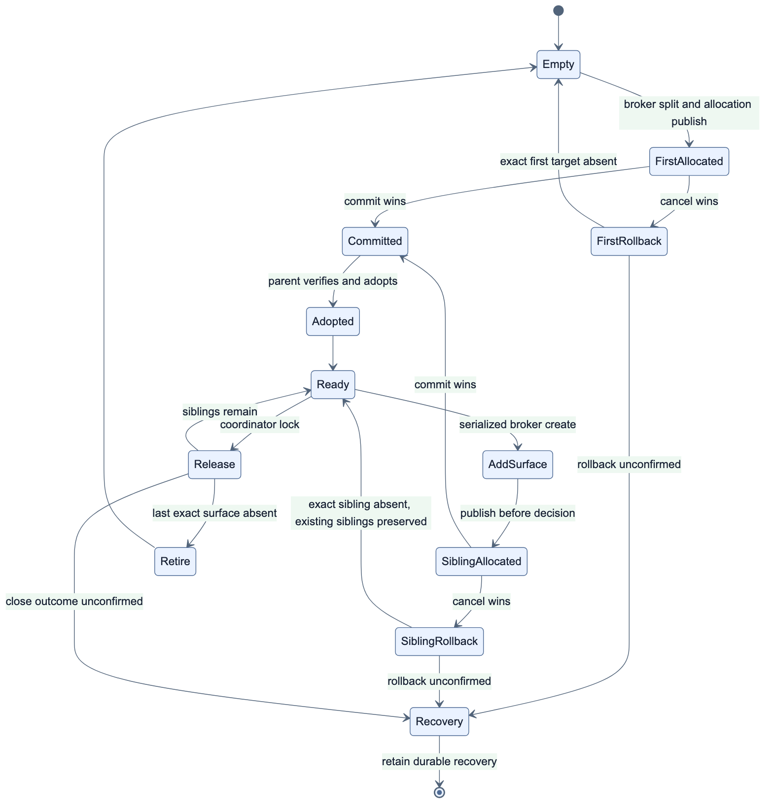

# 다중 subagent interactive pane layout 설계

> **상태:** 구현 완료. `auto`는 기본 정책이며 strict V2 layout schema, backend primitive, detached broker, process-global coordinator, runner/config propagation, nested self-extension bootstrap과 테스트가 완료됐다. 2026-07-20 cmux와 tmux `auto` live layout smoke는 모두 **PASS**했다. tmux 증거는 제한된 3 top-level + parent/2 nested scenario이며, 기존 tmux crash/reaper acceptance **PASS**는 이 layout 검증과 별개다.

이 문서는 여러 interactive subagent가 동시에 실행될 때 parent Pi의 화면이 반복 split으로 지나치게 좁아지는 문제를 해결하기 위한 구현 기준이다. 실행 protocol, completion, lease와 reaper 자체는 [cmux/tmux 기반 실제 Pi TUI 설계 및 구현](./cmux-pi-tui-design.md)을 따르고, `pi-cmux`와의 역할 분리는 [`pi-subagent`와 `pi-cmux` 연동 가이드](./pi-cmux-integration.md)를 따른다.

## 1. 결정 요약

interactive subagent의 **실행 동시성**과 **동시에 화면을 차지하는 pane 수**를 분리한다.

목표 기본 `auto` layout은 backend의 native container를 사용한다.

| backend | `auto` 배치 | parent 화면 영향 |
|---|---|---|
| cmux | 하나의 전용 오른쪽 pane 안에 child별 terminal surface를 tab으로 적층 | 최초 한 번만 split |
| tmux | child별 detached window에 단일 pane 생성 | parent window를 split하지 않음 |
| Herdr | child별 unfocused 새 tab의 strict root pane | 현재 tab을 split하거나 focus하지 않음 |

기존의 child별 오른쪽 split 방식은 명시적인 `split` 호환 모드로 남긴다. `auto`에서 tiled grid, process queue, inline overflow, nested tmux 실행은 사용하지 않는다.

```text
cmux auto
┌──────────────── parent Pi ────────────────┬──── subagent pane ────┐
│                                           │ [scout][reviewer][...] │
│                                           │ selected child Pi TUI │
└───────────────────────────────────────────┴────────────────────────┘

 tmux auto (현재 production window 이름)
window 0  parent Pi
window 1  subagent:scout:a14f82c1
window 2  subagent:reviewer:5d2e09ab
window 3  subagent:worker:91c6f7e0
```

`tmux-new-window`는 allocation 시 검증된 agent/run별 stable label을 한 번 설정한다. 형식과 protocol·recovery 경계는 [안정적인 tmux window 이름 설계 및 구현](./tmux-window-naming-design.md)을 따른다.

## 2. 문제 정의

### 2.1 `split` 호환 동작과 `auto`의 해소 방식

명시적 `split`은 모든 interactive run마다 호출자의 원래 terminal을 오른쪽으로 나누는 기존 호환 동작이다.

```text
cmux: cmux new-split right --surface <source>
tmux: tmux split-window -h -t <source-pane>
```

현재 최상위 병렬 호출 하나는 기본적으로 최대 50개 task를 받고 호출별 동시성 기본값 16을 사용한다. chain 병렬 단계의 기본 최대 task 수는 8이다. process-local scheduler가 queue fairness를 담당하고 private durable tree authority가 root parent와 모든 nested child의 실제 ACTIVE/RESERVED 합계를 `max-active`(기본 16) 이하로 제한한다. foreground parent permit transfer로 nested deadlock을 피하며 background는 spare permit만 사용한다. 같은 source pane을 반복해서 기본 비율로 나누면 대략 다음처럼 폭이 줄어든다.

```text
첫 child:  parent 1/2
둘째:      parent 1/4
셋째:      parent 1/8
넷째:      parent 1/16
```

실제 비율은 multiplexer layout에 따라 다를 수 있지만 다음 문제는 동일하다.

1. parent Pi가 가장 먼저 읽기 어려운 폭이 된다.
2. 새 child와 기존 child의 크기가 균등하지 않다.
3. Pi TUI의 editor, tool UI, dialog에 필요한 최소 열 수를 보장할 수 없다.
4. nested subagent가 자신의 좁은 pane을 다시 split하면 열화가 재귀적으로 누적된다.
5. terminal 폭이 작은 환경에서는 두 번째 또는 세 번째 split부터 launch 자체가 실패할 수 있다.

### 2.2 단순 방향 변경으로 해결되지 않는 이유

`right`를 `down`으로 바꾸면 열 부족이 행 부족으로 이동한다. `tiled` layout도 3~4개의 실제 Pi TUI와 parent를 한 화면에 모두 표시하기에는 작다.

따라서 해결 기준은 “더 좋은 split 방향”이 아니라 “동시에 실행 중인 child 수만큼 pane을 늘리지 않는 것”이다.

## 3. 목표와 비목표

### 목표

1. 병렬 호출별 동시성, process-local fairness와 tree-wide foreground/background `max-active` 상한을 설정 가능하게 유지한다.
2. 동일 root source를 공유하는 활성 `pi-subagent` allocation에 대해 cmux가 새로 관리하는 pane을 최대 하나로 제한한다.
3. tmux parent window의 크기를 interactive subagent가 변경하지 않게 한다.
4. child별 stable handle, 독립 취소, 결과 수집과 reaper를 유지한다.
5. root sibling과 nested descendant 모두 같은 폭 열화를 만들지 않게 한다.
6. launch, close, reload와 crash가 겹쳐도 다른 child나 사용자 pane을 닫지 않는다.
7. 기존 `split` 동작을 명시적 호환 모드로 제공한다.

### 비목표

- 모든 child TUI를 동시에 한 화면에 표시
- 사용자의 기존 pane을 자동 재배치하거나 균등화
- cmux와 tmux에 완전히 같은 시각적 UI 강제
- pane layout 정책 밖의 장기 사용자 소유 surface
- `pi-cmux`의 command나 내부 helper를 layout backend로 재사용
- terminal 크기를 읽어 모델이나 task 동시성을 자동 변경
- 첫 구현에서 pane 비율, 방향, tab 정렬을 세밀한 사용자 설정으로 노출

## 4. 용어

| 용어 | 의미 |
|---|---|
| run | 하나의 subagent 실행과 그 lifecycle artifact 집합 |
| allocation | run 하나에 할당된 실제 cmux surface, tmux pane 또는 Herdr pane |
| container | allocation을 담는 cmux pane, tmux window 또는 Herdr tab |
| source | 위임을 시작한 parent Pi의 cmux surface, tmux pane 또는 Herdr pane |
| shared pane | cmux에서 sibling/descendant surface를 tab으로 담는 pane |
| layout coordinator | 동시 launch를 직렬화하고 container를 선택·재사용하는 parent-process 객체 |
| legacy split | run마다 source를 `right` split하는 현재 방식 |

container는 lifecycle의 성공 기준이 아니다. child별 allocation과 completion sidecar가 계속 source of truth다.

## 5. 사용자 설정 contract

### 5.1 layout mode

현재 설정은 다음 두 값을 지원한다.

```ts
export type InteractivePaneLayout = "auto" | "split";
```

우선순위는 기존 위임 보호 설정과 같은 패턴을 따른다.

```text
CLI flag > environment variable > default
```

공개 interface:

```text
--subagent-pane-layout auto|split
PI_SUBAGENT_PANE_LAYOUT=auto|split
```

기본값은 `auto`다.

| 값 | cmux | tmux | Herdr |
|---|---|---|---|
| `auto` | shared pane + surface tabs | detached window per child | child별 unfocused `layout.apply` 새 tab의 strict root pane |
| `split` | child별 `new-split right` | child별 `split-window -h` | child별 `pane.split right` |

잘못된 값은 extension 초기화 단계에서 actionable error로 거부한다. backend launch 뒤 조용히 다른 layout이나 inline으로 fallback하지 않는다.

CLI flag에서 결정된 값도 nested child가 같은 정책을 사용하도록 child process 환경의 `PI_SUBAGENT_PANE_LAYOUT`에 resolved value를 명시적으로 전달한다. 부모 shell에 환경 변수가 없었다는 이유로 descendant가 default로 되돌아가면 안 된다.

### 5.2 첫 구현에서 노출하지 않을 설정

다음은 구현 내부 상수로 시작하고 후속 필요가 확인된 뒤 공개한다.

- split 방향
- split 비율
- shared pane 최대 surface 수
- tmux window name format
- tiled layout과 최대 visible pane 수

첫 버전의 cmux 전용 pane은 cmux 기본 split 비율을 사용한다. 반복 split 제거가 핵심이며, 기존 사용자 layout을 강제로 resize하지 않는다.

## 6. 공통 architecture와 authority 경계


_2x PNG · [SVG](./diagram/interactive-layout-coordination.svg) · [Mermaid source](./diagram/interactive-layout-coordination.mmd)_

현재 production interactive launch는 detached V2 broker가 allocation과 commit 전 rollback을 소유한다. layout은 이 안전 경계를 바꾸지 않는다. **parent-process coordinator**와 broker의 책임은 다음처럼 분리한다.

```text
runner
  ├─ parent-process InteractiveLayoutCoordinator
  │   ├─ policy: auto | split 해석
  │   ├─ 같은 parent process의 launch/release 직렬화
  │   ├─ source topology를 근거로 placement 선택
  │   └─ committed allocation의 shared-container state adopt/release
  └─ detached V2 broker
      ├─ strict launch-intent의 placement request 검증
      ├─ pre-commit native allocation (cmux split/new-surface, tmux split/new-window, Herdr split/new-tab)
      ├─ exact allocation.json durable publish
      └─ decision 경쟁과 commit 전 exact rollback
```

- coordinator는 정책, serialization, placement 선택, shared state의 adopt/release만 소유한다. pre-commit allocation을 직접 실행하거나 durable authority를 publish하지 않는다.
- broker는 **유일한 pre-commit allocator 및 durable publisher**다. 요청된 cmux split/new-surface, tmux new-window/split 또는 Herdr new-tab/split을 실행하고 canonical target을 `allocation.json`에 먼저 publish한다.
- parent는 `launch-intent.json`에 strict V2 layout placement request를 넣는다. broker의 commit 뒤에만 allocation을 읽고 request와 정확히 일치하는 target을 active registry와 coordinator state에 adopt한다. mismatch, 누락 또는 malformed field는 command target으로 쓰지 않고 recovery/retain 경로로 보낸다.
- coordinator state는 process-local 배치 최적화일 뿐 reaper authority가 아니다. startup reaper는 coordinator 없이 durable exact allocation만 descendant-first로 처리한다.

다음은 현재 production runtime의 책임 경계다. coordinator가 선택·직렬화하고 broker가 allocation-first commit을 수행한 뒤 runner가 strict record와 일치하는 allocation만 adopt한다.

| 파일 | 책임 |
|---|---|
| `src/runtime/interactive-layout.ts` | 설정 해석, process-local coordinator, placement 선택, allocation adopt/release 직렬화 |
| `src/runtime/interactive-pane.ts` | backend-neutral inspect/interrupt/close contract와 direct legacy adapter |
| `src/runtime/pane-launch-broker.mjs` | strict V2 request 검증, detached allocation, allocation-first durable publish, commit 전 rollback |
| `src/runtime/cmux.ts` | canonical topology/ID parser와 split, surface, respawn, inspect, close primitive |
| `src/runtime/tmux.ts` | source session/topology lookup, new-window/split, fingerprint, inspect, close primitive |
| `src/runtime/runner.ts` | private artifact 준비, broker launch/gate, committed allocation adopt, result/completion/reaper |
| `src/runtime/run-protocol.ts` | strict V2 intent/allocation/decision/launch/gate parser와 safe artifact IO |

### 6.1 coordinator request와 handle

coordinator는 run ID, agent name, parent depth와 source identity를 받아 **placement request**를 선택한다. task, prompt, secret은 title·metadata·request에 넣지 않는다. `agentName`과 `runId`는 짧은 진단용 title에만 쓴다.

broker가 commit한 allocation을 parent가 adopt한 뒤의 handle은 container가 아니라 child PTY의 exact allocation을 가리킨다. cmux는 canonical workspace/surface/pane UUID, tmux는 socket/server/pane/pane-PID fingerprint를 보존한다. container ID는 배치 선택·진단용이며 reaper의 broad close target이 아니다.

## 7. cmux `auto` 상세 설계

### 7.1 placement 선택은 parent, allocation은 broker

cmux의 계층은 `window → workspace → pane → surface(tab)`다. parent coordinator는 canonical source topology와 자신의 committed shared state를 보고 다음 strict request 중 하나를 선택한다.

| 상황 | parent가 intent에 요청하는 placement | broker가 commit 전 실행하는 동작 |
|---|---|---|
| root source에 adopt된 shared pane이 없음 | `cmux-split` + source container | source surface의 unfocused `new-split right` |
| 같은 root source에 matching shared pane이 있음 | `cmux-new-surface` + exact shared pane container | 그 pane의 unfocused `new-surface` |
| nested cmux | `cmux-new-surface` + exact source-pane container | source surface가 실제로 속한 pane의 `new-surface` |
| 명시적 `split` mode | `cmux-split` + source container | source surface의 unfocused `new-split right` |

nested 여부만으로 pane을 추측하지 않는다. nested coordinator는 `CMUX_SURFACE_ID`와 canonical workspace tree에서 **exact source topology**를 읽어 enclosing pane을 확인한 뒤 source-pane stacking을 요청한다. source가 stale, container가 source와 맞지 않거나 tree가 incomplete이면 focused surface로 대체하지 않고 launch를 실패시킨다.

broker는 `--focus false`를 유지하며 request가 요구한 canonical workspace/source/container 관계를 재검증한다. allocation response의 workspace, pane, surface ID가 모두 canonical이고 request와 일치할 때만 immutable `allocation.json`을 publish한다. parent는 commit 뒤 matching allocation만 adopt하고, 그 뒤 gate/respawn으로 wrapper를 시작한다. 실패·취소에서는 broker 또는 committed parent가 **그 exact surface만** 닫는다.

### 7.2 shared state와 마지막 surface



_2x PNG · [SVG](./diagram/cmux-shared-pane-lifecycle.svg) · [Mermaid source](./diagram/cmux-shared-pane-lifecycle.mmd)_

root coordinator의 state는 `(workspaceId, sourceSurfaceId)`별로 adopt된 shared `paneId`와 active managed `surfaceId` 집합만 가진다. allocation과 release는 같은 mutex/promise queue로 직렬화한다. `coordinator.release`는 exact allocation을 닫기 **전에** 이 lock을 획득하고, close outcome 및 matching active-set 갱신·빈 state retire까지 lock을 유지한다. close가 terminal outcome을 확인하지 못하면 allocation/state는 recovery 대상으로 남기며, stale `paneId`를 다음 allocation에 재사용하지 않는다.

```text
empty → broker split commit → parent adopt → ready
ready → broker new-surface commit → parent adopt → ready
release: lock → exact surface close → close outcome
  ├─ terminal/absent → active set 갱신 → empty state retire → unlock
  └─ unconfirmed    → recovery state retain → unlock
```

첫 surface가 먼저 종료되어도 sibling surface를 닫지 않는다. 마지막 surface 이후 fixture가 확인한 cmux `0.64.20` 동작은 `last_surface_pane=removed`다. 따라서 parent는 `coordinator.release`가 같은 lock 안에서 exact last surface의 absence/commit lifecycle과 state retire를 처리하게 하며, pane close나 stale-pane 재사용을 시도하지 않는다. 사용자가 surface를 옮기거나 추가한 pane도 user-owned로 보고 close·move·resize·reuse하지 않는다.

### 7.3 Phase 0으로 확인된 cmux contract

`test/fixtures/cmux-layout-contract-v1.json`은 gated live probe가 고정한 sanitized fixture다. fixture가 지원하는 semantic cmux `0.64.20`에서 다음을 확인했으므로 Phase 0은 **GO**다.

- fixture의 `new-split`과 `new-surface` response가 direct top-level canonical `workspace_id`, `pane_id`, `surface_id`를 가지며, split과 new-surface는 같은 workspace/pane, 서로 다른 surface다.
- 필요한 capabilities는 `surface.create`, `surface.close`, `surface.send_key`, `surface.respawn`이다.
- 마지막 managed surface를 닫으면 그 pane은 `removed`다.

이는 command syntax·identity·retire 전제를 검증한 fixture evidence다. production runtime은 이 contract 위에서 strict V2 schema, backend primitive, broker, coordinator, 설정/runner 연결을 사용해 `auto` placement를 수행한다. 지원되지 않는 capability 또는 version은 actionable error를 반환하며, 사용자는 `--subagent-pane-layout=split`으로 명시적 호환 모드를 선택할 수 있다.

## 8. tmux `auto` 상세 설계

### 8.1 detached same-session window

tmux의 계층은 `server → session → window → pane`이며 pane 안의 cmux-style surface tab이 없다. parent coordinator는 source pane의 stable session ID를 canonical query로 확인하고 `auto`에서 `tmux-new-window` placement를 선택한다. strict request의 container는 exact socket/server/session이며 broker는 해당 session에 detached `new-window -d -P`를 만든다. topology와 allocation의 machine-readable format은 locale/client가 tab을 바꿀 수 있으므로 printable `|`를 delimiter로 사용한다.

```text
tmux [-S <socket>] list-panes -a -F '#{pane_id}|#{session_id}|#{window_id}|#{pane_pid}'
```

```text
tmux [-S <socket>] new-window -d -P \
  -F '#{session_id}|#{window_id}|#{pane_id}|#{pane_pid}' \
  -t '<session-id>:' -n 'subagent:<agent-token>:<8-char-run-prefix>' \
  -c <cwd> "<staged broker>"
```

현재 production runner는 strict V2/V3 `tmux-new-window` intent에 canonical `windowLabel`을 넣고 broker는 allocation 전에 이를 검증한다. label-less 과거 artifact는 recovery/reaper에서만 읽으며 신규 mutation authority가 아니다. 상세 계약은 [안정적인 tmux window 이름 설계 및 구현](./tmux-window-naming-design.md)을 따른다.

broker는 source socket/server/session 관계와 returned session/window/pane/PID를 검증한 뒤 exact allocation을 durable publish한다. parent는 commit 뒤 request와 matching allocation만 adopt한다. 모든 depth의 nested tmux도 같은 session의 detached window를 요청한다. source/ancestor window를 다시 split하지 않는다.

명시적 `split` compatibility mode만 `tmux-split` + exact source-pane container를 요청한다. 그 경우 broker가 existing `split-window -h` allocation path를 쓴다. lifecycle은 stable pane ID와 server/pane-PID fingerprint로 inspect, Escape, exact `kill-pane`을 수행하며 session/window 전체를 닫지 않는다.

## 9. Herdr `auto` 상세 설계

Herdr `auto`는 protocol 19/20 공통 `layout.apply`를 정확히 한 번 사용합니다. request는 immutable source workspace와 일치하고 `tab_id`는 **없으며**, `focus: false`, bounded diagnostic `tab_label`, 하나의 root pane과 `[wrapperPath]` direct exact argv를 가집니다. root pane의 initial `cwd`는 trusted filesystem root이고, direct wrapper는 gate 통과 뒤 validated effective task/workspace `cwd`로 이동한 후 Pi를 시작합니다. 이 순서는 gate 전에 프로젝트 `bunfig.toml` 또는 Bun preload가 broker/verifier에 적용되는 일을 막습니다.

socket owner/mode, exact `HERDR_*` environment binding 및 protocol 19/20 fail-closed 점검 절차는 [cmux/tmux/Herdr 실제 Pi TUI 설계의 Herdr troubleshooting](./cmux-pi-tui-design.md#102-herdr-fail-closed-점검)을 따른다. broker는 mutation 전에 `herdr-workspace.workspaceId`가 immutable source workspace와 정확히 같은지 확인한다. `layout_apply.layout.root`의 strict discriminator·workspace·new-tab·root-pane·argv/cwd binding을 먼저 확인하고, 그 root pane을 `pane.get`으로 조회해 terminal binding을 확정할 때만 allocation을 수용한다. command line을 typed/display하지 않으며 auto의 gate rejection은 조용하다. 별도 tab 생성 RPC, `pane.send_text`, parent `pane.send_keys`/`pane.close`, auto rollback은 사용하지 않는다.

`split`은 `herdr-source.workspaceId/tabId/paneId/terminalId` 네 값 모두가 immutable source와 정확히 같을 때만 source pane의 기존 오른쪽 split 호환 경로를 사용하고 `pane.send_text`로 wrapper를 delivery한다. 따라서 이 legacy mode는 숨겨진 command text나 atomic terminal binding을 약속하지 않는다. target pane ID가 immutable source pane ID 또는 terminal identity로 직전에 rebound한 current source pane ID와 같거나, terminal ID가 immutable source terminal ID와 같거나, tab/workspace binding이 맞지 않으면 dispatched mutation의 unknown outcome으로 fail-closed한다. label 또는 topology diff로 target을 채택하지 않는다. durable allocation에는 child tab provenance를 남긴다. auto의 post-launch cancellation은 authenticated child bridge의 cooperative `ctx.abort()`/`ctx.shutdown()`만 사용한다. present/unknown/hung child는 recovery/manual cleanup 상태와 late watcher를 유지하고, bounded `pane.list`가 confirmed absence를 보일 때만 retire한다. terminal이 이후 다른 tab으로 rebind되면 자동 interrupt/close와 reaper close는 보류하며, 수동 focus도 protocol과 current terminal binding을 다시 검증한 뒤에만 가능하다.

## 10. legacy `split` mode

`split`은 기존 화면 동작을 보존하는 explicit compatibility policy다.

```text
cmux: source surface 오른쪽에 run별 split
tmux: source pane 오른쪽에 run별 split
Herdr: source pane 오른쪽에 run별 split
```

반복 split으로 parent 폭이 줄어드는 것은 이 mode의 의도된 trade-off다. `auto` capability 부재, tiled 재배치, queue, inline fallback을 자동으로 선택하지 않는다.

## 11. V2 lifecycle protocol과의 결합

layout 변경은 result/completion channel을 바꾸지 않는다.

```text
result channel    = child session JSONL
control channel   = state/completion/parent lease sidecar
terminal backend  = broker allocation + parent committed lifecycle
```

### 11.1 backward-compatible strict V2 layout schema migration

obsolete `LaunchRecordV1`에 optional placement/container diagnostics를 덧붙이는 방식은 사용하지 않는다. V2 parser는 **두 개의 exact branch**를 지원한다.

1. 현재의 legacy V2 intent/allocation처럼 layout field가 전혀 없는 record는 backward compatibility를 위해 `split` allocation으로 해석한다. legacy record의 existing strict key set은 넓히지 않는다.
2. 새 layout-aware V2 intent/allocation은 `layout`, `placement`, `container`를 모두 가지며, 각 discriminant별 exact key set과 canonical identity 관계를 만족해야 한다. optional generic field, mixed backend field, `*_ref`, partial container는 거부한다.

구현 schema는 다음 strict discriminated branch를 enforce한다. 아래는 layout portion만 보인 **축약 excerpt**이며, parent/reaper parser는 [`src/runtime/run-protocol.ts`](../src/runtime/run-protocol.ts), detached broker parser는 [`src/runtime/pane-launch-broker.mjs`](../src/runtime/pane-launch-broker.mjs)가 각각 source of truth다. 두 parser와 broker/parent binding의 직접 증거는 `test/runtime/run-protocol.test.ts` 및 `test/runtime/pane-launch-broker.test.ts`다. 이 excerpt를 완전한 object shape로 취급하면 안 된다.

```ts
type LayoutModeV2 = "auto" | "split";
type CmuxSourceContainerV2 = {
  kind: "cmux-source"; workspaceId: string; sourceSurfaceId: string;
};
type CmuxPaneContainerV2 = {
  kind: "cmux-pane"; workspaceId: string; paneId: string;
};
type CmuxSourcePaneContainerV2 = {
  kind: "cmux-source-pane"; workspaceId: string; sourceSurfaceId: string; paneId: string;
};
type TmuxSourcePaneContainerV2 = {
  kind: "tmux-source-pane"; socketPath?: string; serverPid: number;
  sessionId: string; windowId: string; paneId: string; panePid: number;
};
type TmuxSessionContainerV2 = {
  kind: "tmux-session"; socketPath?: string; serverPid: number;
  sessionId: string; sourceWindowId: string;
};
type HerdrSourceContainerV2 = {
  kind: "herdr-source"; workspaceId: string; tabId: string;
  paneId: string; terminalId: string;
};
type HerdrWorkspaceContainerV2 = {
  kind: "herdr-workspace"; workspaceId: string;
};
type HerdrTabContainerV2 = {
  kind: "herdr-tab"; workspaceId: string; tabId: string;
};

type LayoutPlacementRequestV2 =
  | { layout: LayoutModeV2; placement: "cmux-split";
      container: CmuxSourceContainerV2 }
  | { layout: "auto"; placement: "cmux-new-surface";
      container: CmuxPaneContainerV2 | CmuxSourcePaneContainerV2 }
  | { layout: "split"; placement: "tmux-split";
      container: TmuxSourcePaneContainerV2 }
  | { layout: "auto"; placement: "tmux-new-window";
      container: TmuxSessionContainerV2 }
  | { layout: "split"; placement: "herdr-split";
      container: HerdrSourceContainerV2 }
  | { layout: "auto"; placement: "herdr-new-tab";
      container: HerdrWorkspaceContainerV2 };

type LayoutAllocationFieldsV2 =
  | { layout: LayoutModeV2; placement: "cmux-split";
      container: { kind: "cmux-pane"; workspaceId: string; paneId: string } }
  | { layout: "auto"; placement: "cmux-new-surface";
      container: { kind: "cmux-pane"; workspaceId: string; paneId: string } }
  | { layout: "split"; placement: "tmux-split";
      container: { kind: "tmux-window"; socketPath?: string; serverPid: number;
        sessionId: string; windowId: string; paneId: string; panePid: number } }
  | { layout: "auto"; placement: "tmux-new-window";
      container: { kind: "tmux-window"; socketPath?: string; serverPid: number;
        sessionId: string; windowId: string; paneId: string; panePid: number } }
  | { layout: "split"; placement: "herdr-split";
      container: HerdrTabContainerV2 }
  | { layout: "auto"; placement: "herdr-new-tab";
      container: HerdrTabContainerV2 };
```

새 layout-aware `LaunchIntentV2`는 source identity와 `LayoutPlacementRequestV2`가 backend/mode에 맞는 위의 정확한 branch일 때만 valid다. 예를 들어 cmux `auto`의 root 첫 allocation은 `cmux-split`/`cmux-source`, existing shared pane은 `cmux-new-surface`/`cmux-pane`, nested source stacking은 `cmux-new-surface`/`cmux-source-pane`이어야 한다. tmux `auto`는 `tmux-new-window`/`tmux-session`만, `split`은 `tmux-split`/`tmux-source-pane`만 허용한다. Herdr `auto`는 `herdr-new-tab`/`herdr-workspace`만 허용하며 workspace는 immutable source와 같아야 한다. Herdr `split`은 `herdr-split`/`herdr-source`만 허용하며 workspace/tab/pane/terminal 전체가 immutable source와 같아야 한다.

새 layout-aware `AllocationRecordV2`는 matching `LayoutAllocationFieldsV2`를 포함한다. broker가 request의 `layout`/`placement`을 반복하고, `container`에는 exact created container만 durable 기록한다 (cmux pane UUID 또는 tmux socket/server/session/window/pane fingerprint). target identity는 기존처럼 child surface 또는 pane fingerprint다. parent adoption은 intent request와 allocation의 backend, layout, placement, container relation, target을 모두 비교한다.

**tmux binding rules:** `tmux-split` allocation의 `sessionId`와 `windowId`는 source request의 `sessionId`와 `windowId`와 정확히 같아야 하며, allocated container의 `(socketPath, serverPid, paneId, panePid)` fingerprint는 target과 정확히 같아야 한다. `tmux-new-window` allocation의 `sessionId`는 요청된 session과 정확히 같아야 하고, allocated `windowId`는 broker가 `new-window`로 생성한 새 window여야 하며, allocated container의 pane fingerprint는 target과 정확히 같아야 한다. 어느 binding이라도 불일치하면 parent는 allocation을 adopt, start 또는 close하지 않는다.

`DecisionV2`, committed `launch.json`, `launch.gate`는 layout diagnostics를 위한 optional field를 추가하지 않는다. 이 artifact들은 현재처럼 commit/dependency/ownership 또는 start authorization에 실제 필요한 exact fields만 가진 strict record로 유지한다. `launch`과 `gate`가 allocation path/mode chain으로 layout-aware allocation에 의존하는 것으로 충분하다.

### 11.2 정상 종료, cancel, crash

1. `agent_settled` completion 확인 및 final session drain
2. parent가 `coordinator.release`를 호출하고, release가 shared serialized lock을 획득한 뒤 exact committed handle을 close
3. release가 close outcome을 처리한 뒤에도 lock을 유지한 채 terminal/absent가 확인된 matching adopted allocation만 active set에서 제거하고, 마지막 surface면 state를 retire; 확인되지 않은 close는 recovery state로 retain
4. secret/task/wrapper artifact 정리

shutdown과 completion이 경쟁해도 close/release는 idempotent하다. cmux/tmux과 Herdr `split` cancel은 exact allocations에 Escape를 보낸 뒤 grace period 후 exact close한다. Herdr `auto`는 인증된 child bridge의 cooperative `ctx.abort()`/`ctx.shutdown()`만 요청하며 parent `pane.send_keys`, `pane.close`, rollback 또는 reaper mutation을 하지 않는다. cmux shared pane, tmux session/window, Herdr tab, user container에는 broad close를 보내지 않는다.

parent crash 또는 startup reaper는 coordinator 상태를 읽지 않는다. immutable allocation/intent dependency chain에서 exact target만 찾고 descendant-first로 cleanup한다. 같은 cmux pane을 공유하는 records도 surface별로 닫으며, tmux는 socket/server/pane/pane-PID fingerprint가 모두 맞을 때만 닫는다. Herdr auto child가 present/unknown/hung이면 recovery/manual cleanup과 late watcher를 유지하고 confirmed terminal absence에서만 retire한다. layout migration 뒤에도 reaper는 coordinator-independent exact allocation reaper로 남는다.

## 12. race와 failure 처리

### 12.1 동시 최초 launch

요구사항:

```text
N개의 root sibling이 동시에 allocate
→ new-split 정확히 1회
→ new-surface 정확히 N-1회
```

첫 broker split이 실패하면 parent coordinator는 shared state를 adopt/publish하지 않는다. 대기 중인 request는 다음 순서에서 재시도하거나 동일한 actionable error를 받는다. 부분 allocation 또는 handle을 성공으로 반환하지 않는다.

### 12.2 command delivery 실패

broker allocation 뒤 parent gate/respawn 또는 staged verifier의 wrapper 시작 확인에 실패하면 해당 committed allocation만 exact cleanup한다.

- cmux: recorded surface만 close
- tmux: recorded pane fingerprint를 재검증한 뒤 kill

기존 sibling과 사용자 container를 rollback 대상으로 삼지 않는다.

### 12.3 첫 child가 먼저 종료

첫 child surface가 shared pane을 만들었다는 이유로 container owner가 되지 않는다. 먼저 종료되면 그 surface만 닫고 나머지 surface는 계속 실행한다.

### 12.4 마지막 child 종료와 새 launch 경쟁

`coordinator.release`는 exact last allocation을 닫기 전에 allocation과 같은 serialized lock을 획득하고, close outcome·active-set 제거·empty-state retire까지 이를 유지한다. 따라서 대기 중인 allocate는 stale last-surface `paneId`를 관찰하거나 재사용할 수 없다. release 뒤 새 allocation은 live active state만 사용하고, retire된 state를 관찰하면 새 shared pane을 만든다. 남아 있는 pane이 user surface를 담는지 판별하거나 그 pane을 되살리는 경쟁 상태를 만들지 않는 보수적 정책이다.

### 12.5 reload

`/reload` 또는 session shutdown은 active run shutdown을 먼저 수행한다. coordinator는 모든 allocation release 뒤 메모리 state를 비운다. reload 후 이전 process의 in-memory pane ID를 재사용하지 않는다.

### 12.6 사용자의 수동 layout 변경

사용자는 실행 중 다음 작업을 할 수 있다.

- cmux surface를 다른 pane/workspace로 이동
- cmux pane이나 surface 직접 닫기
- tmux pane을 다른 window로 이동
- tmux window 이름 변경

원칙:

1. stable allocation ID가 존재하면 이동된 위치에서도 inspect/close한다.
2. allocation이 사라지면 completion 이전에는 실행 오류로 처리한다.
3. 이름이나 pane index 변화는 오류로 보지 않는다.
4. fingerprint가 달라지면 ID 재사용 가능성으로 간주해 close하지 않는다.
5. shared container state가 실제 tree와 다르면 state를 무효화하고 다음 launch에서 재구성한다.

## 13. UX 세부 정책

### 13.1 focus

자동 launch는 parent focus를 유지한다.

- cmux: `--focus false`
- tmux: `new-window -d`
- Herdr: `layout.apply` 또는 `pane.split`의 `focus: false`

background 실행 여부와 focus 여부는 별개다. foreground subagent 호출도 child TUI로 focus를 강제 이동하지 않는다. `/subagents focus`는 negotiated cmux 또는 protocol-gated Herdr의 exact rebound child pane에만 사용하며, tmux는 fail-closed한다.

### 13.2 cross-backend pane title (구현됨)

wrapper는 cmux/tmux 모두에서 printable-ASCII base title `<agent> [depth=<n>;run=<prefix>]`를 사용한다. effective child environment와 `cwd`를 설치한 직후, tree permit이 child를 `STOP`할 수 **전에** wrapper가 `<base> · queued` OSC title을 발행한다. 이어 child bridge가 정확히 `ready`, `running`, `waiting`, `returning`, `failed` suffix를 쓴다. 즉 허용 lifecycle suffix 전체는 `queued`, `ready`, `running`, `waiting`, `returning`, `failed`이며, abort는 `waiting`으로 표시한다. 최종 title은 control 문자를 제거한 96자 이내이며 task, prompt, secret, cwd를 포함하지 않는다.

```text
reviewer [depth=2;run=a14f82c1] · queued
reviewer [depth=2;run=a14f82c1] · running
reviewer [depth=2;run=a14f82c1] · returning
```

pane/surface title은 lifecycle/cleanup authority가 아니다. title 설정 또는 관측 실패는 lifecycle 실패로 승격하지 않으며 `/subagents details`는 raw title 대신 managed title과 `matching|changed|unavailable`만 표시한다. gated live smoke는 `queued` title을 먼저 정확히 관측한 뒤 barrier를 해제해 lifecycle title을 검증한다. 2026-07-27 isolated tmux smoke는 현재 title 형식의 `queued → running`, stable window label, user rename과 target 정리 뒤 source·sentinel 보존을 **PASS**했다. 이 smoke는 production runner/broker를 우회하므로 production-path live 증거는 아니다. 2026-07-23 cmux PASS는 이전 title 형식의 historical evidence이며 현재 cmux 형식의 재실행 통과는 이 문서에서 주장하지 않는다.

현재 production tmux broker는 **window 이름**을 `subagent:<agent-token>:<8-char-run-prefix>`로 allocation 시 한 번 설정한다. pane title의 lifecycle 갱신은 이 이름을 바꾸지 않으며 user rename도 복구하지 않는다. 이름은 cleanup authority가 아니고 exact tmux fingerprint만 기존 lifecycle 판단에 사용한다. strict protocol 전달, legacy recovery와 검증 상태는 [안정적인 tmux window 이름 설계 및 구현](./tmux-window-naming-design.md)에 기록한다.

### 13.3 어떤 child가 보이는가

cmux shared pane에서는 첫 surface가 기본 선택 상태일 수 있고, 이후 `--focus false` surface는 tab으로만 추가된다. 자동 tab 전환은 사용자의 화면을 흔들 수 있으므로 하지 않는다.

tmux에서는 parent window를 계속 표시한다. 사용자는 tmux status line이나 choose-tree로 child window를 선택한다.

### 13.4 `pi-cmux`와의 관계

각 cmux surface에서 로드된 `pi-cmux` sidebar/progress/log는 그대로 동작할 수 있다. surface별 status key를 사용하므로 stacked surface끼리 충돌하지 않는다.

`agent_end` 알림과 flash가 병렬 child마다 발생할 수 있는 문제는 layout과 별개다. 이 억제는 더 이상 후속 항목이 아니다. `inherit` child에는 `pi-subagent`가 검토된 `subagent-child-v1` profile로 `PI_CMUX_NOTIFY_LEVEL=disabled`와 `PI_CMUX_SIDEBAR_FLASH=disabled`를 주입하며, parent 알림은 유지한다. `managed` child는 inherited `pi-cmux` 자체를 로드하지 않는다. 자세한 package 경계와 profile은 [`pi-subagent`와 `pi-cmux` 연동 가이드](./pi-cmux-integration.md)를 따른다.

## 14. 보안과 안전

1. task, prompt, API key를 title이나 CLI metadata에 넣지 않는다.
2. wrapper path는 기존 shell quoting 규칙을 유지한다.
3. cmux/tmux command target은 stable UUID/ID를 사용한다.
4. stale source를 focused pane으로 임의 대체하지 않는다.
5. shared container를 통째로 닫지 않고 exact allocation만 닫는다.
6. tmux server/pane fingerprint 검증을 layout 변경 뒤에도 유지한다.
7. malformed JSON/ID는 launch 실패로 처리하고 command target으로 사용하지 않는다.
8. 새 strict layout intent/allocation artifact도 기존 private run directory 권한과 immutable publish 규칙을 유지한다.

## 15. 구현과 검증 상태

`auto`와 `split` runtime wiring은 구현됐다. 이 문서의 historical layout PASS는 M0 performance benchmark나 JSONL/completion/wrapper polling 제거의 증거가 아니다. title은 별도 gated real tmux/cmux smoke로 검증한다. 현재 source에는 strict V2 layout branch·binding, cmux `new-surface`/topology, tmux same-session `new-window`/fingerprint, detached broker의 allocation-first publish, process-global coordinator의 adopt/release lock, runner의 gate·exact cleanup, CLI/env policy 전파가 연결돼 있다. `auto`는 기본값이고 `split`은 명시적 호환 모드다.

이 구현 사실과 stress/acceptance 증거는 구분한다. static scope는 `test/runtime/interactive-layout.test.ts`, `test/runtime/run-protocol.test.ts`, `test/runtime/cmux.test.ts`, `test/runtime/tmux.test.ts`, `test/runtime/pane-launch-broker.test.ts` 및 관련 runner/reaper test가 다룬다. cmux와 tmux `auto` live layout smoke는 모두 **PASS**했지만, tmux는 3 top-level + parent/2 nested의 제한된 scenario만 다룬다.

## 16. 실제 테스트 범위와 미검증 acceptance

### 16.1 static test에서 직접 확인한 범위

- layout resolver의 `auto` 기본값, CLI > env 우선순위와 exact lowercase 거부
- coordinator root `auto`의 N=`1/6/16/17/50` deterministic stress: split 정확히 1회, `new-surface` N-1회, unique target, staggered reverse release와 final active count 0
- `split`의 N=`1/6/16/17/50` stress: 모든 allocation이 split이고 nested caller의 exact source 및 independent root lock을 확인
- 첫 split failure 중 queue된 allocator가 lock을 이어받아 새 split으로 성공하고 phantom shared state를 남기지 않음
- nested source-pane request, explicit `split`, stale shared pane 무효화, exact allocation adopt, release/allocate race와 retry/idempotence
- `mapConcurrent` N=`17/50`: worker 최대 16, 결과 index 보존, abort 뒤 dequeue 없음
- cmux의 strict canonical topology·surface lifecycle과 tmux의 complete-row topology/fingerprint·same-session window primitive
- broker/protocol의 strict layout branch, allocation-first publish, Herdr allocated-tab provenance 보존, source/target alias 거부와 exact cleanup binding
- runner public lifecycle seam과 deterministic fake backend component harness: foreground/background/parallel-chain overlap, cancel·external-close·shutdown·reload 이후 source/sentinel 비변형 및 exact target cleanup

### 16.2 아직 주장하지 않는 범위

다음은 구현 wiring 또는 설계 목표이지만 현재 automated/live acceptance로 확인됐다고 주장하지 않는다.

- N=`1/6/16/17/50` deterministic component stress는 추가됐지만, 실제 broker→runner full-path에서 foreground/background가 겹쳐 active allocation이 16을 초과하는 live stress
- 결과 순서, cancel, chain parallel stage, background job을 실제 broker/runtime과 함께 묶은 end-to-end integration coverage
- child별 완료·cancel·`/reload`·parent crash·TUI 입력을 포함한 폭넓은 live smoke

`acceptance:layout:dry-run`은 기존 isolated safety harness를 mutation 없이 호출해 required live gate와 source/sentinel 보존·exact cleanup evidence contract를 표시한다. `acceptance:layout`은 같은 harness를 실행하지만 `PI_SUBAGENT_LIVE_TMUX=1` 및 `PI_SUBAGENT_LIVE_CMUX=1`이 없으면 실패한다. dry-run은 live PASS를 주장하지 않는다.

현재 broker launch closure에는 fake backend 주입 seam이 없으므로, M1은 public lifecycle helper와 coordinator를 결합한 deterministic component harness까지만 검증한다. 위 항목들은 별도 broker/runtime integration 또는 명시적으로 gated live acceptance가 추가되기 전까지 **planned/unverified**다.

### 16.3 live layout evidence

cmux와 tmux `auto` smoke는 20절의 제한된 scenario에서 각각 **PASS**했다. tmux는 top-level child 3개와 nested parent + descendant 2개를 검증했으며, 이는 6개 coordinator unit concurrency나 50 task/16 초과 stress의 증거가 아니다. 기존 tmux crash/reaper **PASS**는 parent crash와 exact reaper cleanup의 별도 acceptance로, 이 layout 검증을 대체하지 않는다.

## 17. acceptance criteria 상태

| 기준 | 상태 |
|---|---|
| 기본 layout `auto`, CLI > env > default, exact lowercase validation 및 nested resolved-policy 상속 | ✓ |
| cmux root sibling shared pane, nested source-pane stacking, `split` compatibility | ✓ |
| tmux same-session detached window `auto`, `split` compatibility | ✓ |
| process-global coordinator, broker-only pre-commit allocation, strict layout records, release lock 및 shutdown fence | ✓ |
| child별 exact surface/pane lifecycle·reaper cleanup과 shared container/window/session broad-close 방지 | ✓ |
| schema/primitives/broker/coordinator/runner/auth/reaper 테스트 | ✓ |
| cmux live layout smoke | PASS — 2026-07-20, 20절 evidence |
| tmux `auto` layout live smoke | PASS — 2026-07-20; 3 top-level + parent/2 nested limited smoke. 이전 tmux crash/reaper PASS는 별도 acceptance. |

## 18. 보류한 대안

### 18.1 tiled grid

동시에 여러 child를 볼 수 있지만 parent를 포함한 3~5개의 Pi TUI가 모두 작아진다. tmux는 `select-layout tiled`를 지원하지만 cmux와 동작 차이가 크고 nested 문제도 남는다. 기본안에서 제외한다.

### 18.2 visible pane 수 제한과 queue

pane 수는 제한되지만 task 실행도 대기해 병렬 위임의 장점을 잃는다. layout 때문에 scheduler 의미를 바꾸지 않는다.

### 18.3 overflow를 inline/background로 실행

사용자가 요청하거나 환경이 결정한 interactive mode를 layout 압박 때문에 조용히 바꾸면 결과 관찰과 오류 semantics가 달라진다. 사용하지 않는다.

### 18.4 tmux preview slot과 `swap-pane`

child는 detached window에서 실행하고 하나의 side preview pane과 `swap-pane`으로 선택 child를 교체할 수 있다. UX는 좋을 수 있지만 container 이동, focus, pane fingerprint와 cleanup race가 크게 늘어난다. auto v1 안정화 뒤 별도 설계로 검토한다.

### 18.5 cmux child별 workspace

각 child가 전체 크기를 얻지만 workspace가 빠르게 늘고 parent와 child의 시각적 연관성이 약해진다. cmux가 이미 pane 내부 surface tab을 제공하므로 기본안으로 선택하지 않는다.

### 18.6 side pane 내부에 nested tmux 실행

backend를 중첩해 PTY, keybinding, resize, cancel과 orphan 처리를 이중화한다. 사용하지 않는다.

## 19. Phase 0: cmux CLI probe — GO readiness

Phase 0 gated live probe 결과는 semantic cmux `0.64.20` 지원 fixture로 [`test/fixtures/cmux-layout-contract-v1.json`](../test/fixtures/cmux-layout-contract-v1.json)에 고정했다. 따라서 cmux CLI contract readiness는 **GO**다.

| 확인한 기준 | fixture 증거 |
|---|---|
| `new-split`, `new-surface`, `tree`, `respawn-pane`, `close-surface`와 required surface capabilities | `surface.create`, `surface.close`, `surface.send_key`, `surface.respawn`가 모두 `true` |
| allocation identity | 두 response가 direct top-level canonical `workspace_id`, `pane_id`, `surface_id`를 가지며 workspace/pane은 같고 surface는 다름 |
| 마지막 surface retire 전제 | `last_surface_pane`이 `removed` |

fixture는 sanitized response envelope과 direct canonical identity 관계를 parser test가 검증하는 durable Phase 0 evidence다. fixture guard는 `bun test test/runtime/cmux.test.ts`이며, fixture를 새 live probe 결과로 교체하는 유일한 경로는 `PI_SUBAGENT_CMUX_LAYOUT_PHASE0=1 bun run acceptance:cmux-layout-phase0`이다. 이 fixture와 strict V2 schema, cmux/tmux backend primitive, detached broker, parent coordinator, 설정·runner 연결은 production `auto` runtime에 모두 반영됐다. live 범위는 20절의 cmux 및 제한된 tmux **PASS**를 따른다.

## 20. Live layout smoke 기록

> 각 backend subsection의 ID는 해당 backend의 2026-07-20 live smoke snapshot/evidence에서 온 것이다. 검증용 temporary nested agent들은 모두 제거했으며 패키지에 bundled agent는 없다.

### cmux `auto` — PASS (2026-07-20)

- top-level child 3개는 새 pane `909DD661-5AAF-4EF6-BF3B-12F95686B4FD` 하나에 surface 3개를 만들었고, child별 exact cleanup 뒤 해당 allocation이 남지 않았다.
- nested parent와 descendant 2개는 pane `5FAA4688-5D83-4208-B61F-30DE1E699B55` 하나에 surface 3개를 만들었다. staggered close 동안 sibling surface가 유지됐고 마지막까지 exact cleanup이 확인됐다.
- 호출자 workspace `E036C9A7-A8CC-476E-BB21-9B027E60E430`와 source surface `210452A4-9422-46AA-B654-842EC0E0DDC0`는 두 scenario 모두 보존됐다.

이 smoke는 cmux `auto` layout의 shared-pane/stacking 및 exact cleanup evidence다. 기존 cmux crash/reaper acceptance 기록은 별도 lifecycle/crash 범위를 계속 보장한다.

### tmux `auto` — PASS (2026-07-20)

환경은 tmux `3.7b`, server PID `53463`이었다. cmux identity는 없었고 기본 `auto` policy를 사용했다. source는 session `$8`, window `@13`, pane `%20`, pane PID `19506`이었다.

- **Top-level 병렬 3개:** 같은 session에 detached window `@14`/`@15`/`@16`과 각각의 단일 pane `%21`/`%22`/`%23`이 생성됐다. source `@13`은 계속 단일 pane이었고 initial launch snapshot도 source가 active인 상태를 보존했다. 세 child 모두 marker를 반환했다. 완료 뒤 세 window/pane은 모두 사라졌고 source는 보존됐다. 무관한 session `$0`, window `@0`, pane `%0`도 보존됐다.
- **Nested temporary project agent:** 검증 전용 agent는 `bash`, `subagent`만 허용했고 이후 제거했다. parent는 `@17`/`%24`, nested descendant는 `@18`/`%25`, `@19`/`%26`의 같은-session detached 단일-pane window로 생성됐다. source는 한 번도 split되지 않았다. child window는 parent가 남아 있는 동안 먼저 사라졌고, 그 뒤 parent도 사라졌다. source와 무관한 session `$0`/window `@0`/pane `%0`은 모두 보존됐다.
- broker 또는 acceptance process, tmux log leak은 남지 않았으며 temporary `.pi`도 제거됐다.

이 evidence는 tmux `auto` detached-window placement와 exact cleanup의 제한된 live smoke다. `50` task 또는 `>16` active allocation stress, cancel, reload는 검증하지 않았고, `split`은 unit/static 검증 범위에만 있다. 2026-07-20의 tmux crash/reaper acceptance **PASS**는 parent crash와 exact reaper cleanup의 별도 증거로, 이 layout smoke를 대체하지 않는다.

### Herdr 진단 메타데이터와 race 경계

auto-tab label은 범위가 제한된 구조화 진단 정보이며 ownership handle이 아닙니다. ownership은 exact terminal ID와 socket generation으로 계속 결정됩니다. Herdr title readback은 identity inspection 뒤에만, 그리고 bounded printable인 경우에만 `terminal_title_stripped`를 먼저 사용하고 그다음 `terminal_title`을 사용합니다. raw title은 UX 진단 경로 밖으로 절대 나가지 않습니다. Herdr의 pane/terminal revision 관찰은 upstream에서 atomic하지 않으므로 movement/revision race는 destructive retry로 해소하지 않고 unknown으로 유지합니다.
