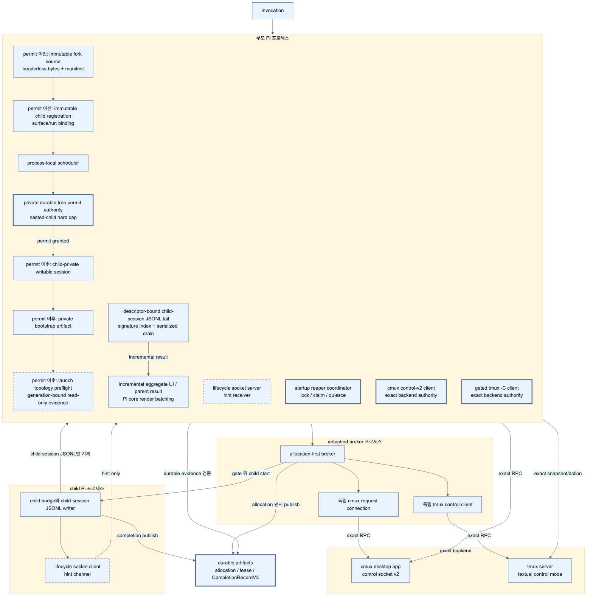
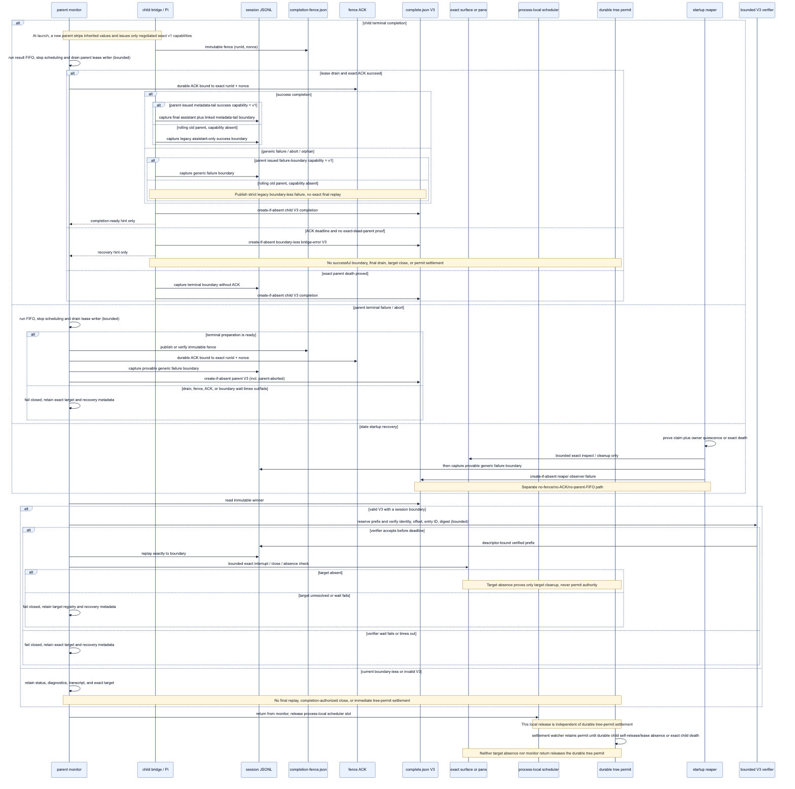
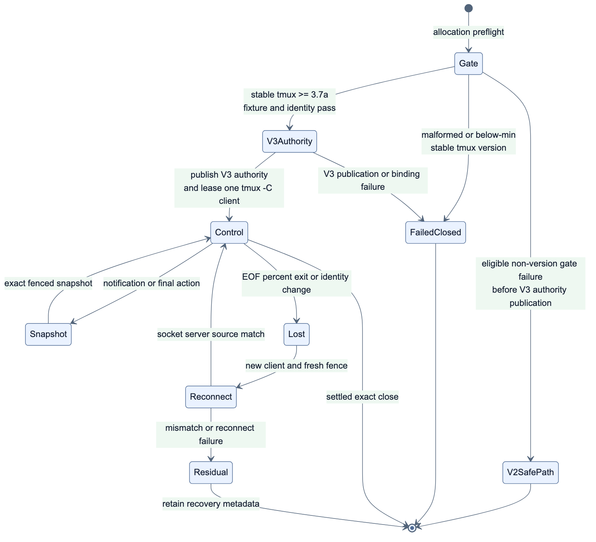
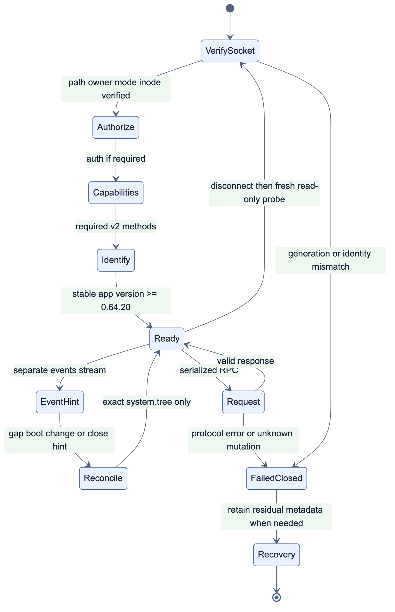
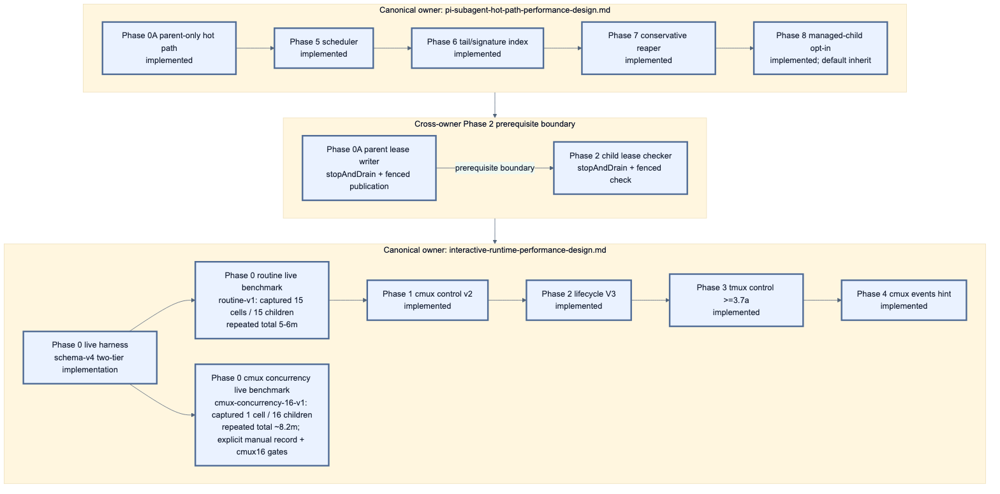

# Interactive subagent runtime 성능 개선 설계

> **상태:** Phase 0 local baseline과 schema v4 gated-provider live capture가 구현·기록됐다. `routine-v1`의 15 cells/15 provider children capture는 총 5~6분, `cmux-concurrency-16-v1`의 1 cell/16 provider children capture는 약 8.2분으로 반복 관찰됐다. 이 값은 관찰된 capture 총시간이며 SLA가 아니다. source-bound fixture는 문서 변경을 포함한 source 변경 뒤 다시 생성하고 각 current-source verifier를 통과해야 최종 검증으로 인정한다. 따라서 이 문서 변경 시점의 기존 fixture를 이미 검증된 것으로 주장하지 않는다. Phase 1 cmux control-socket v2, Phase 2 private lifecycle socket·`CompletionRecordV3`·healthy cmux inspect polling 제거, Phase 3 stable-3.7b-minimum gated `tmux -C`·healthy tmux inspect polling 제거, Phase 4 `events.stream` hint는 구현됐다.
>
> **Authority:** 이 문서는 lifecycle Unix socket, `CompletionRecordV3` transport schema·settlement, cmux desktop control socket v2, `tmux -C`, polling 제거, exact-target mutation/recovery/fencing, transport Phases 0–4 및 canonical cross-document phase register의 authoritative source다. topology/cache/preflight/lease/UI/fork/I/O/tail/reaper, scheduler 및 managed-child 정책은 [Pi-subagent internal hot-path 성능 개선 설계](./pi-subagent-hot-path-performance-design.md)의 authoritative scope다.

현재 호출 계약과 durable lifecycle 안전성을 유지하면서 interactive runtime의 정상 경로 비용을 줄이는 설계와 구현 상태를 함께 기록한다.

## 1. 결정 요약

현재 interactive runtime은 durable completion·lease artifact를 복구 authority로 유지한다. 구현된 cmux 정상 경로는 authenticated lifecycle socket 연결과 1초 memory heartbeat 동안 periodic `system.tree`를 발행하지 않고, disconnect·stale heartbeat·cmux event reconciliation hint·abort/final cleanup에서만 exact snapshot을 사용한다. stable 3.7b 이상 gate를 통과한 tmux run도 process-owned `tmux -C` notification 대기 중 periodic status query와 recurring short-lived tmux process를 만들지 않고, event·disconnect·abort/final/reaper에서만 같은 generation의 exact snapshot을 사용한다. gate를 통과하지 못한 tmux는 기존 strict V2 safe path를 유지하며, file/lease polling과 일부 session/reaper 상태는 여전히 run 수와 session 길이에 따라 증가한다.

개선 방향은 다음과 같다.

1. parent와 child 사이에 private Unix domain socket event channel을 추가한다.
2. **pi-subagent 내부의 모든 production cmux CLI invocation**을 cmux desktop Unix-domain-socket control protocol v2의 persistent request connection으로 교체한다. CLI fallback은 두지 않는다.
3. 정상 lifecycle과 heartbeat는 (A) private lifecycle socket으로 처리하고 durable artifact는 crash recovery authority로 유지한다. (B) cmux app control socket은 surface allocation·inspect·중단·종료만 담당한다.
4. 정상 실행 중 cmux 상태 polling을 제거하고, **3.7b gate를 통과해 control mode가 enable된 tmux run**은 supported textual control mode(`tmux -C`)의 장기 client로 event를 받는다. 해당 run의 healthy steady state에서 pi-subagent가 발행하는 tmux multiplexer status query와 반복적인 `tmux display-message`/`list-panes` short-lived process churn을 0으로 만들며, final cleanup·abort·disconnect·reaper의 exact snapshot도 같은 control connection에서 수행한다. unsupported/ungated tmux는 기존 safe path와 polling을 유지하고 별도 metric으로 보고한다.
5. scheduler, tail/signature, reaper, managed-child, topology/cache/preflight, lease/check, aggregate UI visibility, fork source/private session 및 async I/O는 transport authority와 독립된 internal hot path로서 [companion](./pi-subagent-hot-path-performance-design.md)의 Phase 0A, Phase 2 lease sub-gate 및 Phases 5–8에서 정의한다. 이 작업도 public tool schema·callback 횟수/순서·inline stream callback·durable recovery authority를 바꾸지 않으며, actual repaint는 Pi TUI core의 existing 약 16ms batching을 그대로 사용한다.

여기서 protocol **v2는 cmux control API family**를 뜻하며 cmux 앱의 semantic version이 아니다. tested baseline은 cmux `0.64.20`, upstream commit [`14e3400b95daedd652d0b6f395d0777c41e39eef`](https://github.com/manaflow-ai/cmux/tree/14e3400b95daedd652d0b6f395d0777c41e39eef)이다. 기존 CLI topology fixture [`cmux-layout-contract-v1.json`](../test/fixtures/cmux-layout-contract-v1.json)과 별도로 direct request/stream 계약은 [`cmux-control-v2.json`](../test/fixtures/cmux-control-v2.json), [`cmux-events-v1.json`](../test/fixtures/cmux-events-v1.json) 및 fake/live gated tests로 고정한다.

이 개선은 기존 `{ agent, task }`, `tasks`, `chain`, `action`, `background`, `spawn | fork` tool schema를 변경하지 않는다. 설정이 필요하면 session-level CLI flag와 환경 변수로 제공한다.

## 2. 범위와 근거

이 문서는 다음 구현을 기준으로 한다.

- `src/runtime/runner.ts`: interactive run loop, active run registry, startup reaper와 concurrency helper
- `src/runtime/child-bridge.ts`: child lifecycle과 parent lease 확인
- `src/runtime/session-tail.ts`: child session JSONL 증분 읽기
- `src/runtime/run-protocol.ts`: private artifact, lease와 completion protocol
- `src/runtime/cmux.ts`: 기존 domain command vocabulary를 strict direct control-socket adapter에 연결하며 production 기본값에는 cmux CLI fallback이 없음
- `src/runtime/tmux.ts`와 `src/runtime/tmux-control.mjs`: tmux pane authority와 구현된 persistent `tmux -C` control-mode lifecycle
- `src/runtime/pane-launch-broker.mjs`: V2/V3 one-shot allocation/commit broker; gated tmux allocation은 expansion-free control command로 encode
- `src/core/agents.ts`, `src/core/project-agent-paths.ts`, `src/core/project-trust.ts`: user/project agent discovery, canonical project boundary와 session trust override
- `src/core/runner-events.js`, `src/core/types.ts`, `src/ui/render.ts`: interactive tail의 assistant aggregation과 parallel/parallel-chain display
- `index.ts`: foreground/background invocation, fork source/private-copy 생성, aggregate callback과 호출별 concurrency

현재 비용·동작의 직접 근거는 `src/runtime/session-tail.ts`의 bounded recent IDs와 private exact on-disk index, `src/core/runner-events.js`의 full-message `__processedAssistantSignatures`, 2초 cadence를 유지하는 `src/runtime/run-protocol.ts`의 absolute-due/one-pending parent lease writer와 `src/runtime/child-bridge.ts`의 absolute-due/one-pending child checker, `src/runtime/lifecycle-socket.ts`의 bounded authenticated NDJSON channel, `src/runtime/completion-v3.ts`의 descriptor-bound JSONL boundary 검증, `src/runtime/runner.ts`의 V2/V3 dual-reader와 stale reaper다. Phase 2와 companion의 Phase 6 tail/signature, conservative Phase 7 budgeted reaper가 구현되었다. 제안 test 이름은 아직 구현되지 않은 것은 명시적으로 `(제안)`으로 표시한다.

현재 lifecycle과 V2 broker의 정확한 authority 계약은 [cmux/tmux 기반 실제 Pi TUI 설계 및 구현](./cmux-pi-tui-design.md)을 따른다. 이 문서는 해당 안전 계약을 대체하지 않고 정상 경로의 감시·스케줄링·메모리 비용을 개선한다. 단, cmux 경로에서는 broker, parent runner, rollback, reaper와 recovery가 같은 direct control-socket adapter를 사용하도록 바꾼다.

cmux upstream contract를 확인할 때는 다음 pinned source를 기준으로 한다. request/response와 bare-LF framing은 [`ControlRequest`](https://github.com/manaflow-ai/cmux/blob/14e3400b95daedd652d0b6f395d0777c41e39eef/Packages/macOS/CmuxControlSocket/Sources/CmuxControlSocket/Wire/ControlRequest.swift), [`ControlResponseEncoder`](https://github.com/manaflow-ai/cmux/blob/14e3400b95daedd652d0b6f395d0777c41e39eef/Packages/macOS/CmuxControlSocket/Sources/CmuxControlSocket/Wire/ControlResponseEncoder.swift), [`ControlClientLineReader`](https://github.com/manaflow-ai/cmux/blob/14e3400b95daedd652d0b6f395d0777c41e39eef/Packages/macOS/CmuxControlSocket/Sources/CmuxControlSocket/Server/ControlClientLineReader.swift)를, access mode는 [`SocketControlMode`](https://github.com/manaflow-ai/cmux/blob/14e3400b95daedd652d0b6f395d0777c41e39eef/Packages/macOS/CmuxSettings/Sources/CmuxSettings/Values/SocketControlMode.swift)와 [`SocketClientAuthorization`](https://github.com/manaflow-ai/cmux/blob/14e3400b95daedd652d0b6f395d0777c41e39eef/Packages/macOS/CmuxControlSocket/Sources/CmuxControlSocket/Transport/SocketClientAuthorization.swift)를 따른다. method capability와 event semantics는 [`TerminalController` control methods](https://github.com/manaflow-ai/cmux/blob/14e3400b95daedd652d0b6f395d0777c41e39eef/Packages/macOS/CmuxControlSocket/Sources/CmuxControlSocket/Coordinator/Surface/ControlCommandCoordinator%2BSurface.swift), [`CmuxEventStream`](https://github.com/manaflow-ai/cmux/blob/14e3400b95daedd652d0b6f395d0777c41e39eef/Sources/CmuxEventStream.swift), [`CmuxEventBus`](https://github.com/manaflow-ai/cmux/blob/14e3400b95daedd652d0b6f395d0777c41e39eef/Sources/CmuxEventBus.swift)를 참조한다.

반복 split을 줄이는 layout은 [다중 subagent interactive pane layout 설계](./interactive-pane-layout-design.md), `pi-cmux` child 정책과 관리 UI는 [`pi-subagent`와 `pi-cmux` 연동 가이드](./pi-cmux-integration.md)에서 별도로 다룬다.

## 3. 비용 모델과 구현 전 baseline

### 3.1 Active run polling (Phase 1–3 이전 baseline)

아래는 전환 전 parent가 interactive run마다 약 250ms 간격으로 반복하던 baseline이다. 현재 healthy cmux 및 gated tmux steady state는 lifecycle/event notification으로 대기하며, 이 inspection은 ungated/degraded/final/reaper 경로에만 남는다.

- child session JSONL `stat`과 증분 읽기
- completion artifact 읽기
- wrapper status 존재 여부 확인
- surface 또는 pane 상태 조회

baseline의 마지막 항목은 단순 메모리 조회가 아니라 외부 CLI process를 생성했다.

전환 전 cmux는 run마다 다음 command를 실행했다.

```text
cmux --json --id-format both tree --all
```

baseline broker rollback은 별도로 workspace-scoped probe를 사용했다. 현재 production은 allocation, respawn, key, close, reaper/rollback exact verification을 포함한 **모든 내부 cmux CLI invocation**을 direct app control socket v2로 교체했으며 CLI fallback이 없다. 사용자가 직접 실행하는 `cmux` 명령과 tmux backend는 범위 밖이다.

tmux fingerprint 조회는 run마다 대체로 다음 두 command를 실행한다.

```text
tmux display-message -p '#{pid}'
tmux list-panes -a -F ...
```

구조상 계산한 호출 빈도는 다음과 같다. 이는 benchmark 결과가 아니라 250ms 주기와 command 수를 곱한 예상치다.

| Active child | cmux CLI | tmux CLI |
|---:|---:|---:|
| 1 | 약 4회/초 | 약 8회/초 |
| 4 | 약 16회/초 | 약 32회/초 |
| 16 | 약 64회/초 | 약 128회/초 |

이 tmux 수치는 `display-message`와 `list-panes`를 매 iteration에 새 process로 실행하는 현재 baseline이다. 아래 control-mode 설계는 tmux server와 파일/lease polling, 그리고 supervised long-lived `tmux -C` client process 자체를 없애지 않는다. healthy steady state에서 없애는 것은 **pi-subagent의 periodic multiplexer status query와 recurring short-lived tmux CLI process**다.

### 3.2 Durable lease write

각 parent-owned run은 기본적으로 약 2초마다 lease를 갱신하고, child bridge도 약 2초 주기로 parent lease를 확인한다. 현재 replaceable artifact write에는 임시 파일 생성, write, file sync, rename, chmod와 best-effort directory sync가 포함된다.

이 비용은 crash 판단을 보수적으로 만들지만 run 수에 비례해 지속적인 sync write를 만든다. socket 도입 후에도 durable parent lease와 child lease check의 2초 주기는 유지한다. startup reaper와 immutable authority, exact-target cleanup도 유지한다.

### 3.3 호출별 동시성

최상위 parallel 호출은 기본적으로 최대 50개 task를 받고 호출별 동시성 기본값 16을 적용한다. chain 병렬 단계의 기본 최대 task 수는 8이다. process-local scheduler는 foreground/background queue의 FIFO/round-robin을 유지하고, 별도의 private durable tree authority가 root parent와 모든 nested child의 ACTIVE/RESERVED 합계를 `max-active`(기본 16) 이하로 제한한다. `maxActive`와 호출/백그라운드 한계는 CLI·환경 변수·신뢰된 프로젝트/전역 JSON으로 설정할 수 있다.

nested foreground delegation은 대기 parent lease를 `PARKED_WAIT`로 전환해 descendant에 transfer하므로 cap 1에서도 deadlock을 피한다. background는 parent가 계속 실행되므로 transfer 없이 spare permit을 기다린다. exact PID/start identity로 증명된 dead lease만 crash 뒤 회수하고 unknown identity는 capacity를 retain한다. 자세한 mapping은 [configuration](./configuration.md#호출-및-백그라운드-한계)을 따른다.

### 3.4 Session state 메모리

`SessionTailState`는 bounded recent ID cache와 descriptor-bound private exact on-disk bucket index를 사용한다. primary index publication/read가 실패하면 bounded private fallback index로 전환하며, public message bytes는 생략하지 않는다.

parent의 `SingleResult.messages`와 public/onUpdate callback payload는 현재 계약대로 모든 assistant message를 계속 보존해야 한다. 이 public 결과 배열의 RSS를 bounded하다고 주장하거나 terminal에만 재구성할 수 없다. 최적화 범위는 internal dedup signature의 CPU·중복 저장뿐이다.

### 3.5 Startup reaper

root Pi의 `session_start`는 stale interactive run scan 전체를 기다리지 않는다. private root lock 뒤 `200ms 또는 50개 entry` startup budget만 기다리고 같은 directory handle ownership을 background completion으로 넘긴다. retained run directory가 많으면 background 경로에 다음 비용이 누적될 수 있다.

- run root 전체 순회
- run별 private directory와 artifact validation
- lease, intent, decision, allocation, completion 읽기
- stale cmux/tmux target의 직렬 inspect·interrupt·close

정상 완료 artifact는 제거되므로 평상시 비용은 작지만 crash와 unresolved recovery metadata가 쌓이면 startup latency가 증가할 수 있다.

### 3.6 Child Pi 자체 비용

각 active child는 독립 Pi process, terminal PTY, extension/tool registry, model context와 provider connection을 가진다. 감시 polling을 제거해도 이 비용은 남는다.

### 3.7 Production polling 분류

아래 표는 production interactive 경로의 polling과 timer를 전수 분류한다. `구현 상태`는 현재 source에서 확인한 항목과 남은 설계가 단계별로 도입할 항목을 구분한다. 각 phase의 범위와 acceptance는 이 구분을 기준으로 판단하며, 단발 대기와 acceptance 전용 polling을 정상 실행 polling 감소 수치에 섞지 않는다.

| 분류 | 주기 | 대상 또는 용도 | 구현 상태와 단계별 처리 |
| --- | ---: | --- | --- |
| event-driven active loop | lifecycle heartbeat/event, degraded 5초 watchdog | child session JSONL 증분 읽기 | 구현됨; authenticated lifecycle/tmux/cmux hint에서 깨어난 뒤 durable JSONL을 읽고 healthy 250ms timer loop는 사용하지 않음 |
| event-driven active loop | lifecycle heartbeat/event, degraded 5초 watchdog | `complete.json` 읽기 | 구현됨; wake-up마다 immutable completion authority를 먼저 읽고 `completion-ready`는 payload가 아닌 hint로만 사용 |
| event-driven active loop | lifecycle heartbeat/event, degraded 5초 watchdog | wrapper status 존재 여부 확인 | 구현됨; lifecycle event 우선이며 terminal/degraded recovery에서 durable status를 계속 확인 |
| active loop | 250ms | cmux 또는 ungated tmux backend `inspect()` | cmux healthy lifecycle 및 stable-3.7b-minimum gated tmux steady state에서는 제거됨. ungated V2 tmux, stale/disconnect/비정상/final cleanup은 strict exact snapshot을 유지 |
| tmux control client | 지속 연결 | control notification 및 command response | 구현된 Phase 3. healthy gated run에서 periodic status query 없음. tmux server와 process-owned supervised `tmux -C` client는 유지 |
| broker bounded polling | 100ms | decision 및 `launch.json` publication 대기 | 현재 구현; broker protocol의 bounded control polling으로 유지 |
| tmux broker gate polling | 50ms | staged gate verifier의 gate/authority 대기 | 현재 구현; broker 내부 bounded gate polling으로 유지 |
| lease timer | 2초 | durable parent lease 갱신 및 child parent-lease 검사 | 현재 구현; 유지 |
| UI heartbeat | 기본 1초 | parallel 실행 중 UI 상태 갱신 | 현재 구현; `--subagent-parallel-heartbeat-ms`/`PI_SUBAGENT_PARALLEL_HEARTBEAT_MS`로 설정 가능하며 외부 CLI/file I/O가 없고 completion authority가 아니므로 Phase 2에서 유지 |
| socket heartbeat | 1초 | authenticated connection의 memory-only liveness hint | Phase 2 구현; disk write나 completion authority가 아니며 monotonic time 사용 |
| process watchdog | degraded 5초 | socket stale/disconnect와 durable completion fallback 확인 | Phase 2 구현; healthy run에서는 backend CLI를 호출하지 않음 |
| diagnostic cleanup timer | 현재 run별 기본 1시간 | terminal run artifact 지연 삭제 | 현재 구현; durable completion/intent의 absolute deadline에서 남은 시간만 예약하므로 restart가 TTL을 reset하지 않으며 polling이 아님 |
| 단발 timeout/delay | 단발 또는 deadline | abort grace, wrapper settle, broker ready/commit deadline 등 | 현재 구현; polling 성능 수치와 분리 |
| acceptance-only polling | harness 한정 | live harness의 target absence/evidence 재확인 | production polling이 아니며 별도 보고 |

현재 active loop는 lifecycle/control/event hint 또는 degraded watchdog에서 깨어난 뒤 JSONL, completion, wrapper와 필요한 backend inspect를 확인한다. healthy path의 250ms timer loop와 periodic multiplexer inspect는 제거되었지만 durable JSONL/completion/wrapper file read 자체는 authority 확인을 위해 유지한다. tmux control notification과 cmux event는 authority가 아닌 resync hint다.

특히 parent agent directory를 폭넓게 상속하면 child에 필요하지 않은 extension과 tool schema도 함께 로드될 수 있다. `fork` mode는 parent session snapshot 크기에도 영향을 받는다.

### 3.8 Parent-local 추가 hot path

동일 workspace/server topology의 반복 조회, sibling launch의 중복 preflight, discovery scan, overlapping lease I/O, tail signature, aggregate UI construction, fork/session artifact I/O와 startup reaper의 비용은 parent-local hot path다. 이 항목의 security boundary와 상세 알고리즘은 [companion §9–§13](./pi-subagent-hot-path-performance-design.md#9-pi-subagent-전용-hot-path)이 authoritative하며, child 간 task·credential·session/recovery state 공유의 근거가 아니다.

## 4. 목표와 비목표

### 목표

- 정상 active loop의 periodic multiplexer inspect CLI 호출을 0으로 만든다. cmux에서는 lifecycle mutation과 final exact-target close/absence 검증도 CLI가 아니라 direct control socket으로 수행하고 별도 request 수로 측정한다. tmux는 **successfully gated control-mode run에서만** pi-subagent-issued periodic status query와 recurring short-lived CLI를 0으로 만들며, tmux 내부 format-subscription 평가, file/lease polling과 final exact verification은 유지한다.
- cmux direct adapter는 socket v2의 supported contract를 정확히 충족할 때만 시작한다. contract/version/auth가 불명확하거나 unsupported이면 fail-closed하며 CLI로 되돌아가지 않는다.
- completion 전달 latency를 기존 250ms polling보다 나쁘지 않게 유지한다.
- durable allocation, completion, ownership과 exact-target cleanup 계약을 유지한다.
- 기존 subagent tool schema와 결과 aggregation 의미를 유지한다.
- scheduler, bounded tail state와 index, reaper budget, aggregate UI, fork/private session 및 managed-child의 internal goals는 [companion](./pi-subagent-hot-path-performance-design.md)의 authority를 따른다.

### 비목표

- Pi core, cmux 또는 tmux 자체 수정
- tmux private server UDS `MSG_*` protocol을 재구현하거나 이를 production transport로 사용하는 일
- interactive child를 in-process worker로 교체
- model provider 요청 비용 최적화
- session 내용을 자동 요약해 `fork` 의미 변경
- unresolved recovery authority를 성능 목적으로 임의 삭제
- warm Pi process pool 도입

Internal scheduler, cache, private-session, aggregate UI 및 reaper design의 goal/non-goal은 [companion](./pi-subagent-hot-path-performance-design.md)을 따른다.

## 5. 제안 architecture



_2x PNG · [SVG](./diagram/interactive-runtime-architecture.svg) · [Mermaid source](./diagram/interactive-runtime-architecture.mmd)_

```text
Parent Pi process
  ├─ process-local scheduler
  ├─ (A) private lifecycle Unix socket server
  │    ├─ child A connection
  │    ├─ child B connection
  │    └─ child C connection
  ├─ (B) process-owned persistent cmux control-socket v2 request client (cmux only)
  ├─ (C) process-owned supervised `tmux -C` control client (tmux only)
  ├─ generation-scoped read-only topology batcher
  ├─ session-scoped agent-discovery cache and immutable preflight memo
  ├─ invocation-scoped read-only prompt/fork source + child-private session leases
  ├─ incremental parallel aggregate UI publisher
  ├─ durable artifact writer/reader
  └─ same-process budgeted streaming background reaper

Child Pi process
  ├─ child bridge
  ├─ (A) private lifecycle socket client
  ├─ session JSONL writer
  └─ durable completion fallback

Detached pane-launch-broker process
  ├─ (B) 별도로 connect·authorize하는 request connection
  └─ (C) tmux 참여 시 별도로 fence·supervise하는 control client

cmux desktop app
  ├─ (B) existing app control socket v2: tree/split/create/send-key/respawn/close
  └─ optional separate events.stream connection

tmux server
  └─ (C) supported textual control-mode clients; server-private UDS `MSG_*` is never spoken
```

(A), (B), (C)는 이름·path·token·소유자·권한·failure domain이 다른 channel이다. **(C)**는 `tmux -C` textual control client이며 tmux server의 private UDS `MSG_*` wire protocol이 아니다. **(A)**는 parent가 per-session private directory에 만들고 child lifecycle notification만 전달하는 pi-subagent 소유 socket이다. **(B)**는 cmux가 제공·재시작·authorize하는 app control socket으로 surface control RPC만 전달한다. (A)의 token으로 (B)를 인증하거나 (B)의 password/capability를 (A)에 쓰지 않는다. request/control connection은 process 간 공유하지 않는다. detached broker는 자기 connection을 열고 독립적으로 authorize/handshake 또는 tmux identity fence를 수행한다. startup foreground scan에서 이어지는 background reaper는 **같은 parent process의 task**이며 parent-owned connection/client의 reserved close/snapshot capacity를 사용한다. 다음 Pi parent가 이전 run을 복구할 때는 그 새 parent가 자기 connection/client를 만든다. 별도 detached reaper process나 iterator FD-transfer protocol은 이 설계에 없다. “persistent”는 해당 process의 bounded lifecycle 동안 연결/client를 재사용한다는 뜻이다. 정상 lifecycle notification은 (A)를 사용하고, cmux action/inspect는 (B)를, tmux action/snapshot은 (C)를 사용한다. 파일 artifact는 복구 authority로 남으며 cmux production 경로에는 CLI를 사용하지 않는다.

## 6. Unix socket event channel

### 6.1 플랫폼 범위와 Node runtime

이 channel은 **Linux와 macOS 전용**이다. `node:net`의 비동기 Unix-domain-socket IPC를 사용하며, extension이 OS-specific readiness API를 직접 호출하거나 그 API를 public 계약으로 노출하지 않는다. Windows의 현재 terminal mode 선택은 forced-inline이므로 interactive socket server/client, socket path 및 socket capability를 만들거나 사용하지 않는다.

일반 regular file 변경은 socket event channel의 대체가 될 수 없다. `fs.watch()`는 atomic rename, watcher overflow, directory 교체와 platform 차이 때문에 primary lifecycle channel로 사용하지 않는다.

### 6.2 Server와 연결 단위

parent process는 Linux/macOS session당 socket server 하나를 만든다. server는 인증 전 connection 수, 전체 connection 수, 전역 buffered byte와 run별 pending frame 수를 제한한다. 각 connection은 짧은 hello deadline과 idle timeout을 가지며 4KiB를 넘는 pre-auth 입력이나 slow/incomplete hello는 즉시 destroy한다.

```text
${PI_SUBAGENT_RUN_STATE_DIR}/parent-<session-id>/events.sock
```

각 child bridge는 하나의 connection을 열고 첫 frame에서 run identity를 인증한다. `runId`와 self-reported `childPid`는 식별자일 뿐 인증 authority가 아니다. run별 token은 CSPRNG로 만든 **256-bit** capability이며 per-child private `0600` **transient bootstrap artifact**로만 전달한다. artifact의 canonical containment/owner/mode/no-symlink를 검증하고 bridge가 token을 memory로 읽은 즉시 첫 connect 전에 unlink한다. broker argv, 일반 환경 상속, 로그, durable launch/lease/completion/recovery artifact 또는 evidence에는 기록하지 않는다. bridge는 token 관련 bootstrap path/value도 `process.env`에서 즉시 제거해 이후 tool/descendant process에 상속하지 않는다. token은 commit/gate 뒤에만 활성화하고 run당 authenticated connection 하나만 허용하며, reconnect는 기존 connection의 명시적 handoff 뒤에만 허용하고 terminal state에서 즉시 폐기한다. Node/Bun의 portable `node:net` API만으로 Linux와 macOS의 peer credential을 동일하게 검증할 수 없으므로 token과 private filesystem boundary를 필수 인증 경계로 사용한다. 동일 UID process 전체를 적대적 격리해야 하는 배포는 별도 UID/container 경계가 필요하며 이 protocol만으로 그 격리를 제공하지 않는다.

```json
{"version":1,"type":"hello","runId":"a14f...","token":"<256-bit-base64url>","childPid":12345,"sequence":0}
```

socket directory는 `0700`, pathname socket은 listen 직후 `0600`으로 제한한다. token은 task, prompt, API key, credential 또는 transcript와 함께 event에 넣지 않는다.

### 6.3 Framing과 message

첫 구현은 parser와 진단이 단순한 `node:net` 기반 **bounded NDJSON**을 사용한다. connection은 정확히 하나의 strict `hello` frame으로 시작하며, 이후 모든 frame은 허용 schema와 단조 증가 sequence를 만족해야 한다.

허용 event 예시는 다음과 같다.

```text
hello (sequence 0)
agent-started
agent-ended
agent-settled
completion-ready
shutdown
heartbeat
```

frame은 UTF-8 JSON object 한 줄이고 **4KiB 이하**여야 한다. fragmented write는 newline까지 누적해 parse하고, multiple frame은 순서대로 분리한다. malformed JSON, unknown schema/type, sequence gap/replay, wrong token 또는 oversized frame은 connection을 fail-closed로 종료하고 durable fallback으로 전환한다.

completion이나 task 본문은 socket payload로 복제하지 않는다. socket payload에는 prompt, transcript, credential, API key를 절대 넣지 않는다. `completion-ready`는 parent가 immutable `complete.json`과 필요한 session JSONL 구간을 읽으라는 알림만 제공한다.

### 6.4 CompletionRecordV3 migration과 순서



_2x PNG · [SVG](./diagram/completion-v3-sequence.svg) · [Mermaid source](./diagram/completion-v3-sequence.mmd)_

기존 strict `CompletionRecordV2` parser는 알 수 없는 field를 거부하므로 성공 completion에 경계를 덧붙이는 방식은 호환되지 않았다. Phase 2에서 child bridge·parent·reaper를 **원자적으로** 아래 strict discriminated union으로 migration했다. 모든 variant는 listed key 외 extra field를 거부한다.

```text
CompletionSuccessV3 = {
  version: 3, runId, producer: "child", status: "completed", completedAt,
  session: {
    byteOffset,                 // positive safe integer
    finalEntryId,               // byteOffset에서 끝나는 마지막 complete JSONL entry의 stable ID
    digestAlgorithm: "sha256",
    prefixDigest                // child session bytes [0, byteOffset)의 lowercase 64-hex SHA-256
  }
}

ChildFailureV3 = {
  version: 3, runId, producer: "child",
  status: "failed" | "aborted" | "orphaned", completedAt,
  errorCode: "child-error" | "bridge-error" | "lease-expired" | "surface-closed",
  stopReason: string | null,
  session?: SessionBoundaryV3    // generic complete prefix; success semantics를 주장하지 않음
}

ObserverFailureV3 = {
  version: 3, runId, producer: "parent" | "reaper",
  status: "failed" | "aborted" | "orphaned", completedAt,
  errorCode: "child-error" | "bridge-error" | "lease-expired" | "surface-closed" |
             "child-exited" | "completion-boundary-unproven" | "parent-aborted" | "transport-lost",
  evidenceRefs: ("launch" | "allocation" | "state" | "lease" | "wrapper-status" |
                 "process-identity" | "target-snapshot")[],
  session?: SessionBoundaryV3    // generic complete prefix; success semantics를 주장하지 않음
}
```

`producer: "child"` failure variant는 agent error/abort와 lease-expiry orphan publication을 보존한다. child·parent·reaper failure variant는 모두 선택적인 `session` generic boundary를 가질 수 있다. 이 boundary는 성공을 주장하지 않으며, complete JSONL prefix를 증명할 수 있을 때만 failure 시점까지의 assistant/tool/summary usage를 final replay할 수 있게 한다. `evidenceRefs`는 검증된 durable artifact/snapshot 종류의 중복 없는 sorted allowlist이며 raw path, command, prompt, transcript 또는 자유형 evidence text를 담지 않는다.

### 롤링 parent/child 호환성

V3 child failure의 optional `session` key는 strict legacy parent가 unknown field로 거부할 수 있으므로, child는 parent가 private `PI_SUBAGENT_V3_FAILURE_BOUNDARY_CAPABILITY=v1`을 **명시적으로** 전달한 경우에만 그 key를 publish한다. 별도로 Pi 0.81의 final-assistant 뒤 linked metadata tail은 이전 success verifier가 final assistant ID만 허용하므로, child는 `PI_SUBAGENT_V3_METADATA_TAIL_SUCCESS_BOUNDARY_CAPABILITY=v1`이 명시적으로 전달된 경우에만 그 tail 전체를 success boundary에 포함한다. 새 runner는 매 launch에 두 exact value를 주입하고 inherited value는 제거한다. capability가 없는 이전 parent 아래의 새 child는 final assistant line에서 끝나는 legacy-compatible digest/offset/id boundary를 publish하므로 post-assistant compaction·summary usage는 최종 replay에서 생략될 수 있다. 새 parent+child 조합은 full linked tail과 그 usage를 exact replay한다. 이전 child도 boundary-less failure를 계속 publish하므로 새 parent는 fail-closed recovery behavior를 유지한다.

1. parent는 새 child session을 만든 직후 `(dev, ino)`를 private identity로 capture한다. 이는 child completion payload에 넣지 않는다.
2. terminal child는 parent-generated nonce를 포함한 immutable `completion-fence.json`을 publish하고, exact `runId`/nonce의 parent ACK가 durable하게 보일 때까지 기다린다. exact parent PID/start identity가 dead로 증명된 경우만 ACK 없이 진행할 수 있다. ACK deadline 안에 ACK도 exact-dead-parent proof도 없으면 child는 boundary를 계산하거나 성공을 추정하지 않고 boundary-less `bridge-error` V3를 publish해 recovery retention으로 남긴다.
3. parent는 incremental drain callback, ACK, parent-origin boundary capture와 final replay를 하나의 run별 result-mutation FIFO에 직렬화한다. terminal ACK 전에 새 parent-lease scheduling을 멈추고 in-flight lease writer를 bounded `stopAndDrain()`으로 끝낸다. 따라서 ACK 전 시작한 callback은 boundary에 포함될 수 있지만, ACK 뒤 callback이 boundary capture 사이에 들어갈 수 없고 late lease rename도 terminal authority와 경쟁하지 않는다. global interactive fence는 registry/ownership 확인만 짧게 수행하며 backend I/O, ACK/filesystem wait와 terminal publication은 이 run별 FIFO에서 fence 밖으로 진행한다.
4. ACK 뒤 child는 metadata-tail success capability가 있으면 final assistant/linked-metadata-chain boundary를, 없으면 final assistant line까지만의 legacy-compatible boundary를 계산한다. abnormal failure의 generic complete JSONL boundary는 parent가 exact failure-boundary capability를 협상한 child에만 포함하고, 그렇지 않으면 strict legacy boundary-less V3 failure를 publish한다. 그 뒤 immutable `complete.json` V3 record를 publish하고 `completion-ready` hint를 보낸다. parent가 직접 terminal failure를 publish할 때도 같은 FIFO에서 fence/ACK와 generic boundary capture를 수행한다. terminal preparation, fence/ACK, boundary verifier 중 어느 bounded wait라도 실패하거나 timeout되면 fail closed하며 exact target과 recovery metadata를 retain한다. 반면 startup reaper는 parent fence/ACK/FIFO를 사용하지 않는 별도 경로다. reaper는 claim과 parent·broker·child owner의 quiescence 또는 exact-dead proof를 다시 확인한 뒤에만 generic boundary를 capture하고 observer record를 publish한다.
5. parent는 strict V3 schema, captured `(dev, ino)`, exact offset, final entry ID, `[0, byteOffset)` SHA-256을 검증하고 **그 prefix만** 새 final result로 replay한다. replay 뒤 exact surface/pane close와 absence 확인은 bounded하게 수행하며, 실패하면 terminal result를 반환해도 exact target registry와 recovery metadata를 reaper용으로 retain한다. monitor 반환 시 process-local scheduler slot을 release하는 일은 durable tree permit settlement와 별개다. target absence는 target cleanup/unregister 근거일 뿐 permit authority가 아니며, durable tree permit은 child self-release/lease absence 또는 exact child death가 확인될 때까지 settlement watcher가 retain한다.

V3 verifier의 prefix 상한은 `64 MiB`다. process-global FIFO reservation은 검증할 complete prefix의 bytes를 합산해 capacity를 제한하고, verifier가 반환한 suffix lease는 final parser가 끝날 때까지 유지한다. 한 JSONL line과 누적 entry-ID bytes는 각각 `8 MiB`, entry 수는 `100,000`으로 제한한다. 이는 incomplete line을 `64 KiB`까지만 보유하는 ordinary live-preview tail과 다른 verified replay 한도다. duplicate ID, malformed/fatal UTF-8, incomplete final line, ID/entry budget 초과는 boundary를 거부한다. same-inode에서 offset 뒤에 append한 bytes는 boundary 밖이므로 replay하지 않는다. pathname replacement, inode/device mismatch, prefix mutation 또는 truncation은 거부한다.

V3/V2의 strict boundary-less record는 read-compatible하게 남는다. 그러나 **현재 boundary-less V3**은 live tail에 마지막 poll 뒤의 bytes가 포함됐음을 증명할 수 없으므로 status/diagnostic authority만 적용하고 immediate final drain·completion-authorized close·permit release를 진행하지 않는 recovery-blocking 상태다. target absence나 monitor return도 이 durable permit의 release authority가 아니다. 이는 exact child가 계속 live일 때 capacity를 즉시 반환한다는 뜻은 아니다. foreground scope의 unref settlement watcher는 durable child self-release/lease absence 또는 exact child death를 나중에 확인하면 parked parent를 resume할 수 있다. V2도 기존 strict reader로만 처리하며 V3 fast path나 boundary-less bytes replay를 얻지 않는다. child가 boundary를 증명하지 못하거나 fence handshake가 malformed이면 success를 추정하지 않고 boundary-less `bridge-error` failure를 남긴다. unknown mutation/ownership은 recovery metadata를 retain한다.

socket event가 유실되어도 completion artifact는 남는다. incremental `onUpdate`/UI preview는 advisory이며 authoritative result와 usage는 검증된 final replay에서만 확정된다. 저빈도 watchdog이나 socket disconnect가 artifact를 다시 확인하므로 semantic completion의 source of truth는 계속 durable record다.

### 6.5 Disconnect와 heartbeat

parent가 `SIGKILL`되면 kernel이 child socket을 닫고 child는 `close`를 받는다. child surface가 사용자에 의해 닫히거나 child process가 죽으면 parent도 connection 종료를 받는다.

connection 종료는 원인을 단정하지 않는다.

- valid completion이 있으면 정상 completion 경로를 수행한다.
- completion 없이 child connection이 닫히면 exact target을 한 번 inspect한다.
- target이 없으면 terminal failure completion을 시도한다.
- target이 남아 있으면 abort/close 또는 recovery metadata 보존 정책을 적용한다.

socket 연결만으로 event-loop hang과 system suspend를 판정할 수 없으므로 memory-only heartbeat를 사용한다. heartbeat와 watchdog elapsed time은 wall clock jump의 영향을 받지 않는 monotonic clock으로 계산한다. suspend/wake 또는 큰 clock discontinuity 뒤에는 grace window와 fresh durable lease/PID-start identity를 다시 확인하며, stale heartbeat나 lease 한 번만으로 immutable orphan completion 또는 target cleanup을 수행하지 않는다.

```text
heartbeat interval: 1초
stale threshold: 12초
```

heartbeat는 작은 socket frame이며 disk sync를 만들지 않는다. durable parent lease renewal과 child lease check는 현재와 같이 각각 약 2초를 유지한다. socket event는 durable lifecycle authority가 아닌 알림 fast path다.

### 6.6 Socket path와 filesystem safety

macOS의 Unix socket path는 UTF-8 byte 기준 보수적으로 **92 bytes 이하**로 제한한다. 계산된 state-root 경로가 이를 넘으면 `realpath(os.tmpdir())`로 얻은 canonical temporary root 아래에 `mkdtemp`로 짧고 예측 불가능한 ASCII 이름의 전용 directory를 만들고 그 안의 짧은 socket pathname을 사용한다. macOS의 lexical `/tmp` symlink를 그대로 신뢰하지 않고 canonical `/private/tmp` 같은 root-owned sticky temporary root의 owner, mode와 non-user-writable ancestor 조건을 검증한 뒤, 새 UID-owned `0700` 하위 directory부터 strict no-symlink/containment 규칙을 적용한다. Linux에서도 같은 짧은-path 정책을 사용해 portability margin을 확보한다. Linux abstract socket은 macOS와 호환되지 않고 pathname permission 경계도 제공하지 않으므로 사용하지 않는다.

server는 generation마다 재사용되지 않는 전용 directory와 immutable generation marker를 만들고 bind한 socket의 `(dev, ino)`를 기록한다. stale cleanup과 shutdown unlink 직전에는 directory owner/mode, marker, containment와 socket `(dev, ino)`가 처음 기록과 정확히 같은지 다시 확인한다. `EADDRINUSE`, ownership/containment 검증 실패, inode 변경, symlink 또는 경로 충돌은 추측 삭제나 임의의 대체 path 선택 없이 fail-closed한다. shutdown은 server와 active connection을 먼저 닫은 뒤 재검증된 exact pathname socket과 전용 directory만 제거한다.

### 6.7 Backpressure

구현된 strict lifecycle schema는 `agent-started`, `agent-ended`, `agent-settled`, `completion-ready`, `shutdown`, `heartbeat`만 허용하며 progress payload를 전송하지 않는다. run별 pending lifecycle frame 수와 총 byte 수에 상한을 두고, malformed/unknown frame이나 상한 초과는 connection을 닫아 durable fallback으로 전환한다. `completion-ready`와 `shutdown`도 authority payload가 아니라 durable artifact 재검사를 위한 terminal hint다.

### 6.8 Multiplexer event stream의 위치

cmux desktop control socket v2는 `events.stream` NDJSON method를 제공하고 bundled CLI의 `cmux events --reconnect`도 이 method를 사용한다. pi-subagent production은 CLI wrapper를 실행하지 않고, event 최적화를 enable할 때 별도 app-socket connection에서 `events.stream`을 직접 호출한다. tmux event 최적화는 §7의 supported `tmux -C` control mode만 사용한다.

이 event stream은 direct request adapter와 분리된 구현 완료 optional optimization이다.

- cmux event는 canonical close authority가 아니라 exact `system.tree` reconciliation hint이며 pinned fixture와 live heartbeat probe를 통과했다.
- tmux global hook은 user configuration과 충돌하므로 사용하지 않는다.
- tmux control mode는 process/server/attached-session당 supervised 장기 client lifecycle을 유지하며, notification은 exact snapshot의 hint다.

child socket disconnect와 durable completion만으로도 정상 lifecycle authority를 유지하고, 별도 authenticated cmux event stream은 외부 surface close reconciliation latency만 줄인다.

### 6.9 Watchdog

완전한 무감시 대신 5~10초 간격의 저빈도 watchdog을 parent process 하나에서 실행한다.

watchdog은 모든 run마다 CLI를 실행하지 않는다.

1. socket heartbeat와 durable completion 상태만 메모리/파일로 확인한다.
2. stale 또는 disconnected run만 multiplexer별 batch inspect 후보로 만든다.
3. cmux는 workspace당 tree 한 번, tmux는 server당 same-control-connection identity/list snapshot 한 번으로 여러 run을 확인한다.

정상 steady state의 multiplexer inspect command 수는 0이어야 한다. cmux adapter가 완료된 뒤에는 이 수를 `cmux control-socket v2 system.tree` request 수로, tmux는 event-triggered/final control snapshot 수로 따로 계측하며 short-lived CLI command 수는 0이어야 한다.

## 7. tmux control mode 기반 polling 제거



_2x PNG · [SVG](./diagram/tmux-control-lifecycle.svg) · [Mermaid source](./diagram/tmux-control-lifecycle.mmd)_

### 7.1 Supported transport, pinned baseline과 gate

이 경로에서 pi-subagent code는 tmux server의 private Unix-domain-socket `MSG_*` protocol을 직접 말하거나 reverse engineer·재구현하지 않는다. spawned tmux client가 내부적으로 server UDS/`MSG_*`를 사용하는 것은 tmux 자체 구현 경계다. pi-subagent가 다루는 transport는 지원되는 textual client interface인 **`tmux -C` control mode만**이다. 조사 baseline은 tmux `3.7b` tag commit [`e802909de06012a4df6209d55e86487c56223163`](https://github.com/tmux/tmux/tree/e802909de06012a4df6209d55e86487c56223163)이다. production support보다 먼저 이 exact source/tag의 read-only parser fixture와 명시적 opt-in gated live fixture를 추가해야 한다. version 문자열만 맞거나 newer tmux라는 사실만으로는 enable하지 않는다.

공식 근거는 [`tmux.1`](https://github.com/tmux/tmux/blob/e802909de06012a4df6209d55e86487c56223163/tmux.1), [`control.c`](https://github.com/tmux/tmux/blob/e802909de06012a4df6209d55e86487c56223163/control.c), [`control-notify.c`](https://github.com/tmux/tmux/blob/e802909de06012a4df6209d55e86487c56223163/control-notify.c), [`client.c`](https://github.com/tmux/tmux/blob/e802909de06012a4df6209d55e86487c56223163/client.c), [`cmd-refresh-client.c`](https://github.com/tmux/tmux/blob/e802909de06012a4df6209d55e86487c56223163/cmd-refresh-client.c)와 공식 [Control-Mode wiki](https://github.com/tmux/tmux/wiki/Control-Mode)다. fixture는 이 문서의 interpretation을 고정하는 것이지 private protocol compatibility를 주장하는 증거가 아니다.

production activation은 allocation 전에 packaged fixture contract ID, canonical executable generation, stable `tmux -V >= 3.7b`, read-only live probe transcript, socket inode, server PID/start identity, attached session과 source pane identity를 모두 검증하는 deterministic gate다. production은 이 deterministic gate를 자동 평가한다. acceptance용 `PI_SUBAGENT_LIVE_TMUX=1`은 isolated live harness 실행을 허가할 뿐 gate를 bypass하거나 production transport를 강제하지 않는다.

allocation dispatch 전에 run directory의 immutable `transport-gate.json`을 `0600` atomic write+file/directory `fsync`로 publish한다. strict record는 `{ version: 1, runId, selectedTransport, fixtureContractId, pinnedSourceCommit, executableGeneration, probeRecipeId, probeResult, probeDigestAlgorithm: "sha256", probeDigest, canonicalSocketPath, socketDev, socketIno, serverStartedAt, createdAt }`만 허용한다. `executableGeneration`은 fixed-key `{ realpath, dev, ino, size, mtimeNs, ctimeNs }`이고 path는 canonical absolute path, 나머지는 non-negative decimal safe integer다.

`probeRecipeId: "tmux-control-readonly-v1"`은 exact executable의 `tmux -V`, selected canonical socket에서 source target에 대한 `display-message -p '#{pid}\t#{session_id}\t#{pane_id}\t#{pane_pid}'`, 그리고 uniqueness 확인용 `list-panes -a -F '#{session_id}\t#{pane_id}\t#{pane_pid}'`만 실행하는 versioned read-only recipe다. parser는 CR/NUL/invalid UTF-8을 거부하고 input line을 LF로 끝나게 한다. `probeResult`의 exact type은 `{ detectedTmuxVersion: stableNormalizedVersionAtLeast3_7b, serverPid: positiveSafeInteger, attachedSessionId: "$" + decimalInteger, sourcePaneId: "%" + decimalInteger, sourcePanePid: positiveSafeInteger, paneRows: { sessionId: "$" + decimalInteger, paneId: "%" + decimalInteger, panePid: positiveSafeInteger }[] }`다. `paneRows`는 `(numeric session suffix, numeric pane suffix, panePid)` ascending으로 정렬하고 duplicate session/pane pair를 거부한다. canonical bytes는 fixed key order `detectedTmuxVersion,serverPid,attachedSessionId,sourcePaneId,sourcePanePid,paneRows`, row key order `sessionId,paneId,panePid`의 whitespace 없는 UTF-8 JSON + final LF다. parser는 stored `probeResult`에서 SHA-256을 매번 다시 계산해 `probeDigest`와 비교하고, `serverStartedAt`의 OS identity가 `probeResult.serverPid`와 일치하며 source row가 `paneRows`에 exactly once 존재하는지도 요구한다. recovery는 같은 recipe를 다시 실행·canonicalize해 stored canonical bytes/digest와 비교한다. raw command text나 arbitrary tmux output은 보존하지 않는다.

control-mode broker artifact는 strict **V3 branch**로 원자 migration하고 같은 run에서 V2/V3를 섞지 않는다.

- `LaunchIntentV3`는 matching tmux `LaunchIntentV2` legacy/layout variant의 exact key set을 재사용하되 `version: 3`으로 바꾸고 mandatory `{ transport: "tmux-control-v1", transportGatePath, transportGateDigest }`만 추가한다. `transportGatePath`는 same run directory의 exact `transport-gate.json`이어야 한다.
- `AllocationRecordV3`는 matching tmux `AllocationRecordV2` layout variant의 exact key set을 `version: 3`으로 바꾸고 mandatory `{ transport: "tmux-control-v1", intentDigest }`를 추가한다.
- `CommittedLaunchRecordV3`의 exact keys는 `{ version: 3, runId, terminalMode: "tmux-pane", transport: "tmux-control-v1", allocationPath, allocationDigest, childSessionFile, committedAt, ownership: "parent-owned" }`다.
- V3 run의 broker claim/residual-risk/status/decision/launch-gate는 대응 V2 variant와 같은 exact required/optional key set에서 `version`만 3으로 바꾸며, decision/gate가 참조하는 intent/allocation/launch는 모두 V3여야 한다. extra field 또는 cross-version path는 거부한다.

artifact chain은 star binding이 아니라 exact predecessor chain이다. `transportGateDigest = SHA-256(exact transport-gate.json bytes including final LF)`를 V3 intent에, `intentDigest = SHA-256(exact launch-intent.json bytes including final LF)`를 V3 allocation에, `allocationDigest = SHA-256(exact allocation.json bytes including final LF)`를 V3 committed launch에 넣는다. 각 parser는 predecessor digest와 immutable `runId`를 strict verify한다. stable minimum version 실패나 malformed `tmux -V`는 V2로 fallback하지 않고 allocation 전에 실패한다. existing strict V2 parser/recovery는 minimum version을 통과했지만 V3의 비-version transport 조건을 충족하지 못한 V2 safe-path run만 처리하며 V2 record에 extra field를 허용하거나 control authority를 부여하지 않는다. gate-only crash에는 allocation authority가 없으므로 mutation/rollback하지 않고 private artifact만 exact cleanup한다. startup recovery는 V3 predecessor chain과 current probe/generation을 재검증해 같은 adapter를 선택하며 unknown/mismatch는 old control authority를 부여하지 않는다. allocation/mutation 뒤 transport fallback은 없다.

`tmux -C` child는 tmux server에 연결된 하나의 long-lived client process다. active parent run은 **control contract, executable generation, canonical socket `(path, dev, ino)`, server PID/start, attached session, immutable source pane/window identity**가 모두 같은 authority마다 process-local shared client 하나를 lease하고, 해당 active run의 snapshot·interrupt·close는 그 accepted generation의 **same connection**에서 직렬화한다. 각 lease는 notification cursor/wait를 독립적으로 유지하고 reconnect generation을 받아들이기 전에 자기 V3 gate digest와 exact source/target을 다시 검증한다. 반대로 durable `keep`의 session-shutdown cleanup과 startup reaper, detached broker는 parent pool이나 FD를 빌리지 않고 각각 fresh generation-bound client를 만든다. 이 “인증”은 tmux access control을 새로 만든다는 뜻이 아니라, inherited `TMUX` socket/server identity와 durable source fence를 다시 확인해 다른 server/session의 client를 authority로 사용하지 않는다는 뜻이다. client EOF, `%exit`, child exit, server PID 변경 또는 reconnect 실패는 해당 generation의 authority를 무효화한다.

reconnect는 새 `tmux -C` process, fresh exact snapshot, socket identity와 server process identity, source pane ID/pane PID/session/window 재검증으로 시작한다. durable server generation은 canonical socket path와 `(dev, ino)`, server PID와 OS process start identity를 포함한다. PID/start identity 또는 socket inode를 검증할 수 없거나 하나라도 달라지면 pane ID/PID 재사용을 가정하지 않고 old allocation의 interrupt/close authority를 폐기해 existing durable residual/recovery 규칙을 적용한다. file/lease polling, final exact verification, tmux server, 그리고 이 supervised client process는 제거 대상이 아니다.

### 7.2 Framing, snapshot과 event loop

adapter는 control client stdin에 **한 줄의 tmux command text와 newline**을 쓰고 stdout을 line parser로 읽는다. command response는 `%begin`부터 대응하는 `%end` 또는 `%error`까지이며, response block 안에는 notification이 들어오지 않는다는 3.7b contract를 fixture로 확인한다. block 밖의 `%...` line은 asynchronous notification으로만 처리한다. malformed begin/end/error sequence, nested block, unknown response correlation, overlong line, EOF mid-response 또는 unexpected plain output은 client generation failure로 처리하고 mutation success로 해석하지 않는다.

startup/reconnect 직후와 final/abort/disconnect/reaper path에서는 이 **같은 control connection**으로 `display-message -p '#{pid}'` 및 full `list-panes -a -F ...` exact snapshot command를 보낸다. healthy steady state에서는 periodic status command를 보내지 않는다. notification, `pane_dead` subscription, lifecycle socket disconnect 및 watchdog은 resync 후보를 만들 뿐 authority가 아니며, 후보 발생 시만 serialized exact snapshot을 한 번 수행한다. 이 설계는 새 `tmux display-message`/`list-panes` process를 final verification용으로 다시 spawn하지 않는다.

`%layout-change`는 attached-session에 link된 특정 window의 layout/visible-layout/flags 변경을 알리는 hint다. payload의 layout에 pane ID가 나타날 수 있지만 complete authoritative membership 또는 삭제 tombstone으로 해석하지 않고, tracked/source window를 exact snapshot으로 reconcile하는 trigger로만 사용한다. `%window-add`, `%window-close`, `%sessions-changed` 및 `%exit`도 resync를 유발한다. `%sessions-changed`는 어느 session/window가 바뀌었는지 충분히 식별하지 못하므로 attached session 전체 snapshot을 요구한다. control-mode notification에는 `%pane-died`, `%pane-exited`, `%session-closed`가 **없다**고 전제한다. 이 이름을 기다리거나 synthetic hook으로 보완하지 않는다.

`refresh-client -B`의 `#{pane_dead}` subscription은 optional dead-state hint다. tmux는 이를 최대 초당 한 번 **내부 평가**하며, removed pane의 tombstone을 제공하지 않는다. 따라서 “zero polling”은 pi-subagent가 발행하는 periodic status command와 short-lived process가 0이라는 뜻이지 tmux 내부 subscription timer가 없다는 뜻이 아니다. subscription event만으로 pane absence/death를 확정하지 않고 `%layout-change`/window/session event와 쌍으로 사용한 뒤 exact snapshot으로 reconcile한다. global hook은 설치하지 않는다. user hook/configuration과 충돌하고 server-global lifecycle을 pi-subagent가 소유하지 않기 때문이다.

### 7.3 Output, slow client와 supervision

child pane output은 control client의 status authority에 필요하지 않다. tmux 3.7b에서는 initial `tmux -S <socket> -C attach-session -f no-output -t <session>` argv로 no-output을 attach와 동시에 적용하므로, option이 적용되기 전 `%output`이 pipe에 도달할 window가 없다. parser는 defense-in-depth로 `%output`/`%extended-output` payload를 content로 해석·로그·artifact화하지 않고 즉시 폐기하며, fake high-volume startup output fixture도 queue/parser disconnect 없이 command와 subscription protocol을 계속 처리함을 확인한다. unavailable 또는 behavior mismatch면 `pause-after`를 명시적으로 설정·처리하고 `%pause` 뒤 `refresh-client -A %pane:continue`로만 재개한다. pause-after 자체에 별도 pause timeout이 있다고 가정하지 않는다. no-pause slow-client termination 또는 output backlog는 connection failure와 event-triggered resync로 처리하며, output을 무제한 buffer하거나 polling fallback을 켜지 않는다.

supervisor는 one control client의 spawn/exit, stdin write queue, line/byte limit, attach target, PID fence, snapshot serialization과 restart backoff만 관리한다. client가 healthy일 때 heartbeat를 위해 `display-message`/`list-panes`를 반복 실행하지 않는다. `TmuxControlClient`의 attach startup deadline과 per-command deadline은 분리되며, 둘 다 기본 5초이고 최대 30초의 양의 정수로 제한된다. active parent shared-pool client만 output/notification backlog 아래의 serialized read response를 위해 **command** deadline을 30초로 명시하며 startup은 5초로 유지한다. detached broker와 startup reaper는 명시적 근거 없이 이 기본값을 바꾸지 않는다. deadline 만료는 재시도 루프가 아니라 해당 physical generation을 poison/close하여 generation-fenced reconnect를 요구한다. read-only command timeout은 unknown mutation으로 세지 않지만, write 뒤 mutation timeout은 unknown이고 reconnect 전후에도 replay하지 않는다. PID와 pane PID를 다시 비교하는 guarded `if-shell`은 true branch의 `send-keys`/`kill-pane`와 false branch의 고정 `display-message -p -l pi-subagent-guard-noop` 때문에 **응답 block 두 개**를 요구한다. 정확히 이 repository guard shape일 때만 두 block을 기다리며, 둘은 하나의 원래 command deadline과 aggregate line/byte bounds를 공유한다. 첫 block 뒤에는 다음 queue item을 dispatch하지 않고, 어느 block의 오류·EOF·timeout도 mutation을 unknown으로 처리하며 재실행하지 않는다. abort, final cleanup, disconnect와 reaper는 reserved queue capacity를 사용해 same-connection snapshot→fenced action→absence snapshot을 수행한다. connection loss 중 mutation result는 unknown이며, reconnect 후 exact proof가 있기 전 action을 replay하지 않는다.

### 7.4 Control command mapping과 command-language safety

아래 mapping은 기존 `src/runtime/tmux.ts`와 `src/runtime/pane-launch-broker.mjs`의 direct argv intent를 textual control command로 옮기는 설계다. command line은 newline으로 frame하지만, task/prompt를 line에 붙이거나 shell로 넘기지 않는다. control parser가 받는 것은 tmux command language이며 `shell: true`나 `sh -c`가 아니다.

| 현재 direct CLI 책임 | same control connection의 command text | exact rule |
|---|---|---|
| server PID | `display-message -p '#{pid}'` | response의 single positive PID가 durable/inherited server PID와 같아야 함 |
| topology/fingerprint | `list-panes -a -F '#{pane_id}|#{session_id}|#{window_id}|#{pane_dead}|#{pane_pid}'` | all-pane complete snapshot에서 pane/session/window/PID uniqueness와 durable fence를 확인 |
| split allocation | `split-window -h -d -P -F '…' -t %N -c <cwd> -- <argv…>` | returned pane/session/window/PID가 source와 disjoint하고 allocation artifact에 먼저 publish되어야 함 |
| detached window allocation | `new-window -d -P -F '…' -t '$N:' -n <title> -c <cwd> -- <argv…>` | returned session/window/pane/PID가 requested session과 source fence를 만족해야 함 |
| interrupt | `if-shell -F -t %N '<server-and-pane-PID condition>' 'send-keys -t %N Escape' 'display-message -p -l pi-subagent-guard-noop'` | command evaluation 시점에 server PID와 pane PID를 다시 비교하고 top-level 및 선택 branch의 두 response block을 모두 기다림 |
| close | `if-shell -F -t %N '<server-and-pane-PID condition>' 'kill-pane -t %N' 'display-message -p -l pi-subagent-guard-noop'` | same fence를 통과한 exact pane만 close하고 top-level 및 선택 branch의 두 response block을 모두 기다림 |

표의 `-- <argv…>`는 구현 syntax를 확정한 표기가 아니라 **required proof point**다. `cwd`, title, target, format, environment와 argv를 포함한 모든 dynamic token은 하나의 formally specified tmux-command token encoder만 사용한다. NUL/CR/LF는 lossless single-token proof가 없으면 거부하고, separator·quote·backslash·`$()`·`;`·`run-shell` 등 adversarial 값이 두 번째 tmux command, option mutation 또는 source-target mutation으로 parse되지 않음을 검증한다. broker allocation은 이 encoder가 tmux 3.7b direct multi-argv launch를 보존하고, default shell 또는 shell expansion을 거치지 않으며, wrapper argument에도 prompt/task text가 leakage하지 않는다는 gated fixture를 통과해야 한다. fixture는 `/usr/bin/env`와 sanitized environment를 포함한 현재 launch argv를 decoded argv로 비교하고 shell canary가 실행되지 않음을 증명한다. supported encoder/3.7b behavior가 이를 증명하지 못하면 tmux control-mode allocation은 enable하지 않고 existing safe path를 유지한다.

allocation command가 dispatched된 뒤 `%end`/`%error`/EOF가 complete exact allocation response를 주지 않으면 `possible-unrecorded-allocation`은 계속 residual risk다. broad rediscovery, guessed close, auto-replay 또는 prompt/task를 이용한 target naming으로 해소하지 않는다. `send-keys`, `if-shell`, `kill-pane`도 write after EOF와 server-generation change에서는 unknown outcome으로 처리하며 durable socket path/server PID/pane ID/pane PID/source fencing 및 allocation/cleanup rules를 약화하지 않는다.

### 7.5 tmux test, metrics와 status gate

정적 test는 control line tokenizer, `%begin/%end/%error` response demultiplex, notification-outside-block invariant, queue/reserved cleanup capacity, EOF/unknown mutation, `%layout-change`/window/session/%exit resync 및 `pane_dead` no-tombstone behavior를 fake transcript로 검증한다. 3.7b pinned fixture는 위 official source links의 expected line classes와 command response를 fixture로 고정한다. gated live acceptance는 explicit `PI_SUBAGENT_LIVE_TMUX=1`에서 private socket/session과 isolated child pane만 사용하며: initial snapshot, no periodic query during idle interval, layout/window/session-triggered resync, final/abort/disconnect/reaper same-connection snapshots, no global hook, server restart fence, output/slow-client path, multi-argv no-shell canary 및 residual allocation handling을 확인한다.

benchmark에는 active run별 tmux short-lived spawn count, **physical authority-keyed** persistent client count/restarts, healthy periodic control status command count, event-triggered/final exact snapshot count, notification-to-reconcile latency, line/byte backlog, `refresh-client -B` internal evaluation cadence, CPU/RSS를 기록한다. 성공 기준은 **successfully gated control-mode run**의 healthy steady state에서 pi-subagent-issued periodic `display-message`/`list-panes` **0회**, recurring short-lived tmux CLI **0개**, 각 process/server/session 조합의 supervised control client **1개 이하**다. ungated/fallback run은 기존 polling을 별도 baseline으로 보고한다. final/abort/disconnect/reaper snapshot과 file/lease polling은 별도 metric으로 남긴다.

## 8. cmux desktop control socket v2 전환



_2x PNG · [SVG](./diagram/cmux-control-lifecycle.svg) · [Mermaid source](./diagram/cmux-control-lifecycle.mmd)_

### 8.1 범위, baseline과 version matrix

이 section은 macOS의 `cmux-pane` production path만 다룬다. **2026-07-20 조사 환경**의 installed/tested baseline은 cmux `0.64.20`, upstream commit [`14e3400b95daedd652d0b6f395d0777c41e39eef`](https://github.com/manaflow-ai/cmux/commit/14e3400b95daedd652d0b6f395d0777c41e39eef)이며, 현재 저장소가 보존한 CLI fixture는 [`test/fixtures/cmux-layout-contract-v1.json`](../test/fixtures/cmux-layout-contract-v1.json), CLI live gate는 `test/acceptance/cmux-layout-phase0.ts`다. fixture는 `new-split`/`new-surface` canonical UUID와 `surface.create`, `surface.close`, `surface.send_key`, `surface.respawn` capability를 확인한다. socket v2 contract는 새 read-only fixture와 gated live fixture로 별도 고정해야 하며 기존 CLI fixture를 전용 증거로 오용하지 않는다.

| cmux semantic version | upstream source/tag history에서 관찰한 contract | 이 저장소의 지원 상태 |
|---|---|---|
| `0.64.0` | core v2 methods와 socket authorization | tag-specific direct-UDS fixture 없음; 지원하지 않음 |
| `0.64.4` | `events.stream` 포함 | tag-specific direct-UDS fixture 없음; 지원하지 않음 |
| `0.64.14` | `surface.respawn` 포함 | tag-specific direct-UDS fixture 없음; 지원하지 않음 |
| `0.64.20` | 아래 full contract와 CLI/direct-UDS fixtures | production baseline fixture; stable minimum app-bundle gate와 gated live acceptance 통과 |

하위 행은 upstream source/tag history를 정리한 것이며 이 저장소의 최소 버전 증거가 아니다. `v2`는 API family이고 앱 semantic version이 아니다. production은 설치된 cmux가 stable `0.64.20` 이상 app-bundle gate와 full direct-UDS contract를 만족할 때만 enable한다. prerelease와 malformed version은 거부하며 API·capability·output fixture 계약은 버전과 별도로 strict하게 유지한다.

### 8.2 transport와 exact wire contract

(B) app socket은 cmux가 제공하는 Unix-domain socket pathname으로 connect한다. adapter는 cmux가 expose한 configured/current path만 사용하고 이를 추측·생성·unlink하지 않는다. pathname과 owner/mode/ancestor를 connect 전후에 확인하고 socket `(dev, ino)` 변경을 connection generation 변경으로 취급한다. request connection은 process가 사용하는 동안 **persistent**하며 serialize된 in-flight RPC 하나만 허용한다. 일반 v2 request는 UTF-8 JSON object 뒤의 **bare LF (`\n`) 한 개**로 끝난다. CRLF, length prefix, blank frame 또는 EOF-terminated JSON은 보내지 않는다.

예외적으로 non-descendant `cmuxOnly` capability mode의 physical line은 JSON 자체가 아니라 `_cmux_capability_v1 <token> <json-request>` envelope 뒤 bare LF다. upstream capability는 one-time login이 아니며 **각 command line**을 감싼다. transport foundation은 이 physical wrapper와 whitespace/newline/NUL-free token validation을 구현한다. capability-backed non-descendant mode의 production 승격은 token 전달/폐기와 gated live fixture가 준비된 뒤에만 별도로 수행한다.

```json
{"id":"a14f-000001","method":"system.tree","params":{}}
```

성공 response는 정확히 다음 envelope shape를 만족해야 한다.

```json
{"id":"a14f-000001","ok":true,"result":{}}
```

실패 response는 정확히 다음 envelope shape를 만족해야 한다.

```json
{"id":"a14f-000001","ok":false,"error":{"code":"not_found","message":"Surface not found","data":{}}}
```

`id`는 request마다 충돌하지 않는 JSON scalar를 발급하고 response에서 JSON scalar type과 value를 정확히 비교한다. success에는 `id`, boolean `ok: true`, `result`만, failure에는 `id`, boolean `ok: false`, string `error.code`, string `error.message`와 선택적 JSON `error.data`만 허용한다. 양쪽 payload, 누락 field, unexpected `id`, malformed UTF-8/JSON, duplicate key, multiple line, embedded raw newline 또는 response size limit 초과는 protocol violation으로 connection을 폐기한다. parser는 [`ControlRequest`](https://github.com/manaflow-ai/cmux/blob/14e3400b95daedd652d0b6f395d0777c41e39eef/Packages/macOS/CmuxControlSocket/Sources/CmuxControlSocket/Wire/ControlRequest.swift), [`ControlResponseEncoder`](https://github.com/manaflow-ai/cmux/blob/14e3400b95daedd652d0b6f395d0777c41e39eef/Packages/macOS/CmuxControlSocket/Sources/CmuxControlSocket/Wire/ControlResponseEncoder.swift), [`ControlClientLineReader`](https://github.com/manaflow-ai/cmux/blob/14e3400b95daedd652d0b6f395d0777c41e39eef/Packages/macOS/CmuxControlSocket/Sources/CmuxControlSocket/Server/ControlClientLineReader.swift)의 single-line/bare-LF contract와 호환해야 한다.

`events.stream`은 request connection에서 호출하지 않는다. stream을 켜면 **두 번째 persistent connection**을 열고 그 connection도 독립적으로 authorize한다. password mode는 먼저 `auth.login` request/response를 완료한 뒤 `events.stream` frame을 보내고, capability-backed `cmuxOnly`를 향후 지원한다면 stream request line에도 capability envelope를 적용한다. 이후 그 connection에서는 ack/replay/event/heartbeat/error line만 읽는다. request connection은 request/response correlation만 담당한다. stream이 block되거나 slow consumer로 close되어도 mutation RPC를 block하지 않는다.

### 8.3 handshake, authorization과 version gate

connection state machine은 다음과 같다.

```text
Disconnected → Connecting → transport-ready
  → configured password/capability authorization if required
  → system.capabilities validated → system.identify validated
  → semantic-version/contract probe complete → Ready
  → (socket restart, revocation, protocol error) Disconnected/Failed
```

1. credential을 보내기 전에 socket pathname의 canonical parent, owner/mode, socket type과 connect 전후 `(dev, ino)` 일치를 확인한다. 현재 cmux/Node portable API만으로 listening process의 code identity를 password 전 검증할 수 없으므로 기본 threat model은 **같은 UID의 local process를 신뢰**한다. malicious same-UID socket replacement까지 방어해야 하는 환경은 native peer-PID/code-signature attestation 또는 upstream server-authenticated challenge가 마련되기 전 direct adapter를 지원하지 않는다. `system.identify`는 post-authorization consistency check이지 password를 보낼 server의 선행 인증 증거가 아니다.
2. configured password가 있으면 다른 RPC보다 먼저 해당 connection에서 `auth.login`한다. password mode에서 unauthenticated `system.capabilities`/`system.identify`가 성공할 것이라고 가정하지 않는다. credential이 없고 첫 safe probe가 authorization error를 반환하면 retry loop나 mode 추측 없이 unsupported-contract error로 끝낸다.
3. authenticated/authorized connection에서 `system.capabilities`를 호출하고 `protocol: "cmux-socket"`, API-family `version: 2`, 중복 없는 required-method subset과 reported access mode를 검증한다. 서버가 광고하는 unrelated extra method는 허용한다.
4. `system.identify` response를 strict envelope로 validate하고 app identity fields를 record한다. 첫 production baseline에서는 identify의 `app_bundle_path`를 canonicalize하고 symlink/owner/containment policy를 적용한 뒤 그 app bundle의 `Info.plist`에서 `CFBundleShortVersionString`을 읽어 **stable `0.64.20` 이상인지 validate**하고, `identify.app_version`이 제공되면 bundle version과의 equality도 검증한다. 필요한 identify path 또는 bundle read가 없거나 제공된 version이 불일치하면 supported contract가 아니다; `cmux --version`을 호출하지 않는다.
5. `SocketControlMode.off`는 listener가 없거나 request가 denied되는 expected fail-closed state다. interactive cmux launch를 unsupported-contract error로 끝낸다.
6. `cmuxOnly`는 peer가 cmux descendant이거나 cmux가 발급·검증한 capability를 **각 command line에** 제시해야 한다. detached broker가 reparenting될 수 있으므로 첫 구현은 process별 descendant proof를 지원한다. same-process background reaper는 parent의 proof/connection generation을 벗어나지 않으며 다음 Pi parent의 startup recovery는 그 새 parent가 fresh proof/connection을 만든다. 향후 capability mode를 지원할 때 upstream token은 app restart 뒤에도 유효하고 per-token expiry/revocation registry가 없다는 점을 전제로, pi-subagent가 별도 짧은 수명·전달·폐기 정책과 live fixture를 제공해야 한다.
7. `automation`은 same-UID peer만 허용한다. socket file mode만 authorization proof로 취급하지 않는다.
8. `password`는 same-UID에 더해 connection-scoped `auth.login`의 `params.password`가 필요하다. login success는 **그 connection에만** 유효하므로 reconnect 또는 request/stream 분리 뒤에는 다시 authenticate한다. password는 log, artifact, argv, private lifecycle socket과 event payload에 쓰지 않는다.
9. `allowAll`은 local arbitrary client를 허용하므로 production 권장값이 아니다. explicit developer opt-in 진단 외에는 enable하지 않는다.

mode change, password credential revision, listener rebind/close 또는 cmux authorization generation revocation은 모든 affected request/stream connection을 invalid로 만들고 in-flight operation을 unknown outcome으로 처리한다. 이는 [`SocketControlMode`](https://github.com/manaflow-ai/cmux/blob/14e3400b95daedd652d0b6f395d0777c41e39eef/Packages/macOS/CmuxSettings/Sources/CmuxSettings/Values/SocketControlMode.swift), [`SocketClientAuthorization`](https://github.com/manaflow-ai/cmux/blob/14e3400b95daedd652d0b6f395d0777c41e39eef/Packages/macOS/CmuxControlSocket/Sources/CmuxControlSocket/Transport/SocketClientAuthorization.swift), [`TerminalController` capability/auth handling](https://github.com/manaflow-ai/cmux/blob/14e3400b95daedd652d0b6f395d0777c41e39eef/Sources/TerminalController%2BSocketClientCapability.swift)을 기준으로 한다.

### 8.4 method mapping과 canonical authority

adapter는 compatibility command text나 `*_ref`를 만들지 않는다. `workspace_id`, `pane_id`, `surface_id`는 strict canonical UUID여야 하며 response의 target UUID는 request/source binding과 exact equality(저장 시 normalized form)까지 확인한다. absent, duplicate, cross-workspace, source-surface reuse, unexpected type 또는 unknown result field는 authority가 아니다. `system.tree` authority snapshot은 workspace filter 없이 **global topology**를 읽고 unique canonical workspace→pane→surface edge를 확인한다. 저장된 workspace는 routing hint일 뿐이며 moved surface는 global UUID lookup으로 current workspace/pane edge를 다시 resolve한다. allocation 전 global topology identity set을 durable baseline으로 기록하고 응답 target이 baseline에 없으며 source와 disjoint한 exact-new canonical UUID임을 증명해야 adoption/rollback authority를 얻는다.

| 기존 cmux CLI 책임 | v2 method | 최소 params/strict result rule |
|---|---|---|
| full tree inspect/absence | `system.tree` | unfiltered global tree; workspace/pane/surface canonical UUID와 unique edge를 확인하고 moved target의 current workspace를 resolve |
| split allocation | `surface.split` | `workspace_id`, source `surface_id`, `direction`, `type: "terminal"`, `focus: false`; returned workspace UUID는 request와 같고 새 pane/surface UUID는 pre-mutation global baseline에 없으며 source identity와 disjoint해야 함 |
| existing pane에 surface 생성 | `surface.create` | `workspace_id`, `pane_id`, `type: "terminal"`, `working_directory`, `focus: false`; returned UUID가 requested workspace/pane과 같고 pre-mutation global baseline에 없으며 source와 다름 |
| graceful interrupt | `surface.send_key` | `workspace_id`, `surface_id`, `key: "escape"`; success result의 same canonical target을 검증 |
| gate 뒤 wrapper 시작 | `surface.respawn` | `workspace_id`, `surface_id`, sanitized `command`, optional `working_directory`, `focus: false`; same canonical terminal surface response만 허용 |
| rollback/final/reaper close | `surface.close` | `workspace_id`, `surface_id`; only durable allocation과 source binding이 proof인 exact target response를 수용 |

현 source가 method별 routing selector나 response의 optional window/ref fields를 허용하더라도 pi-subagent는 UUID target authority에 필요한 known fields만 consume하고 refs/focus fallback을 사용하지 않는다. payload field 이름·result field와 capability가 live fixture에서 source와 다르면 adapter를 promote하지 않는다.

### 8.5 mutation uncertainty, reconnect와 recovery

write 완료 뒤 EOF, timeout, socket restart, authorization revocation 또는 malformed response가 오면 `surface.split`, `surface.create`, `surface.respawn`, `surface.send_key`, `surface.close`를 자동 재전송하지 않는다. 특히 allocation command는 app side effect가 response 전에 발생했는지 알 수 없으므로, canonical response를 durable `allocation.json`에 publish하기 전 crash하면 현재 V2 원칙처럼 `possible-unrecorded-allocation` residual risk를 retain한다. broad tree/name rediscovery나 guessed close로 이를 해소하지 않는다.

같은 parent process에서는 cmux topology mutation FIFO lock을 별도로 둔다. lock은 source preflight부터 detached broker launch, committed allocation 검증·등록과 immutable gate handoff까지 유지하고, registered/local exact `surface.close` 뒤 `system.tree` absence inspection도 같은 lock을 얻는다. abort된 waiter는 predecessor가 해제할 때까지 자기 FIFO slot을 유지한다. 이 topology lock 아래의 **모든 control-manager call**은 manager의 bounded FIFO(기본 최대 32 call)도 통과한다. manager는 한 physical request connection에서 한 call만 dispatch하며, queued call은 순서를 보존하고 dispatch 전까지만 abort할 수 있다; queue-full은 typed overload로 거부한다. 따라서 active-16 같은 동일 parent의 allocation/close overlap이 request-manager generation reset과 in-flight close를 경쟁시켜 만드는 결정적 `unknown` outcome은 제거한다. 이는 tmux lock과 공유하지 않으며 detached broker/reaper의 독립 authority도 바꾸지 않는다. 실제 write 뒤 transport disconnect·timeout·authorization revocation의 unknown outcome은 여전히 fail-closed이고 replay하지 않는다.

자동 reconnect/retry는 `system.identify`와 `system.tree`처럼 idempotent probe에만 bounded하게 허용한다. failed/rotated connection generation은 queued manager calls를 성공으로 넘기지 않고 fail-closed하며, 이후 독립 call만 새 generation을 만들 수 있다. reconnect 뒤에는 새 handshake/auth/version/capability proof를 모두 다시 수행한다. **server/socket generation**은 canonical socket path의 connect 전후 `(dev, ino)`, validated bundle/executable identity와 semantic version으로 구성해 broker가 allocation과 함께 durable publish하고 parent/reaper가 다시 검증한다. 이는 process별 **connection generation**과 다르며 connection counter를 process 사이에서 같다고 비교하지 않는다. request-socket 자체에는 app boot identifier가 없고 inode도 재사용될 수 있으므로 server/socket generation tuple만으로 app restart 뒤 continued ownership을 충분히 증명했다고 보지 않는다. live fixture가 `surface.health`/terminal process identity 또는 launch nonce를 durable allocation과 다시 결합하는 ownership attestation을 확정하기 전에는 generation이 바뀐 target을 자동 interrupt/close하지 않고 recovery metadata를 retain한다.

known durable allocation과 같은 server/socket generation 및 wrapper ownership proof가 있으면 recovery/reaper는 exact `system.tree` presence를 확인한 뒤 `surface.send_key`/`surface.close`를 dispatch할 수 있다. close outcome이 unknown이면 먼저 absence를 probe한다. target이 남아 있고 generation·wrapper ownership이 다시 증명된 경우에만 bounded backoff cleanup retry를 허용하며, allocation/create/respawn은 절대 replay하지 않는다. proof가 없거나 absence를 확정할 수 없으면 metadata와 scheduled recovery record를 retain한다.

### 8.6 optional events stream

`events.stream`은 external surface close를 더 빨리 감지하는 **Phase-separated optional optimization**이다. [`CmuxEventStream`](https://github.com/manaflow-ai/cmux/blob/14e3400b95daedd652d0b6f395d0777c41e39eef/Sources/CmuxEventStream.swift)와 [`CmuxEventBus`](https://github.com/manaflow-ai/cmux/blob/14e3400b95daedd652d0b6f395d0777c41e39eef/Sources/CmuxEventBus.swift)가 제공하는 ack, `after_seq` replay, `boot_id`, `seq`, gap, heartbeat와 `slow_consumer` close를 fixture로 검증하기 전에는 lifecycle authority로 사용하지 않는다.

subscriber는 `(boot_id, seq)`를 persist하지 않는 bounded in-memory cursor로 deduplicate한다. 최초 subscribe는 `after_seq`를 생략해 ack 시점의 global latest부터 시작하고, reconnect에만 마지막 cursor를 `after_seq`로 보낸다. `seq`는 전체 event bus의 global sequence이므로 names/categories filter가 건너뛴 증가 gap은 정상이며, 같은 boot에서 감소·중복한 sequence만 reorder로 거부한다. ack는 request의 filter와 `after_seq`, `requested_after_seq`, `oldest_seq`/`latest_seq`/`next_seq`, gap/replay 관계를 모두 결속한다. ack의 bounded `heartbeat_interval_seconds`로부터 두 interval의 unref monotonic timeout을 만들고, ack 이후 같은 subscription의 valid event/heartbeat frame마다 하나의 timer만 재설정한다. heartbeat의 `latest_seq`는 global watermark로만 검증하고 delivered/reconnect cursor를 전진시키지 않는다. heartbeat timeout, ack gap, boot ID change, sequence reorder, authorization revocation, malformed frame, overflow 또는 slow consumer는 stream을 한 번만 닫고 cache를 비운 뒤 reconciliation hint와 disconnect를 발생시키며, 마지막 delivered/acknowledged cursor로 새 connection을 시작한다. event만으로 close를 확정하지 않고 `system.tree` exact probe로 degrade한다. per-stream pending event/byte bound는 request path의 backpressure와 분리된다.

### 8.7 failure, security와 backpressure boundaries

- socket pathname, app identity, password/capability, lifecycle token과 all request IDs는 task/prompt/transcript/evidence에 기록하지 않는다. cmux credential은 per-run durable artifact에 복사하지 않는다. parent-owned credential service나 즉시 소비·폐기하는 inherited FD/pipe로 broker에 전달하고, reaper는 fresh credential을 다시 획득한다.
- connection-level request queue, line byte, response byte, auth deadline, idle deadline와 total pending byte 상한을 둔다. queue 상한에서는 아직 write하지 않은 새 work를 typed overload로 거부하고 duplicate `system.tree`를 coalesce하며 interrupt/close용 reserved capacity를 둔다. 이미 write가 시작된 connection을 단순 queue pressure로 닫지 않는다. queued/writing/flushed/response-received 상태를 구분해 unknown outcome을 실제 partial/in-flight mutation에만 적용한다.
- cmux app restart/path rotation은 (B)만 reset한다. (A)의 child completion과 durable lease를 성공/실패로 오인하지 않는다. (A) restart는 (B) authorization을 변경하지 않는다.
- app access-mode downgrade/revocation은 pending lifecycle mutation을 fail-closed하게 중단한다. no-CLI policy 때문에 authorization error를 alternate transport로 우회하지 않는다.
- `surface.close`의 last-surface semantics, user-owned target, source identity 또는 allocation authority가 불명확하면 close하지 않는다. residual metadata와 typed failed/orphaned completion을 남긴다.

Reaper는 adapter-facing exact snapshot, ownership proof, interrupt/close 및 absence verification만 이 transport contract로 수행한다. streaming enumeration, lock/claim, quiescence, cleanup concurrency와 retention algorithm은 [companion §12](./pi-subagent-hot-path-performance-design.md#12-budgeted-startup-reaper-phase-7)이 authoritative하며, adapter proof가 없으면 target을 cleanup하지 않는다.

## 9. Pi-subagent 전용 hot path

> **Moved / authoritative companion:** [Pi-subagent internal hot-path 성능 개선 설계 §9](./pi-subagent-hot-path-performance-design.md#9-pi-subagent-전용-hot-path). topology batching, trust-safe discovery cache, launch preflight, lease/check single-flight, aggregate UI/usage visibility, fork source/private session 및 async private I/O를 그 문서에서 관리한다.

## 10. Process-local scheduler

> **Moved / authoritative companion:** [§10. Process-local scheduler](./pi-subagent-hot-path-performance-design.md#10-process-local-scheduler와-tree-wide-permit-authority).

## 11. Exact session-tail/signature work (Phase 6)

> **Moved / authoritative companion:** [§11. Exact session-tail/signature work](./pi-subagent-hot-path-performance-design.md#11-exact-session-tailsignature-work-phase-6).

## 12. Budgeted startup reaper (Phase 7)

> **Moved / authoritative companion:** [§12. Budgeted startup reaper](./pi-subagent-hot-path-performance-design.md#12-budgeted-startup-reaper-phase-7). Transport adapter가 reaper에 제공하는 exact-target snapshot/close authority와 unknown mutation fail-closed rule은 이 문서의 §7–§8을 따른다.

## 13. Child Pi CPU와 메모리

> **Moved / authoritative companion:** [§13. Child Pi CPU와 메모리](./pi-subagent-hot-path-performance-design.md#13-child-pi-cpu와-메모리).

## 14. Canonical cross-document phase register



_2x PNG · [SVG](./diagram/performance-phase-map.svg) · [Mermaid source](./diagram/performance-phase-map.mmd)_

| Phase | Canonical owner | Scope |
|---|---|---|
| 0 | 이 문서 | transport contract fixture, baseline과 adapter-facing measurement |
| 0A | [companion §17](./pi-subagent-hot-path-performance-design.md#phase-0a-parent-only-저위험-hot-path) | parent-only internal hot path |
| 1 | 이 문서 | cmux direct control-socket v2 adapter |
| 2 | 이 문서 + [companion lease gates](./pi-subagent-hot-path-performance-design.md#phase-2-lease-sub-gate) | lifecycle socket and `CompletionRecordV3`; Phase 0A parent writer와 Phase 2 child checker의 `stopAndDrain`/fenced-publication prerequisite |
| 3 | 이 문서 | gated `tmux -C` control mode and tmux polling removal |
| 4 | 이 문서 | optional cmux `events.stream` |
| 5 | [companion §17](./pi-subagent-hot-path-performance-design.md#phase-5-scheduler--구현됨) | process-local scheduler |
| 6 | [companion §17](./pi-subagent-hot-path-performance-design.md#phase-6-exact-session-tailsignature-work) | exact tail/signature index |
| 7 | [companion §17](./pi-subagent-hot-path-performance-design.md#phase-7-budgeted-reaper) | budgeted reaper/claim algorithm |
| 8 | [companion §17](./pi-subagent-hot-path-performance-design.md#phase-8-managed-child-경량화) | managed-child profile |

Transport compatibility, security boundary, verification, acceptance, status와 implementation order는 이 문서가 소유한다. companion은 internal cache, lease/check, scheduler, tail/signature, UI, fork/I/O와 reaper algorithm만 소유하며, §14는 canonical cross-document phase map이다.

## 15. 기존 계약과 호환성

다음 public invocation 계약은 변경하지 않는다.

- `{ agent, task }`, `tasks`, `chain`, `action`, `background`, `spawn | fork`, model override 및 background status/cancel의 tool schema와 의미
- 결과 aggregation, untrusted-output wrapper, `SingleResult.messages`, public/onUpdate callback의 횟수·timing·순서, inline stream callback과 durable recovery authority

lifecycle Unix socket, cmux direct control-socket v2 및 `tmux -C` client의 path, token/password/capability, handshake, version gate, connection/queue/reconnect policy는 모두 **internal transport implementation**이다. 이를 public tool argument, output field 또는 사용자가 설정해야 하는 public lifecycle/multiplexer option으로 노출하지 않는다. 지원 contract·authorization·identity fence를 확인하지 못하면 해당 transport operation은 fail-closed한다. cmux는 CLI fallback이 없고, enabled tmux control-mode generation도 alternate transport로 fallback하지 않는다. control mode를 처음부터 gate하지 않은 tmux run은 별도로 정의된 current safe path이며 fast-path fallback으로 취급하지 않는다.

내부 cache, scheduler, lease/check, UI, fork/private-session 및 reaper algorithm의 별도 compatibility contract는 [companion §15](./pi-subagent-hot-path-performance-design.md#15-기존-계약과-호환성)를 따른다.

## 16. Failure와 보안 경계

- **Lifecycle socket:** per-run 256-bit capability token과 private filesystem boundary로 authenticate한다. token은 canonical private `0600` transient bootstrap artifact에만 잠시 존재하며 bridge가 memory로 읽은 즉시 첫 connect 전에 unlink한다. strict bounded NDJSON hello/sequence framing, pre-auth deadline, connection/frame/byte limits와 terminal-frame reserved capacity를 적용한다. malformed·unknown·replay·oversized frame 또는 backpressure overflow는 connection을 닫고 durable fallback으로 전환한다. token은 durable/recovery artifact, argv, log, event payload와 descendant environment에 남기지 않는다.
- **Completion authority:** socket notification은 hint일 뿐이다. Phase 2에서는 child bridge, parent와 reaper가 원자적으로 strict `CompletionRecordV3` union을 사용한다. child는 success 또는 자기 failure/orphan variant만, parent/reaper는 known evidence의 observer-failure variant만 publish한다. success는 final JSONL offset, entry identity와 prefix digest를 검증·drain한 뒤에만 settle하며 유실·disconnect·boundary failure에서 성공을 추정하지 않는다.
- **cmux UDS:** configured socket의 path/owner/mode/inode, per-connection authorization, `system.capabilities` API family v2와 stable `0.64.20` 이상 app identity를 검증한다. `system.tree`는 filtered hint가 아닌 global topology에서 canonical UUID edge와 allocation의 exact-new novelty를 증명해야 한다. malformed/authorization/version failure, socket rotation, timeout/EOF 또는 write 뒤 unknown mutation은 fail-closed이며 mutation을 replay하거나 CLI로 우회하지 않는다. password/capability와 request ID는 durable artifact, task, prompt, transcript 또는 evidence에 기록하지 않는다; reconnect는 fresh authorization과 full handshake 뒤 idempotent probe에만 제한한다.
- **tmux control mode:** `tmux -C` command text의 모든 dynamic token은 one-token encoder를 거치며 NUL/CR/LF 또는 injection ambiguity는 거부한다. output은 content로 보존하지 않고 bounded metadata만 유지한다. client EOF, `%exit`, server PID/start identity 또는 socket inode change, reconnect failure는 generation authority를 무효화하며, reconnect 뒤 fresh exact snapshot/fence 전에는 mutation을 replay하지 않는다.
- **Cleanup/recovery:** interrupt, close와 absence verification은 durable allocation/source/ownership proof가 있는 exact target에만 수행한다. unknown mutation, ambiguous topology 또는 generation change에는 guessed close 대신 residual recovery metadata를 retain한다. startup reaper는 fresh generation-bound cmux manager/tmux client를 자기 process 안에서 만들고 authority를 재검증한다. detached reaper, cross-process client sharing 또는 client FD transfer는 허용하지 않는다.

internal cache/lease/reaper algorithm의 failure boundary는 각각 [companion §16](./pi-subagent-hot-path-performance-design.md#16-failure와-보안-경계)를 따른다.

## 17. 구현 단계

### Phase 0: transport baseline과 fixture

현재 polling, short-lived backend CLI spawn, lifecycle latency와 exact cleanup evidence를 측정하고 transport-only regression fixture를 고정한다. cmux `0.64.20` direct-UDS contract와 tmux `3.7b` control-mode parser/live gate의 지원 여부를 분리해 기록한다. 이 phase는 adapter나 socket behavior를 enable하지 않는다.

#### M0 harness 상태

`test/acceptance/performance-phase0.ts`는 provider, cmux, tmux를 전혀 변경하지 않는 고정 local-child benchmark다. 명시적인 `--record-local`에서만 `1/4/8/16 × idle-wait/short-response/long-response/cancel/external-close`를 barrier로 동시에 실행한다. 각 cell은 monotonic duration·settlement latency, child spawn/status-polling count, parent CPU delta/peak RSS/event-loop delay, peak child count와 exact cleanup/residual을 실제 측정한다. `test/fixtures/transport-performance-phase0-baseline.json`은 이 실행으로 생성한 **current-source-bound local evidence**다. ISO capture time 외에 revision, dirty flag, tracked/untracked content·mode digest를 기록하며, local 필수 metric 또는 current identity가 다르면 verify가 실패한다.

schema template/preflight와 baseline verify는 의도적으로 다르다. `bun run benchmark:phase0:preflight`은 runtime과 schema declaration만 검사하고, `bun run benchmark:phase0:verify`는 persisted measured baseline과 현재 source identity를 strict validate한다. 둘 다 project를 변경하지 않는다. fixture를 갱신하는 유일한 명령은 `bun run benchmark:phase0:record-local`이다. Phase 0 local, Phase 7 local, schema v4 live routine/concurrency fixture는 하나의 generated evidence set이므로 이 네 fixture는 `sourceDirty`와 identity digest 양쪽에서 명시적으로 제외한다; 나머지 source/runtime/harness/test/docs tracked·untracked content와 mode는 계속 결속되고 timestamps와 symlink traversal은 사용하지 않는다. local backend에서 cmux/tmux contract metric은 `not-applicable`이며, 후속 실제 transport benchmark는 `not-instrumented`와 혼동하지 않는다. persisted allowlist에는 environment의 revision/dirty/digest/OS/arch/Bun/contract status, fixed workload, sample, canonical metric과 cleanup evidence만 있다. task, prompt, transcript, argv, ambient env와 credential/token은 기록하지 않는다; private staging root/file은 실제 `0700`/`0600`으로 검증한다.

Gated provider matrix의 `short-response`는 task별 completion line과 `SHORT_RESPONSE_<index>`를 byte-exact하게 검증한다. `long-response`는 LLM의 verbatim copy fidelity가 아니라 performance workload identity를 검증한다: 각 index의 exact `LONG_<index>` marker와 completion line은 global하게 정확히 한 번이어야 하며, payload는 control/newline/extra marker 없이 `word1`–`word200`만 200–220 token, UTF-8 1000–1800 byte여야 한다. 따라서 충분히 긴 payload 안의 단어 중복 같은 truthful provider variation은 허용하지만 marker 누락/중복과 short 또는 truncated output은 거부한다.

**Current live-evidence status:** schema v4 live evidence는 두 immutable tier로 분리된다. `routine-v1`은 `inline | tmux | cmux` × 다섯 workload × `activeRuns=1`의 ordered 15 cells/15 verified provider children이다. `cmux-concurrency-16-v1`은 `cmux` `short-response` `activeRuns=16`의 ordered 한 cell/16 verified provider children이다. evidence는 schema v4이고 tier, plan ID/digest, ordered exact matrix, current source/worktree identity에 결속된다. checkpoint는 schema v4이며 same tier/plan/source binding과 recorded Pi version의 current preflight Pi version과의 exact equality를 요구한다. backend version은 evidence나 resume continuity contract에 기록하지 않는다. routine만 `1..15` cells의 bounded checkpoint와 resume을 허용하며 concurrency tier는 partial checkpoint/resume을 허용하지 않는다.

`test/fixtures/transport-performance-phase0-live-routine.json`과 `test/fixtures/transport-performance-phase0-live-concurrency.json`은 explicit record로 atomic owner-only path에 생성된다. 반복 capture에서 `routine-v1`은 총 5~6분, `cmux-concurrency-16-v1`은 약 8.2분으로 관찰됐으며, 이는 SLA가 아니다. generated evidence set의 네 fixture는 identity digest에서 제외하지만, 나머지 source/runtime/harness/test/docs 변경은 계속 binding 대상이다. source/test/docs 변경은 **amend하지 않고** 먼저 commit하고, fixture를 regenerate한 뒤 생성물만 담은 fixture-only commit을 만든다. fixture-only commit은 이전 effective source revision을 유지한다. effective revision lookup에는 fixture를 제외한 source commit까지 도달할 수 있는 Git history가 필요하다. fixture-only HEAD의 shallow/incomplete history는 fail closed하여 source revision lookup이 실패하고 HEAD를 source revision으로 허용하지 않으므로 CI checkout은 full history여야 한다. source 변경과 fixture가 섞인 commit은 effective revision을 전진시키므로, 그 commit 뒤 다시 regenerate하여 fixture-only commit을 새로 만들어야 한다. 그 뒤 아래의 두 tier별 current-source verifier를 모두 통과해야 하며, 기존 fixture가 그 최종 검증을 이미 통과했다고 주장하지 않는다.

```bash
# mutation 없는 live plan/schema preflight; optional live fixture는 읽거나 verify하지 않음
bun run benchmark:phase0:live:preflight

# 두 tier 모두 current-source binding을 검증
bun run benchmark:phase0:live:routine:verify
bun run benchmark:phase0:live:concurrency:verify

# aggregate verify: routine와 concurrency fixture가 모두 있어야 성공
bun run benchmark:phase0:live:verify

# provider-backed routine tier를 명시적으로 실행하고 complete fixture를 record
PI_SUBAGENT_MANAGED_CHILD_ACCEPTANCE_PI_EXECUTABLE=/absolute/path/to/pi \
TMUX_BIN=/absolute/path/to/tmux \
CMUX_BIN=/absolute/path/to/cmux \
bun run benchmark:phase0:live:routine:record

# 별도 cmux active-runs=16 gate/ack가 필요한 concurrency tier를 record
PI_SUBAGENT_MANAGED_CHILD_ACCEPTANCE_PI_EXECUTABLE=/absolute/path/to/pi \
TMUX_BIN=/absolute/path/to/tmux \
CMUX_BIN=/absolute/path/to/cmux \
bun run benchmark:phase0:live:concurrency:record
```

record script는 각각 필요한 `PI_SUBAGENT_PHASE0_LIVE=1`, `PI_SUBAGENT_PHASE0_LIVE_RECORD=1`, `--execute-live`, tier selector, tier별 `--ack-provider-child-runs=15|16`, 그리고 concurrency의 `PI_SUBAGENT_PHASE0_LIVE_CMUX16=1`/`--ack-cmux-active-runs=16`를 고정한다. provider-live는 caller `PATH`로 Pi·tmux·cmux를 탐색하지 않는다. operator는 stable `>=0.81.1` native Pi와 canonical safe tmux/cmux executable의 절대 경로를 각각 `PI_SUBAGENT_MANAGED_CHILD_ACCEPTANCE_PI_EXECUTABLE=/absolute/path/to/pi`, `TMUX_BIN=/absolute/path/to/tmux`, `CMUX_BIN=/absolute/path/to/cmux`로 record 명령 앞에 명시적으로 prefix하며, package script는 이 값을 설정하지 않는다. preflight Pi generation과 canonical executable directory의 정확한 상대 asset allowlist `theme/dark.json` 및 `theme/light.json`만 credentialed cell 전에 runtime root의 private staged native bundle로 한 번 고정되고, 각 cell은 executable·asset digest를 함께 재검증·spawn한다. 다른 theme file이나 directory tree는 복사하지 않는다. synthetic child runtime의 interpreter/backend resolution은 operator-sanitized `PATH`를 계속 신뢰하므로 `PATH`에는 trusted immutable entry만 허용해야 한다. 직접 harness를 호출할 때도 같은 tier selector, gate 및 acknowledgement가 정확히 일치해야 한다. 완료 evidence는 private `0700` root의 `0600` evidence file에서 검증된 뒤 고정된 tier fixture 경로에 기록된다. checkpoint는 sensitive recovery artifact를 scrub한 뒤에만 retain하며, checkpoint·evidence·argv·environment에는 release token을 기록하지 않는다.

routine checkpoint는 의도적인 `--max-cells=1..15` 경계 뒤의 ordered completed prefix에만 쓸 수 있다. resume은 checkpoint의 recorded Pi version과 현재 preflight Pi version이 정확히 같고 source/tier/plan binding도 일치할 때만 가능하다. 이 continuity contract는 Pi version만 비교하므로 같은 version의 executable/theme bundle이 byte-identical하다는 보장은 하지 않는다. backend version은 evidence나 이 resume continuity contract에 기록하지 않는다. resume root는 provider cell 전에 claim/rename되며, 각 provider cell 직전 checkpoint file을 terminalize한다. 따라서 claim된 checkpoint는 재사용할 수 없고, attempted cell은 replay하지 않는다. concurrency tier는 partial checkpoint/resume을 받지 않는다. harness는 **자동 재시도하지 않는다**. 실패 또는 terminalized attempt 뒤에는 operator가 새로 승인한 명시적 실행만 가능하며, concurrency record는 명시적 수동 실행만 허용한다.

#### Opt-in live diagnostic

`PI_SUBAGENT_PHASE0_LIVE_DIAGNOSTIC=1`은 M0-live 실행의 **outer-harness 전용 관찰 진단**이다. 기본값은 꺼져 있으며, 활성화하면 outer harness가 15초마다 stderr에 고정 scalar snapshot만 쓴다. diagnostic interval/stall test override도 outer harness에만 적용되고 synthetic parent/child 환경에는 전달되지 않는다. synthetic parent는 명시 allowlist의 PATH/HOME/locale, proxy/CA 및 명시 transport/harness 값만 받고 ambient `PI_SUBAGENT_*`, credential, loader/shell hook, arbitrary variable, ambient multiplexer state를 상속하지 않는다.

snapshot의 monotonic milestone은 순서대로 `parent-spawned`, `parent-event-observed`, `subagent-launch-requested`, `background-job-admitted`, `descendant-observed`, `read-start-observed`, `proof-observed`이다. 각각 synthetic parent spawn, bounded parent JSONL event, background `subagent` launch request, accepted background job result, descendant high-water, authenticated FIFO read start, released-descriptor proof를 뜻한다. snapshot은 이 milestone과 monotonic counter/high-water, final-stage flag, child resource sample/peak 및 volatile current gauge, fixed terminal category counter만 포함한다. 경로, PID/identity, task, job ID, provider 출력, argv, token·credential·secret은 저장하거나 출력하지 않는다.

elapsed time과 volatile current gauge는 progress가 아니다. monotonic milestone/counter/high-water/flag만 stall clock을 reset하며, 이것들이 120초 동안 전진하지 않으면 watchdog은 마지막 bounded sanitized snapshot으로 cell을 fail-closed한다. start/end correlation은 bounded `toolCallId`와 valid background launch/result shape를 요구하며 job ID는 보존하지 않는다. 실패 root에는 raw `failure-diagnostics.log`를 남기지 않는다. cell cleanup과 transport cleanup을 모두 마친 뒤 category, mode/workload/supported active-runs, latest milestone, monotonic/terminal count와 `cleanupProven`만 담은 bounded private `0600` top-level `failure-summary.json` 하나만 retain될 수 있다. `cleanupProven`은 두 cleanup이 모두 증명된 경우에만 true이고, 같은 sanitized JSON만 thrown error에 포함된다; 임의 artifact나 cleanup 성공을 주장하지 않는다. 이 진단은 schema v4 evidence, schema v4 checkpoint, tier matrix, provider-child cardinality 또는 측정 metric을 변경하지 않는다.

한 cell만 live provider smoke로 확인하려면(정확히 `activeRuns=1`인 하나의 authorized cell만 dispatch하며, 실제 provider child를 실행하므로 provider 인증과 live prerequisite가 필요함) 다음을 사용한다.

```bash
PI_SUBAGENT_MANAGED_CHILD_ACCEPTANCE_PI_EXECUTABLE=/absolute/path/to/pi \
TMUX_BIN=/absolute/path/to/tmux \
CMUX_BIN=/absolute/path/to/cmux \
PI_SUBAGENT_PHASE0_LIVE_SMOKE=1 \
PI_SUBAGENT_PHASE0_LIVE_DIAGNOSTIC=1 \
bun -e 'const { executeLiveSmoke } = await import("./test/acceptance/performance-phase0-live.ts"); await executeLiveSmoke("inline", 1, "short-response");'
```

watchdog failure도 일반 cell failure와 동일하게 exact captured action authority의 cleanup을 먼저 시도하고, child kill, FIFO writer drain, milestone monitor abort, proof server close를 수행한다. outer live runner는 sensitive recovery artifact scrub이 증명된 private root만 retain하고, malformed/unsafe/oversized summary 또는 scrub failure면 root를 삭제한다. 성공한 smoke/runtime root는 삭제한다.

### Phase 1: cmux direct control-socket v2 adapter

macOS `cmux-pane`의 production cmux CLI invocation을 persistent, serialized v2 request adapter로 교체한다. authorization, capability/version/app identity, bare-LF framing, global `system.tree`, canonical UUID novelty, exact mutation/recovery와 no-CLI-fallback gate를 함께 도입한다. optional `events.stream`은 포함하지 않는다.

### Phase 2: lifecycle socket과 `CompletionRecordV3`

private lifecycle socket과 bounded authenticated protocol을 도입하고, child bridge·parent·reaper를 atomic `CompletionRecordV3` settlement로 migration한다. healthy cmux run의 periodic backend inspect는 제거하지만 session JSONL, completion artifact와 durable lease의 file polling/check는 계속 남는다. 이 phase는 [companion Phase 2 lease sub-gate](./pi-subagent-hot-path-performance-design.md#phase-2-lease-sub-gate)의 **Phase 0A parent lease writer와 Phase 2 child checker 모두**의 `stopAndDrain()`/lifecycle-fenced final rename correctness를 hard prerequisite로 한다. terminal publication 전 scheduling stop과 in-flight drain, terminal 뒤 late rename 부재 fixture가 통과하지 않으면 Phase 2를 enable하지 않는다.

### Phase 3: gated tmux control mode

production gate는 allocation 전에 packaged version-independent fixture contract ID(`tmux-control-v1` + pinned source commit), canonical executable identity `(realpath, dev, ino, size, high-resolution mtime/ctime)`, stable `tmux -V >= 3.7b`, read-only live probe transcript, canonical socket `(dev, ino)`, server PID/start identity, attached session과 source pane identity가 모두 일치할 때만 통과한다. `PI_SUBAGENT_LIVE_TMUX=1`은 isolated acceptance 실행을 허가하는 opt-in일 뿐 version/identity/probe를 bypass하거나 production transport를 강제하는 force flag가 아니다. gate failure는 allocation 전에 ungated safe path를 선택하거나 fail-closed하며, control mutation을 시작한 뒤 fallback하지 않는다.

선택된 transport와 versioned canonical probe recipe/result를 포함한 complete gate evidence는 allocation 전 immutable `transport-gate.json`에 publish하고 intent→gate, allocation→intent, launch→allocation exact-byte digest chain을 만든다. startup recovery를 수행하는 다음 Pi parent는 digest chain과 current generation을 재검증해 같은 adapter를 선택하며 mismatch/unknown이면 old control authority로 mutation하지 않고 residual recovery를 retain한다. successfully gated run의 healthy steady state에서는 pi-subagent-issued periodic status query와 recurring short-lived tmux CLI를 제거하되 event-triggered/final exact snapshot과 file/lease polling은 유지한다.

### Phase 4: optional cmux events

separate authorized `events.stream` connection을 optional optimization으로 추가한다. stream event는 close authority가 아니라 exact `system.tree` reconciliation hint이며 gap, restart, slow consumer 또는 auth failure는 request adapter의 fail-closed/recovery rules로 처리한다.

Phase 0A 및 Phases 5–8은 이 문서에서 재정의하지 않는다. 각각 [companion phase register](./pi-subagent-hot-path-performance-design.md#17-구현-단계)의 internal milestone을 따른다.

## 18. 검증과 benchmark 계획

구현 전후 공통 static gate는 다음 명령으로 확인한다.

```bash
bun run check
bun test --pass-with-no-tests
```

### Issue #24 완료: abnormal interactive completion 경계 focused 검증

이 경계/fence 변경의 직접 검증은 다음 focused test다. 이는 실제 cmux/tmux live acceptance를 실행하거나 그 통과를 주장하지 않는다.

```bash
bun test test/runtime/completion-v3.test.ts
bun test test/runtime/session-tail.test.ts
bun test test/runtime/run-protocol.test.ts
bun test test/runtime/child-bridge.test.ts
bun test test/runtime/runner-interactive.test.ts
bun test test/runtime/interactive-reaper.test.ts
bun test test/runtime/tree-permit-authority.test.ts
bun test test/integration/fake-adapter-runner.e2e.test.ts
```

### Transport fixture와 기능 회귀

| Test 목록 | 검증 범위 |
| --- | --- |
| `test/acceptance/performance-phase0-live.test.ts` | schema v4 two-tier plan: routine 15-cell/15-child exact order와 cmux concurrency 1-cell/16-child exact order, tier-specific acknowledgement/gate, schema v4 Pi-version/source/tier/plan-bound checkpoint/resume, source-bound record path, proof FIFO token/deadline, telemetry completeness와 identity-bound teardown, env isolation, bounded monotonic JSONL milestones, volatile-gauge-safe watchdog, private sanitized failure-summary scrub, authorized single-cell smoke dispatch/root cleanup |
| `test/runtime/phase0-live-telemetry.test.ts` | explicit gate, private `0700`/`0600` telemetry artifact, signed bounded NDJSON과 capability non-disclosure |
| `test/runtime/cmux-control-adapter.test.ts`와 `test/runtime/cmux-control-socket.test.ts` | persistent manager, bounded manager-call FIFO, request framing, generation failure/reconnect과 no CLI fallback |
| `test/runtime/tmux-control.test.ts`와 `test/runtime/tmux-control-pool.test.ts` | response-block parser, guarded `if-shell` two-block/one-deadline bounds, pooled lease revalidation과 generation-fenced reconnect |
| `test/runtime/runner-interactive.test.ts`와 `test/runtime/interactive-reaper.test.ts` | completion-fence FIFO/verified final replay, exact promote/`ownership-unknown`, shutdown/reaper cleanup exclusion, boundary transcript retention과 durable ownership markers |

- cmux `0.64.20` direct-UDS fixture/live gate는 bare-LF request/response, authorization, v2 capability/app-version proof, global `system.tree`, canonical UUID exact-new allocation, exact close와 UDS reconnect/unknown-mutation 처리를 검증한다.
- tmux `3.7b` parser fixture와 explicit live gate는 `%begin`/`%end`/`%error`, notification demultiplex, no-shell command encoding, bounded output handling, server/socket identity generation, reconnect, final/abort/disconnect same-client snapshot을 검증한다.
- lifecycle socket fixture는 transient `0600` token bootstrap artifact의 owner/mode/no-symlink, pre-consumption presence, bridge read 직후·첫 connect 전 unlink, hello/sequence/frame limits, fragmented/malformed/replayed frame, backpressure와 terminal event, disconnect/heartbeat durable fallback 및 durable artifact/descendant/log secret non-disclosure를 검증한다.
- `CompletionRecordV3` fixture는 exact success/child-failure/observer-failure union과 extra-field rejection, failure의 generic optional boundary, child/parent/reaper atomic migration, parent-captured `(dev, ino)`, `[0, byteOffset)` SHA-256/final-entry validation, append exclusion/replacement·truncation rejection, success-settlement ordering, child error/lease-expiry, malformed fence ACK와 boundary-less recovery-blocking, parent/reaper evidence-ref authority를 검증한다.
- exact-target fixture는 cmux/tmux의 source/allocation/ownership fence, global topology novelty, absence verification, unknown mutation non-replay과 residual metadata retention을 검증한다.

### 측정값과 acceptance

Fixed local-child baseline과 smoke/chunk diagnostic은 active run `1 | 4 | 8 | 16`, `idle wait | short response | long response | cancel | external close`를 지원한다. gated provider live plan은 두 tier다. `routine-v1`은 세 mode × 다섯 workload × `activeRuns=1`로 15 cells/15 children이며 정확히 `--ack-provider-child-runs=15`를 요구한다. 반복 capture의 관찰 총시간은 5~6분이다. `cmux-concurrency-16-v1`은 cmux short-response `activeRuns=16` 한 cell/16 children이며 `--ack-provider-child-runs=16`, `--ack-cmux-active-runs=16`, `PI_SUBAGENT_PHASE0_LIVE_CMUX16=1`를 추가로 요구한다. 반복 capture의 관찰 총시간은 약 8.2분이다. 두 값은 SLA가 아니다. `4`와 `8`은 smoke/chunk 진단용 지원 count일 뿐이다. evidence schema v4 및 checkpoint schema v4은 tier/plan/ordered cells/current checkout binding이 일치해야 하며, checkpoint는 recorded Pi version과 current preflight Pi version의 exact equality도 요구한다. backend version은 evidence나 resume continuity contract에 기록하지 않고, routine만 ordered prefix checkpoint/resume을 허용한다. concurrency tier는 partial checkpoint/resume을 받지 않는다. checkpoint claim/terminalization은 one-use semantics를 강제하고 harness는 automatic retry를 하지 않는다. 문서 변경 뒤에는 두 live fixture와 local/reaper fixture를 다시 생성한 후 두 current-source verifier를 모두 통과해야 최종 source 검증이 완료된다.

live synthetic parent는 provider acceptance lane에 맞춰 각 background job을 정확히 1 task로 순차 launch한 뒤, chunk별 gate 없이 `activeRuns` 하나의 final all-live stage만 요청한다. routine tier의 active-1은 변경 없이 delay가 없다. concurrency tier의 active-16은 정확히 16개의 single-task background job과 15개 cooldown(총 450초)을 사용하며, harness의 max background-job limit은 16이다. harness의 shared `PI_SUBAGENT_MAX_ACTIVE`는 두 control-plane consumer를 위해 `activeRuns+2`를 사용한다. durable tree permit의 synthetic-parent root `ACTIVE` lease 하나와 child read가 대기하는 동안 process-local orchestration이 점유하는 scheduler slot 하나다(예: active-1은 3, diagnostic active-4는 6, active-16은 18; shared cap 256 이하). 이는 harness headroom일 뿐 18 child를 실행한다는 뜻이 아니다. `PI_SUBAGENT_MAX_CONCURRENCY`, task 계획, final barrier와 verified child identity는 모두 정확히 `activeRuns`로 유지되어 control-plane headroom이 추가 child task를 만들지 않는다. cumulative launch cooldown과 고정 settlement margin은 active-scaled cell deadline보다 엄격히 작다는 invariant를 코드와 test가 검증한다(활성 16의 deadline은 25분). stage publish와 FIFO release 전에는 모든 authenticated read-start PID/start identity가 동시에 live여야 하며, 그 뒤에만 각 job을 poll한다. controller는 canonical barrier path 순서와 정확히 같은 순서의 고유 CSPRNG 256-bit release token과 bounded cell deadline에서 파생한 하나의 absolute release deadline(현재 시각보다 미래이며 최대 30분)을 보유하고, claim 때 각각 하나만 child environment에 배정한다. token은 controller assignment에서 consume되고 child bridge가 tool 등록 전 proof environment에서 capture/delete하는 transient child-bootstrap capability다. `O_RDWR` self-hold descriptor는 deadline까지 정확히 `<assigned-token>\n` 한 frame만 읽는다. token은 argv·log·evidence·checkpoint·durable artifact에 남지 않으며, malicious same-UID process의 관찰은 이 cooperative same-UID trust boundary 밖이다. 그런 적대적 child 격리가 필요하면 별도 UID 또는 mandatory MAC sandbox와 좁은 IPC가 필요하다. missing/malformed/past/too-far 또는 controller/child mixed deadline environment, sibling/wrong/truncated/extra frame 및 abort는 provider proof 전에 실패한다. harness writer는 token을 argv·environment·log·evidence·checkpoint·durable artifact에 넣지 않고 private stdin channel로만 전달하며 deadline·PID/start identity cleanup을 유지한다. tmux control disconnect counter는 raw output·command·error text를 남기지 않고 `timeout`, `protocol`, `exit`(그 밖에는 `closed` 또는 `other`)의 고정된 sanitised reason category만 기록한다. gated live parent/broker만 `PI_SUBAGENT_PHASE0_LIVE_TELEMETRY_DIR`(canonical private `0700`)과 one-cell 64-hex capability를 받아 per-process exclusive bounded `0600` signed NDJSON을 쓴다. harness는 capability tag와 strict schema를 검증해 tmux/cmux의 numeric counter만 수용하며 inline은 reason-bearing not-applicable만 수용한다. acceptance-only `topologyProbeCount`는 production telemetry와 별도다. child tool/wrapper environment에는 telemetry directory/capability를 전달하지 않는다. secret scanner 또는 redacted evidence로 lifecycle token, cmux credential/capability, task/prompt/transcript가 transport log·fixture artifact에 없음을 확인한다.

- [x] cmux `0.64.20` UDS와 tmux `3.7b` control mode는 각각 pinned baseline fixture와 stable-minimum gated live acceptance를 통과한다. tmux production selection은 complete version/fixture/executable/versioned canonical probe/socket-path+inode/server/session/source evidence를 strict immutable `transport-gate.json`으로 allocation 전에 durable publish한다. recovery는 probe를 재현하고 `intent.transportGateDigest → allocation.intentDigest → launch.allocationDigest` exact-byte/final-LF chain을 검증하며 acceptance flag는 gate를 bypass하지 않는다.
- [x] lifecycle socket token은 transient `0600` bootstrap artifact에서 read 직후 첫 connect 전에 삭제되고 durable/recovery artifact·argv·log·descendant environment에는 남지 않는다. strict `CompletionRecordV3` success/child-failure/observer-failure union은 child error·lease expiry와 exact settlement ordering을 보존한다. unit/fake-socket 검증은 저장소 테스트로 재현할 수 있다. 2026-07-21의 fresh-process cmux child smoke 기록은 historical local observation이며, repository fixture나 retained run ID가 없어 현재의 독립 감사 가능한 acceptance evidence로 간주하지 않는다.
- [x] healthy cmux 및 successfully gated tmux run에서 periodic backend status query는 0이며, cmux production CLI fallback은 0이다.
- [x] cmux/tmux mutation, final cleanup과 reaper cleanup은 exact durable authority를 증명한 target만 다룬다.
- [x] lifecycle token은 검증된 transient bootstrap artifact의 pre-consumption 순간 외 durable/recovery artifact, argv, log와 fixture evidence에 없고, cmux password/capability 및 secret-bearing payload도 artifact/evidence에 없다.

internal cache/UI/fork/tail/reaper algorithm의 test와 benchmark는 [companion §18](./pi-subagent-hot-path-performance-design.md#18-검증과-benchmark-계획)에서 별도로 관리한다.

## 19. 현재 구현 상태

- [x] Phase 0 schema v4 gated-provider live evidence record. `routine-v1` 15-cell/15-child capture는 총 5~6분, `cmux-concurrency-16-v1` 1-cell/16-child capture는 약 8.2분으로 반복 완료됐다. 두 값은 SLA가 아닌 관찰값이다. source-bound generated evidence는 문서 변경 뒤 stale해지므로, 네 fixture를 다시 생성하고 `bun run benchmark:phase0:live:routine:verify` 및 `bun run benchmark:phase0:live:concurrency:verify`를 모두 통과하기 전에는 최종 current-source 검증을 주장하지 않는다. schema v4 checkpoint는 recorded Pi version 및 tier/plan/source-bound routine prefix만 허용하고 concurrency partial resume은 금지한다.
- [x] Phase 1 cmux direct control-socket v2 adapter와 no-CLI-fallback gate. active parent/background는 process-owned persistent manager를 재사용하고 startup reaper와 detached broker는 각각 generation-bound manager/connection을 사용한다. 2026-07-20 gated isolated cmux crash/reaper acceptance에서 exact allocation·interrupt·close·absence와 source/sentinel/caller 보존이 PASS했다.
- [x] Phase 2 lifecycle socket, atomic `CompletionRecordV3` settlement와 healthy cmux periodic inspect removal. `lifecycle-socket.test.ts`, `completion-v3.test.ts`, child/reaper/runner 회귀와 fresh-process `LIFECYCLE_OK` cmux smoke가 PASS했다. cmux `surface.respawn`은 pinned 0.64.20 CLI와 동일하게 raw command를 `/bin/sh -c`로 감싸고 raw `tmux_start_command`를 별도 전달한다.
- [x] Phase 3 stable-3.7b-minimum gated `tmux -C` control-mode adapter와 healthy-run polling removal. strict V3 predecessor digest chain, descriptor/path-bound reads, executable/socket/server PID-start/source/target fence, one-token encoder, bounded serialized client, `pane_dead` subscription, no-replay unknown mutation, shutdown-fenced reconnect와 V2 pre-publication fallback을 구현했다. 2026-07-21 isolated live acceptance에서 V3 allocation/verifier/reaper, exact target absence, source/sentinel 보존, notification-triggered 1회 snapshot, adversarial multi-argv canary, 350ms steady-state status query 0회, sampled recurring short-lived tmux process 0개, close-disconnect 뒤 read-only reconnect proof와 server restart generation rejection이 PASS했다.
- [x] Phase 4 optional authorized cmux `events.stream` hint. 별도 connection의 handshake/stable minimum app-version gate, pinned upstream ack/event/heartbeat/nested-error envelope, request-bound resume/filter semantics, filtered global-sequence 처리, bounded parser와 in-memory cursor, acknowledged interval 기반 unref heartbeat timeout을 검증했다. timeout/gap/error/malformed/disconnect는 idempotent하게 stream cache를 폐기하고 exact snapshot reconciliation을 요청하며 마지막 delivered/acknowledged cursor만 다음 connection으로 넘긴다. stream cache는 request adapter가 검증한 socket path/device/inode, app version과 identify digest에 결속되고 generation이 바뀌면 starting/active client와 cursor를 함께 폐기한다. 2026-07-22 live read-only filtered stream은 실제 15초 heartbeat frame(`latest_seq=44707`)을 확인했고, 후속 client probe는 timeout 30초를 넘긴 32초 동안 delivered cursor를 `44889`로 유지하면서 healthy 상태와 zero disconnect/reconciliation을 보존했다. event는 authority가 아니며 healthy lifecycle 연결에서는 periodic inspect를 만들지 않는다.

## 20. 적용한 구현 순서

1. Phase 0 baseline, pinned fixtures와 transport regression evidence를 먼저 고정했다.
2. Phase 1 cmux direct adapter를 완성한 뒤 UDS authorization/version/global-topology/unknown-mutation 및 CLI fallback absence를 검증했다.
3. Phase 2 lifecycle socket과 atomic `CompletionRecordV3` settlement를 적용하고, [companion lease sub-gate](./pi-subagent-hot-path-performance-design.md#phase-2-lease-sub-gate)를 통과시킨 뒤 cmux periodic inspect를 제거했다.
4. Phase 3 tmux adapter를 stable `3.7b` minimum gate와 no-shell/identity/reconnect evidence 뒤에 enable했다.
5. Phase 4 optional cmux events를 request path와 독립된 gated optimization으로 추가했다.

Phase 0A 및 Phases 5–8의 internal milestone은 [companion §20](./pi-subagent-hot-path-performance-design.md#20-권장-구현-순서)에서 순서와 acceptance를 관리하며, 여기에서 반복하지 않는다.
