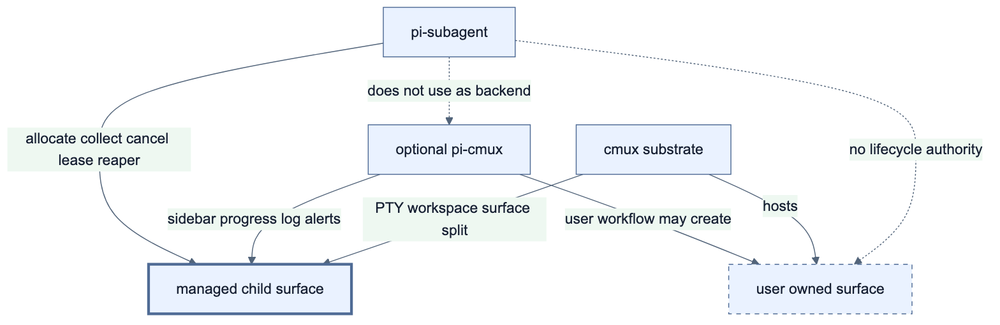

# `pi-subagent`와 `pi-cmux` 연동 가이드

> **상태:** 현재 동작과 권장 운영 정책

이 문서는 cmux 안에서 `pi-subagent`와 [`pi-cmux`](https://github.com/javiermolinar/pi-cmux)를 함께 사용할 때의 역할, 설정, 제한을 설명하는 상위 진입점이다. root-only generic presence producer는 shared [`@pi/presence` protocol (v2-20260828-1)](https://github.com/spi-ca/pi-presence/tree/v2-20260828-1)을 사용하며, 별도 consumer가 이를 선택적으로 표시할 수 있다. `pi-subagent`의 projection 경계는 [`pi-subagent presence projection`](./pi-cmux-presence-integration.md)을, interactive pane의 내부 protocol과 lifecycle 구현은 [cmux/tmux 기반 실제 Pi TUI 설계 및 구현](./cmux-pi-tui-design.md)을 참고한다.

`pi-cmux`는 `pi-subagent`의 실행, 결과 반환, 취소와 cleanup에 필요하지 않은 **선택적 workflow UX 확장**이다. child surface별 sidebar와 command/review 작업 흐름이 필요할 때 설치한다. root Pi/subagent 집계의 generic status·progress·attention은 `pi-subagent` producer를 설치·로드된 `pi-cmux-presence` consumer가 표시할 수 있다.

## 1. 결론

두 패키지는 함께 사용할 수 있고 lifecycle authority를 공유하지 않는다. root parent의 versioned public event는 **외부 선택 consumer**를 위한 좁은 contract이며, `pi-subagent` 내부에는 이를 cmux UI로 변환하는 consumer가 없다. 역할은 다음처럼 나뉜다.

| 구성 요소 | 역할 |
|---|---|
| `pi-subagent` | subagent 위임, child surface 생성·종료, 결과 수집, 취소, lease와 orphan 정리, root parent dashboard/aggregate/detached event 및 generic V2 presence publish, Pi TUI status/notification |
| 외부 event consumer (선택) | public dashboard/aggregate/detached event를 검증해 필요한 UI를 best-effort로 갱신한다. `pi-subagent`에 포함되지 않는다. |
| `pi-cmux-presence` (선택) | `pi-subagent`가 같은 Pi process에서 발행한 generic presence update/remove를 소비할 수 있는 별도 observer/UI다. `pi-cmux` package나 lifecycle authority와 연결되지 않는다. |
| `pi-cmux` (선택) | 각 Pi surface의 sidebar, progress, log, 알림과 사용자 작업 흐름을 제공한다. public event consumer의 소유자나 설치 조건이 아니다. |
| cmux | PTY, workspace, surface와 split 제공 |

핵심 원칙은 **실행과 lifecycle은 `pi-subagent`, root subagent 집계의 기본 표시는 Pi TUI status, surface별 추가 사용자 경험은 optional `pi-cmux` 또는 외부 consumer가 담당한다**는 것이다. event와 status/notification은 관찰 UI일 뿐 completion, cancellation, lease, reaper 또는 target cleanup authority가 아니다. `pi-subagent`는 `pi-cmux`의 내부 모듈이나 `cmux_open_terminal`을 launcher로 사용하지 않으며 production에서 dashboard용 cmux CLI도 실행하지 않는다.



_2x PNG · [SVG](./diagram/pi-cmux-role-boundary.svg) · [Mermaid source](./diagram/pi-cmux-role-boundary.mmd)_

```text
parent Pi
├─ pi-subagent
│  ├─ cmux surface 생성 및 stable ID 추적
│  ├─ child Pi 완료·결과 수집
│  └─ cancel, lease, reaper
└─ pi-cmux (설치한 경우)
   └─ parent surface UX

child Pi surface
├─ pi-subagent child bridge
│  └─ agent_settled 기준 semantic completion
└─ pi-cmux (inherit profile에서 설치한 경우)
   └─ child surface sidebar/progress/log

managed profile은 inherited pi-cmux를 로드하지 않음
```

## 2. 사전 조건과 설치 선택

### 필수 사전 조건

- Pi `0.80.10` 이상
- Pi package로 설치된 `pi-subagent`
- stable cmux `0.64.20` 이상에서 실행 중인 Pi

이 조건만 충족하면 `pi-subagent`의 cmux interactive child TUI, 결과 반환, 취소와 cleanup을 사용할 수 있다. `pi-cmux`는 코어 동작의 필수 조건이 아니다.

### 선택 사전 조건

child별 sidebar와 `cmux_open_terminal`, review/continue 같은 `pi-cmux` 사용자 작업 흐름이 필요하면 `pi-cmux`를 추가로 설치한다. root observer UI만 필요하면 `pi-cmux-presence`를 대신 선택할 수 있다.

```bash
pi install npm:pi-cmux
```

Pi가 이미 실행 중이면 package를 반영한다.

```text
/reload
```

| 기능 | `pi-cmux` 미설치 | `pi-cmux` 설치 |
|---|---|---|
| cmux child Pi TUI 생성 | 사용 가능 | 사용 가능 |
| subagent 결과 반환·취소·cleanup | 사용 가능 | 사용 가능 |
| `pi-cmux` sidebar·progress·log | 제공되지 않음 | 로드 조건과 설정에 따라 제공 |
| `pi-cmux` 알림·flash·사용자 command | 제공되지 않음 | 설정에 따라 제공 |

설치 여부는 원하는 UX를 기준으로 선택하면 된다. 두 패키지 사이에는 직접적인 런타임 API 의존성이 없다.

`pi-subagent`의 cmux interactive mode는 `CMUX_WORKSPACE_ID`와 `CMUX_SURFACE_ID`에서 **앞뒤 공백을 먼저 제거한 값**이 모두 canonical UUID일 때만 선택된다. trim 뒤 부분 값, `*_ref` 또는 malformed 값은 cmux identity가 아니며 tmux 조건을 다시 평가한 뒤 inline으로 처리한다. `pi-cmux`도 같은 cmux 환경 정보를 사용하지만, 이 환경 정보 공유가 패키지 의존성을 뜻하지는 않는다.

## 3. 설치한 경우 자동으로 함께 동작하는 부분

전역 `~/.pi/agent/settings.json`에 `pi-cmux`가 package로 등록되어 있고 `inherit` child가 같은 agent directory와 설정을 사용하면, `pi-subagent`가 실행한 child Pi도 일반적으로 `pi-cmux` extension을 로드한다. `managed` child는 inherited extension 전체를 제외하므로 이 절의 자동 연동 대상이 아니다. 따라서 별도 연동 코드를 추가하지 않아도 child surface에서 sidebar, progress와 log가 표시될 수 있다.

다음 경우에는 extension 자동 로드 또는 sidebar 활성화를 보장할 수 없다.

- 부모 Pi를 `--no-extensions`로 실행한 경우
- child가 다른 agent directory 또는 다른 settings를 사용하는 경우
- cmux workspace 환경 정보가 없는 경우

child tool allowlist와 제외 목록은 `cmux_open_terminal` 같은 도구의 사용 가능 여부에는 영향을 주지만, `pi-cmux` extension 자체의 로드나 sidebar 활성화 여부를 결정하지는 않는다.

`pi-cmux`의 sidebar status key는 기본적으로 surface ID를 포함하므로 여러 child surface가 동시에 실행되어도 서로 다른 status entry를 사용한다.

## 4. lifecycle 경계

두 패키지는 완료를 판단하는 목적과 시점이 다르다.

| 이벤트/주체 | 의미 |
|---|---|
| `pi-cmux`의 `agent_end` 처리 | 현재 agent run의 sidebar 최종 표시, flash와 알림 생성 |
| `pi-subagent` child bridge의 `agent_settled` 처리 | retry, compaction retry와 queued follow-up까지 끝난 child의 semantic completion을 확정하고 결과 반환과 exact surface/pane 정리를 시작 |

`agent_end` 뒤에도 자동 실행이 남을 수 있으므로 `pi-subagent`는 이를 child 종료 신호로 사용하지 않는다. 반대로 현재 `pi-cmux`의 sidebar와 알림은 `agent_end`에서 갱신되므로, 표시상 완료가 `pi-subagent`의 최종 완료보다 먼저 보일 수 있다.

이 차이는 결과 수집이나 surface cleanup의 정확성을 해치지 않는다. lifecycle의 source of truth는 계속 `pi-subagent` child bridge가 publish한 strict `CompletionRecordV3` sidecar다. private lifecycle socket의 `completion-ready`·heartbeat와 optional UI event는 parent를 깨우거나 표시하는 hint일 뿐이며, parent는 JSONL offset·final entry ID·SHA-256 prefix를 검증한 뒤에만 surface를 닫는다.

### Public dashboard event contract

root parent는 process-local `pi.events`에 다음 v1 payload를 publish한다. 이 contract는 `pi-cmux` 설치를 요구하지 않으며, listener failure는 invocation/lifecycle에 영향을 주지 않는다.

| channel | payload | 용도 |
| --- | --- | --- |
| `pi-subagent:dashboard:v1` | session/generation/monotonic sequence envelope, bounded counts 및 최대 64개 active item | parent dashboard 상태 |
| `pi-subagent:aggregate-completed:v1` | 같은 envelope와 terminal invocation 요약 | 완료·실패·취소 집계 알림 |
| `pi-subagent:detached:v1` | 같은 envelope, run ID, agent, `cmux-pane`/`tmux-pane`/`herdr-pane`, detachment time | 새 durable promotion 알림 |

모든 payload는 `version: 1`, `sessionId`, `generation`, 증가하는 `sequence`, `emittedAt`을 가지며 task, prompt, path, credential, raw output을 포함하지 않는다. publisher는 terminal invocation 기억을 256개로, detached notification을 run별 한 번으로 제한한다. consumer는 exact shape와 envelope를 검증하고 세션·generation이 다르거나 sequence가 뒤로 가는 event를 버려야 한다.

`pi-subagent`는 이 channel을 내부에서 소비하거나 dashboard를 위해 cmux CLI/socket mutation을 수행하지 않는다. 외부 선택 consumer는 각 payload와 session/generation/sequence fence를 검증한 뒤 필요한 UI를 best-effort로 갱신할 수 있다. consumer failure는 invocation/lifecycle에 영향을 주어서는 안 된다. detached event도 durable ownership UI를 갱신하려는 외부 consumer를 위한 public 알림일 뿐 lifecycle authority를 만들지 않는다.

### Generic presence는 별도 contract

root `pi-subagent`는 shared [`@pi/presence` protocol (v2-20260828-1)](https://github.com/spi-ca/pi-presence/tree/v2-20260828-1)의 `subagent` projection을 root parent(depth `0`)에서만 생산한다. 이는 Herdr의 내부 socket `agent.*`, child `pane.report_metadata`, dashboard/aggregate/detached와 별개인 best-effort observer이며, consumer는 lifecycle authority를 얻지 않는다. aggregate와 terminal projection, privacy 및 consumer presentation은 [`pi-subagent presence projection`](./pi-cmux-presence-integration.md)을 따른다.

## 5. 권장 운영 정책

다음은 `pi-cmux`를 상속하는 기본 `inherit` child에 적용할 수 있는 운영 권장안이다. opt-in `managed`는 inherited `pi-cmux` 전체를 제외하므로 sidebar·알림·flash·`cmux_open_terminal`이 모두 없다.

```text
inherit: sidebar/progress/log 유지
inherit: child 완료 알림·flash 비활성화 권장
managed: inherited pi-cmux와 cmux_open_terminal 제외
```

병렬 child마다 `agent_end` 알림과 flash를 발생시키면 알림이 과도해지고, semantic completion보다 이른 완료 신호를 줄 수 있다. `pi-cmux`가 지원하는 관련 환경 변수는 다음과 같다.

```bash
PI_CMUX_NOTIFY_LEVEL=disabled
PI_CMUX_SIDEBAR_FLASH=disabled
PI_CMUX_SIDEBAR_SOURCE=pi-subagent
```

`pi-subagent`는 parent의 임의 `PI_CMUX_*` 값을 interactive child에 전달하지 않는다. 대신 `inherit` child에만 검토된 `subagent-child-v1` profile(`PI_CMUX_NOTIFY_LEVEL=disabled`, `PI_CMUX_SIDEBAR_FLASH=disabled`, `PI_CMUX_SIDEBAR_SOURCE=pi-subagent-child`)을 새로 주입해 parent 알림은 유지하면서 child 알림/flash를 억제한다. `PI_CMUX_REGISTER_COMMANDS=0`, `PI_CMUX_REGISTER_TOOLS=0`, `PI_CMUX_SUBAGENT_DASHBOARD=0`도 future-compatible hint로 전달하지만, 사용자 요청에 따라 pi-cmux command/tool 등록 제어 자체는 이 구현 범위와 완료 조건에서 제외한다. `managed` child는 `pi-cmux` 자체를 로드하지 않는다.

현재 선택지는 다음과 같다.

1. 기본 `inherit`는 parent 설정을 건드리지 않고 child notification/flash profile을 주입하며 sidebar source를 child로 표시한다.
2. child의 inherited `pi-cmux` 전체를 제외해도 되면 `PI_SUBAGENT_CMUX_CHILD_POLICY=managed` 최소 profile을 사용한다.
3. 설치된 `pi-cmux`가 future-compatible registration hint를 인식하지 않아도 lifecycle/authority에는 영향이 없으며 command 등록 제어는 지원 범위 밖이다.

## 6. `cmux_open_terminal`과 관리 범위

`pi-cmux`는 Pi가 명시적으로 요청받은 TUI나 장기 실행 command를 split 또는 tab에서 열 수 있도록 `cmux_open_terminal` 도구를 등록한다. 부모 Pi와 inherited `pi-cmux` 및 `cmux_open_terminal`을 로드한 `inherit` policy child에서는 유용하지만, 그 child가 이 도구로 만든 surface는 `pi-subagent`의 run registry 밖에 있다. `managed` policy는 inherited `pi-cmux`와 `cmux_open_terminal`을 제외한다.

그 surface에는 다음 lifecycle이 적용되지 않는다.

- parent cancel에 따른 종료
- parent lease가 없거나 stale할 때의 정리
- startup reaper의 orphan 정리
- nested run의 leaf-first cleanup

`managed` mode는 `--no-extensions` 기반 최소 profile이므로 inherited `pi-cmux`와 `cmux_open_terminal`을 아예 로드하지 않으며, extension-owned tool을 명시적으로 요구하면 launch 전에 fail-closed한다. `inherit` mode에서 이 도구를 허용하는 경우에만 위 unmanaged lifecycle 위험이 남는다. 부모에 적용한 Pi의 `--exclude-tools cmux_open_terminal`은 부모에서도 도구를 비활성화하므로 child-only managed 정책의 대체가 아니다.

`pi-cmux`의 `/cmv`, `/cmh`, `/cmo`, `/cmt`, continue/review 계열 command도 별도 surface를 만든다. 이 command는 managed child에는 등록되지 않는다. inherit child에서 사용자가 직접 만든 surface는 **user-owned/unmanaged surface**로 간주해야 한다.

## 7. 왜 `pi-cmux`를 backend로 재사용하지 않는가

`cmux_open_terminal`과 `pi-cmux` 내부 split helper는 사용자 작업 흐름을 위한 API다. `pi-subagent`가 요구하는 다음 lifecycle contract를 제공하지 않는다.

- 생성한 surface의 stable handle 반환과 지속 추적
- child session 및 typed completion protocol
- parent cancel과 nested cancellation
- parent lease와 startup reaper
- child 결과와 usage 수집

Phase 1에서 `pi-subagent`는 production cmux lifecycle을 CLI가 아닌 **control-v2 Unix-domain socket adapter**로 수행한다. active parent/foreground/background는 process-owned persistent request manager를 재사용하고, startup reaper와 detached broker는 각각 generation-bound manager/connection을 소유한다. socket owner/mode/type/inode, capability/auth, required methods, `identify`, macOS app bundle이 stable `0.64.20` 이상인지 확인하고, `identify.app_version`이 제공되면 bundle version과 같은지 확인하기 전에는 allocation이나 backend mutation을 수행하지 않는다. 알 수 없는 compatibility argv와 password-auth broker는 fail-closed이며 CLI fallback은 없다. legacy CLI V2 record는 진단 보존용일 뿐 mutation authority가 아니다. `pi-cmux`의 비공개 내부 모듈을 import하거나 extension 간 암묵적 API에 의존하지 않는다. Phase 4의 authorized `events.stream` hint foundation은 구현되어 있으며, stream event는 lifecycle authority가 아니라 exact `system.tree` reconciliation을 깨우는 보조 신호로만 사용한다.

## 8. 확인 절차

### 8.1 코어 검증 (`pi-cmux` 불필요)

`pi-cmux` 설치 여부와 관계없이 다음 절차로 `pi-subagent`의 코어 cmux 동작을 확인한다. `pi-cmux`를 설치하지 않기로 했다면 이 절까지만 수행하면 된다.

1. cmux 안에서 부모 Pi를 실행한다.
2. 부모 shell의 두 환경 변수에서 앞뒤 공백을 제거한 값이 각각 canonical UUID인지 확인한다.

   ```bash
   uuid_re='[0-9a-fA-F]{8}-[0-9a-fA-F]{4}-[1-5][0-9a-fA-F]{3}-[89aAbB][0-9a-fA-F]{3}-[0-9a-fA-F]{12}'
   workspace_id=$(printf '%s' "$CMUX_WORKSPACE_ID" | sed 's/^[[:space:]]*//; s/[[:space:]]*$//')
   surface_id=$(printf '%s' "$CMUX_SURFACE_ID" | sed 's/^[[:space:]]*//; s/[[:space:]]*$//')
   printf '%s\n' "$workspace_id" | grep -Ex "$uuid_re" >/dev/null &&
     printf '%s\n' "$surface_id" | grep -Ex "$uuid_re" >/dev/null
   ```

3. `pi-subagent`로 짧은 작업을 실행한다.
4. 다음 코어 동작을 확인한다.
   - 새 cmux surface에 실제 child Pi TUI가 표시된다.
   - 작업 완료 후 parent에 subagent 결과가 반환된다.
   - child surface가 닫히고 managed run artifact가 정리된다.
5. 취소 검증에서는 parent에서 실행을 취소한 뒤 child surface가 남지 않는지 확인한다.

### 8.2 선택 UX 검증 (`pi-cmux` 설치 시)

`pi-cmux` UX를 사용하기로 했다면 설치 후 `/reload`를 실행하고 짧은 subagent 작업을 다시 실행한다.

다음을 추가로 확인한다.

- child surface의 `pi-cmux` sidebar와 progress가 독립적으로 갱신된다.
- 설정에 따라 log, 알림과 flash가 동작한다.
- 코어 검증과 동일하게 결과가 반환되고 child surface가 정리된다.

`pi-cmux`를 설치해 선택 UX 검증을 수행했는데 sidebar가 보이지 않으면 다음을 확인한다.

- child에 `CMUX_WORKSPACE_ID`가 전달되었는가
- `PI_CMUX_SIDEBAR=0`이 설정되어 있지 않은가
- child가 `pi-cmux` package를 실제로 로드했는가
- parent와 child가 같은 Pi agent directory/settings를 사용하는가

현재 부모 Pi의 알림이 너무 많으면 부모 실행 환경의 `PI_CMUX_NOTIFY_LEVEL`과 `PI_CMUX_SIDEBAR_FLASH`를 먼저 확인한다. 이 설정은 managed interactive child 전용 제어가 아니다.

## 9. 현재 제한과 후속 개선안

managed-child 최소 extension profile, 단일 `/subagents`의 list/cancel/doctor/details/focus/keep/promote, bounded activity/result preview, surface title과 parent compact status를 `pi-subagent` 내부에서 구현했다. `pi-cmux`, Pi core와 cmux 자체는 변경하지 않는다. production multiplexer 제어는 authenticated cmux control-v2 socket만 사용하고 CLI fallback은 없으며, inherit mode의 optional `pi-cmux` 표시는 해당 package가 이미 지원하는 환경 변수와 Pi extension API 범위에서만 동작한다.

대부분 기존 `{ agent, task }`, `tasks`, `chain` 호출 계약을 변경하지 않고 session-level 정책, 자동 동작 또는 slash command로 추가할 수 있다. 구현 전에는 아래 권장값을 현재 기본 동작으로 간주하면 안 된다.

### 우선순위가 높은 기능

#### managed-child launch policy (구현됨)

`managed`는 Pi의 `--no-extensions`와 explicit extension loading을 사용해 inherited extension 전체를 끄고, nested delegation용 `pi-subagent`와 interactive lifecycle bridge만 로드한다. 따라서 child의 `cmux_open_terminal`, parent dashboard/review command뿐 아니라 inherited `pi-cmux` sidebar/progress/log도 제외된다. 내장·models.json provider 설정과 auth, child session은 유지하지만 extension이 등록한 custom provider는 inherited extension과 함께 제외된다. 해당 provider만 존재하는 model을 child에 지정하면 Pi가 model-unavailable로 fail-closed하므로 그런 agent는 `inherit`를 사용해야 한다. extension-owned tool allowlist 또는 inherited built-in override를 보존할 수 없는 경우에도 launch 전에 fail-closed한다. parent extension registry와 기존 subagent tool 호출 계약은 바꾸지 않는다.

session-level 정책은 다음 환경 변수로 선택한다.

```bash
PI_SUBAGENT_CMUX_CHILD_POLICY=managed  # 권장 정책 적용
PI_SUBAGENT_CMUX_CHILD_POLICY=inherit  # 기존 환경 그대로 상속
```

`managed`에서는 inherited `pi-cmux`가 로드되지 않으므로 `/cmv`, `/cmh`, review/continue 등 해당 child slash command도 등록되지 않는다. `inherit`에서는 기존 동작을 유지한다. 사용자가 child TUI에서 해당 command를 직접 실행해 만든 surface는 user-owned/unmanaged로 취급한다.

managed는 extension 최소화 정책일 뿐 hostile-child OS sandbox가 아니다. child 출력·지시는 untrusted이지만 child와 parent는 cooperative same-UID peer이며, `0700`/`0600`/no-replace 보호는 다른 UID·race·실수 교체용이다. 따라서 `/subagents promote`의 public durable `detached-ownership.json`도 malicious same-UID code에 대한 ownership proof가 아니다. hostile child가 가능한 환경은 별도 UID 또는 mandatory MAC sandbox와 좁은 IPC를 쓰거나 managed/promotion을 비활성화해야 한다. [설정의 OS 신뢰 경계](./configuration.md#managed-child의-os-신뢰-경계)를 따른다.

#### 단일 `/subagents` 관리 command (구현됨)

slash command는 하나만 등록한다. session-local foreground/background invocation을 bounded recent history와 함께 표시하고, exact full ID 취소·상세 조회·read-only doctor를 제공한다. interactive run은 별도의 exact run ID로 존재/exit/title 상태, backend/placement, depth/elapsed, bounded preview와 ownership을 표시한다. task·prompt·path·credential과 raw multiplexer title은 UI snapshot에 저장하거나 출력하지 않는다.

```text
/subagents                   TUI selector 또는 목록
/subagents list              실행 목록
/subagents doctor            probe 없는 integration 진단
/subagents cancel <full-id>   foreground/background invocation 취소
/subagents details <full-id>  invocation 또는 interactive run 상세
/subagents focus <run-id>     negotiated cmux 또는 전후 identity를 검증하는 user-initiated Herdr focus
/subagents keep <run-id>      session shutdown까지 surface 보존
/subagents promote <run-id>   durable user ownership으로 승격
```

인자 없이 실행하면 TUI mode에서 항목이 있을 때 실행 중이거나 최근 완료된 child를 **attention-first** selector로 보여 준다. `failed` → `cancelling` → `running` → `completed` → `cancelled` 순서이며, interactive run은 `ownership unknown`, `transferring`, `managed`, `kept`, `detached` ownership label과 아이콘을 표시하고 그 ownership attention rank도 같은 정렬에 포함한다. selector는 응답성을 위해 최대 32개 항목만 보이고, duration은 raw millisecond가 아닌 `1m24s` 같은 사람이 읽는 elapsed time으로 표시한다. interactive 항목을 선택하면 negotiated `surface.focus`가 지원되고 성공할 때 해당 surface로 focus하며, 지원되지 않거나 실패하면 해당 항목의 detail notification을 표시한다. 항목이 없거나 non-TUI이면 plain list notification을 표시한다.

```text
> scout · ✕ failed · 1m24s · <invocation-id>
  reviewer · interactive/● managed · d1 · 48s · <run-id>
  worker · ✓ completed · 12s · <invocation-id>
```

현재 구현은 별도의 sanitized session-local UX registry와 exact interactive authority registry를 사용하며 Pi의 `registerCommand()`, `ctx.ui.select()`, `ctx.ui.notify()`, `ctx.ui.confirm()`, `setStatus()`만 사용한다. doctor는 새 CLI/control handshake/topology probe를 실행하지 않고 cmux/Herdr/tmux 현재 환경 identity, scheduler 수치, active interactive authority 수와 Pi registry provenance만 보고한다. control readiness는 doctor가 아니라 각 interactive launch에서 검증한다. `details`와 ownership action만 선택한 exact run의 기존 generation-bound backend를 검사한다. Herdr `auto`는 shared pane/window이 아니라 child별 unfocused 새 tab root pane이고, cancellation 뒤 present/unknown/hung terminal은 recovery/manual cleanup과 late watcher를 유지한다. promotion marker authority가 불확실하면 `details`/list에 run을 계속 보존하고 local cleanup을 revoke한다. cmux focus는 negotiated `surface.focus`가 있을 때만 persistent control-v2로 수행하고, Herdr focus는 protocol-gated exact rebound pane만 사용하며, tmux focus는 안전한 caller-client authority가 없어 fail-closed한다. production cmux CLI fallback은 없다. subcommand completion은 UI 편의이며 LLM tool schema에 추가하지 않는다.

#### parent compact status와 public event (구현됨)

`pi-cmux` native sidebar를 직접 확장하지 않고 parent Pi의 status에 session-local foreground/background invocation 상태를 표시한다. root parent는 별도로 versioned dashboard/aggregate event를 외부 선택 consumer에게 publish한다. `pi-subagent`는 이 event를 내부 cmux adapter로 소비하지 않고 cmux CLI/socket mutation도 수행하지 않는다.

footer는 invocation lifecycle이나 queue authority를 만들지 않는 표시 전용 집계이며, 항상 다음 exact icon/count 순서를 사용한다. `◷`는 개별 invocation position이 아니라 process-local scheduler의 aggregate queue count다.

```text
subagents: ●<running> ◷<scheduler-queued> ◌<cancelling> ✓<completed> ✕<failed> –<cancelled>
```

상세 화면이 필요하면 `/subagents`에서 다음 정보를 제공한다.

```text
Subagents  3 running · 1 done
● scout       01:24  reading
● researcher  00:48  searching
◐ reviewer    00:11  waiting
```

표시 후보는 다음과 같다.

- agent 이름
- `running`, `completed`, `failed`, `cancelling` 상태
- elapsed time
- foreground/background 구분
- delegation depth
- process-local scheduler의 `maxActive` (selector는 active/queued count를 생략할 수 있음; durable tree authority/cap은 보고하지 않음)
- active interactive authority 수

surface별 존재 여부와 token/cost 합계는 현재 compact status에 포함하지 않는다.

parent 화면을 과도하게 차지하지 않도록 기본 status는 한 줄로 유지하고, 상세 정보는 selector에서 보여 주는 방식을 우선한다. TUI-only status/widget이므로 LLM context를 소비하지 않는다.

#### surface title 설정 (구현됨)

managed base title은 `<agent> [depth=<n>;run=<prefix>]`다. wrapper는 effective environment와 `cwd`를 설치한 뒤 tree permit이 child를 `STOP`할 수 **전에** OSC로 `<base> · queued`를 발행한다. 그 뒤 child bridge가 정확히 `ready`, `running`, `waiting`, `returning`, `failed` suffix를 쓴다. 따라서 허용 lifecycle suffix 전체는 `queued`, `ready`, `running`, `waiting`, `returning`, `failed`이며, abort는 별도 suffix가 아니라 `waiting`이다.

```text
scout [depth=1;run=a14f82c1] · queued
scout [depth=1;run=a14f82c1] · running
reviewer [depth=2;run=39bc730e] · returning
```

표시 정보는 sanitized agent name, depth와 run ID prefix로 제한한다. base title은 printable ASCII이고, 동적 lifecycle suffix는 ` · `를 포함할 수 있지만 control character 없이 전체 title은 96자로 제한한다. task, prompt, secret 또는 긴 경로는 title에 넣지 않는다. `details`는 raw title을 공개하지 않고 managed title과 `matching|changed|unavailable` 상태만 보여 준다. gated production-wrapper smoke는 `queued`를 먼저 정확히 관측한 뒤 lifecycle title로 진행하도록 갱신됐지만, 현재 title 형식의 live cmux/tmux 재실행 통과를 여기서 주장하지 않는다.

#### `/subagents doctor` integration health 진단 (구현됨)

별도 `/subagent-doctor` command를 등록하지 않고 단일 관리 command의 subcommand로 제공한다.

```text
/subagents doctor
```

현재 구현은 다음 항목만 확인한다.

- cmux/Herdr/tmux 환경 identity 유효성과 우선순위에 따른 현재 terminal mode
- 현재 interactive layout과 child launch policy
- process-local scheduler의 `maxActive` (active/queued count는 표시 가능한 경우만; durable tree authority/cap은 진단하지 않음)
- active interactive cleanup authority 수
- Pi tool/command registry provenance에서 확인 가능한 `pi-cmux` metadata
- control readiness는 doctor probe가 아니라 각 interactive launch에서 검증한다는 사실

doctor 자체는 probe-free다. surface별 존재/exit/title 상태와 keep/promote ownership은 `/subagents details <run-id>`가 exact active authority를 통해 별도로 진단한다.

`pi-cmux` extension의 실제 로드 여부는 Pi가 노출하는 tool/command metadata로 확인 가능한 범위만 진단한다. 공개 정보만으로 확정할 수 없는 상태는 `확인 불가` 또는 `추정`으로 표시하고 로드됐다고 단정하지 않는다.

### 기본 LLM context 최소화 원칙

slash command는 command registry와 autocomplete에 등록되지만 기본 system prompt나 tool schema에는 포함되지 않는다. 따라서 command를 하나로 합치는 주된 목적은 command 목록과 사용자 interface를 단순화하는 것이며, model input token 감소 효과는 크지 않다.

기본 context 증가는 다음 원칙으로 방지한다.

1. 관리용 LLM tool을 새로 등록하지 않는다. `subagent_manage`, `subagent_doctor`, `subagent_focus` 같은 별도 tool schema를 추가하지 않는다.
2. 기존 `SubagentParams`에 layout, dashboard 또는 관리 field를 추가하지 않는다.
3. `/subagents` 사용 안내를 `before_agent_start` system prompt에 추가하지 않는다.
4. status와 activity를 `pi.sendMessage()`로 전달하지 않는다. custom message는 LLM context에 참여하므로 사용하지 않는다.
5. 현재 parent 표시는 `ctx.ui.setStatus()`와 `/subagents`의 TUI selector/notification만 사용한다.
6. 영속적인 TUI-only 기록이 필요하면 `pi.appendEntry()`와 `registerEntryRenderer()`를 사용한다.
7. dashboard, surface와 doctor 상세 정보를 기존 `subagent` tool result에 항상 추가하지 않고 command가 호출될 때만 계산·표시한다.
8. child에서는 `cmux_open_terminal`을 제외해 불필요한 tool schema가 child model context에 들어가지 않게 한다.

현재 기본 context의 주요 비용은 slash command가 아니라 `subagent` tool schema와 `before_agent_start`에서 주입하는 agent 목록, depth/cycle guard다. 이번 개선안은 이 두 계약을 확장하지 않는다.

다음 기능은 TUI 또는 runtime 내부 상태만 사용하므로 기본 LLM context를 늘리지 않는다.

- managed-child 환경 변수와 tool 제외
- parent compact status/widget
- surface title과 cmux surface 이동
- active run registry와 private sidecar
- `/subagents` overlay와 doctor 화면
- keep/promote ownership metadata

### Activity preview와 ownership (구현됨)

foreground/background callback과 interactive session drain에서 얻은 public result text만 terminal-control 제거 후 256자로 제한해 TUI-only preview로 보관한다. task, path, raw tool argument, raw terminal title, credential 또는 전체 transcript sidecar는 복제하지 않는다. preview는 session generation으로 fence되고 recent-history bound를 따른다.

`/subagents keep <run-id>`는 exact live target을 재확인한 뒤 session-local ownership을 `kept`로 바꾸어 정상 completion close를 보류한다. session shutdown은 generation/fence 아래 이를 강제로 정리한다. kept tmux run의 shutdown cleanup은 active pooled client lease와 분리된 새 generation-bound control client를 열고, immutable gate digest·executable/socket/server·source/session/window·exact target을 다시 검증한 뒤에만 실행한다. 이 client는 각 cleanup 뒤 닫히며, 불확실한 close mutation은 새 연결에서 재실행하지 않는다.

`/subagents promote <run-id>`는 local ownership을 먼저 `transferring`으로 바꾸고 process-local parent mutation authority를 철회한다. 그 뒤 exact allocation digest에 결속된 private immutable `promotion-request.json`을 publish하고, exact child ACK인 `promotion-ack.json`을 확인한 뒤 durable tree permit을 detach한다. 마지막으로 public immutable `detached-ownership.json`을 publish해 final detached ownership을 표시한다. record는 패키지 루트의 `pi-subagent.detached-ownership.schema.json` v1을 따른다. `user-ownership.json`은 legacy read-only compatibility marker이며 새 promotion은 publish하지 않는다. 결과는 `promoted`, `already-promoted`, `ownership-unknown`, `rejected`로 구분한다. ACK timeout, partial chain, 또는 기존 marker가 malformed·unreadable·다른 digest이면 run을 목록에서 지우지 않고 recovery metadata를 retain하는 `ownership-unknown`으로 남긴다. UI는 cleanup authority가 unknown/revoked라 자동 cleanup이 중지되었다고 명시하고, startup reaper도 이 불확실한 상태를 보수적으로 유지하며 target을 mutate하지 않는다. 정상 promoted target도 reaper가 절대 mutate하지 않지만 task/prompt/auth/token/wrapper artifacts는 scrub하고, child session은 PID/start identity가 명시적으로 dead일 때만 제거한다. focus/keep/promote는 session shutdown fence와 per-run operation queue로 직렬화된다.

### 이번 범위에서 제외할 기능

`pi-subagent`만 수정한다는 원칙에 따라 다음 항목은 후속안에서 제외한다.

- 설치된 `pi-cmux` package의 tool 또는 slash command 등록 로직 변경(사용자 요청으로 범위 제외)
- `pi-cmux`의 비공개 notification renderer/internal module 재사용
- public v1 dashboard/aggregate/detached contract 밖의 lifecycle event 또는 `pi-cmux:surface-ready` 같은 신규 외부 event
- Pi core 또는 cmux 자체 수정

Pi TUI terminal toast는 `failed` invocation에만 warning으로 표시한다. `completed`와 `cancelled`는 footer·tool result로 확인하며 별도 toast를 만들지 않는다. background job의 result/error delivery는 기존처럼 Pi `steer`로 유지된다. versioned `pi-subagent:aggregate-completed:v1` event는 외부 선택 consumer에게 publish되지만, `pi-subagent`는 이를 cmux CLI로 전달하지 않으며 external consumer failure가 agent 결과나 lifecycle authority를 바꾸지 않는다. 이는 `pi-cmux` notification renderer나 sidebar internal module을 재사용하는 것이 아니고, public v1 contract 밖의 event도 추가하지 않는다.

다음 일반 기능은 이미 `pi-cmux`가 제공하므로 `pi-subagent`에서 중복 구현하지 않는다.

- 일반 command를 split/tab에서 실행
- zoxide directory 이동
- 수동 review session 생성
- general-purpose arbitrary-session continuation
- worktree 생성
- general-purpose cmux split command

### 적용한 구현 순서

1. managed-child 환경 및 tool 정책
2. 단일 `/subagents`와 parent compact status
3. exact interactive authority와 negotiated cmux focus
4. sanitized one-shot surface title와 bounded preview
5. session-local keep 및 durable promote/reaper exclusion

이 UX는 기존 tool invocation schema를 늘리지 않고 구현되었다. interactive layout은 이미 구현되어 있으며, [다중 subagent interactive pane layout 설계](./interactive-pane-layout-design.md)의 정적 테스트 범위와 live 검증 상태를 따른다. cmux와 tmux `auto` smoke의 2026-07-20 **PASS**는 historical layout evidence이며 M0 performance evidence나 live full-matrix benchmark 결과가 아니다. tmux는 제한된 3 top-level + parent/2 nested smoke 범위고, 기존 tmux crash/reaper **PASS**도 별도 acceptance이며 이 layout 검증을 대체하지 않는다.

## 10. control-socket transport (Phase 1/4 구현)

`src/runtime/cmux-control-socket.mjs`, `src/runtime/cmux-control-adapter.mjs`와 `src/runtime/cmux-events.ts`가 production cmux launcher, broker, rollback, final cleanup과 reaper에 연결되어 있다. active parent/background는 process-owned persistent request manager를 재사용하고 startup reaper와 detached broker는 각각 generation-bound manager/connection을 소유한다. production 기본 cmux domain runner에도 CLI fallback은 없다.

- socket authority는 `CMUX_SOCKET_PATH` 또는 `~/.local/state/cmux/cmux.sock`뿐이다. client는 parent/socket의 realpath, owner UID, mode, socket type 및 connect 전후 device/inode를 검증하며 socket을 추측하거나 unlink하지 않는다.
- control request는 bounded bare-LF NDJSON과 단일 in-flight queue를 사용한다. flush 뒤 mutation의 EOF/timeout은 `CmuxUnknownOutcomeError`이며 replay하지 않는다.
- low-level request client는 caller가 memory-only로 직접 넘긴 password에만 `auth.login`을 사용할 수 있다. 그러나 production interactive path의 detached broker에는 secure inherited FD/pipe password transport가 없으므로 password mode를 socket connect 전에 fail-closed한다. capability mode의 `_cmux_capability_v1` wrapper도 explicit memory-owned token에만 사용할 수 있으며 ambient `CMUX_SOCKET_CAPABILITY`를 broker/child env 또는 per-run artifact로 복사하지 않는다.
- handshake는 optional `auth.login` 뒤 `system.capabilities`와 `system.identify`를 검증하고 macOS app bundle의 stable version이 `0.64.20` 이상인지 반드시 확인한다. prerelease와 malformed version은 거부한다. production detached interactive path는 connection 자체가 authorized된 `automation`/`cmuxOnly`만 지원하고, standalone memory-owned client에서만 explicit password가 가능하다. `allowAll`, `off`와 unknown access mode는 fail-closed한다.
- events stream은 별도 connection에서 같은 handshake/app-version gate 뒤 stream-only ack를 받는다. 0.64.20의 special `events.stream`은 capabilities method 목록에 광고되지 않으므로 pinned ack가 stream contract proof다. gap/boot change/reorder/slow consumer/overflow/auth failure는 `system.tree` reconciliation hint일 뿐 completion·close authority가 아니다.

mutation 없는 exact handshake + `system.tree` probe는 다음처럼 명시적으로 gate한다. gate가 없으면 `not-run`; 통과하면 `production-read-only-gate-pass`를 출력한다.

```bash
bun run cmux:control-probe:dry-run
PI_SUBAGENT_CMUX_CONTROL_PROBE=1 bun run cmux:control-probe
```

## 11. 관련 문서

- [cmux/tmux 기반 실제 Pi TUI 설계 및 구현](./cmux-pi-tui-design.md): interactive pane protocol, session tail, completion, lease와 reaper
- [`pi-subagent presence projection`](./pi-cmux-presence-integration.md): subagent aggregate, terminal, privacy와 consumer 경계
- [다중 subagent interactive pane layout 설계](./interactive-pane-layout-design.md): 구현된 cmux shared-pane/마지막 surface retire 정책과 layout 검증 상태 — cmux와 tmux `auto` live smoke 모두 2026-07-20 **PASS**(tmux는 제한된 smoke 범위)
- [사용법](./usage.md): subagent 호출과 terminal mode의 사용자 동작
- [설정](./configuration.md): terminal mode 감지와 관련 설정
- [`pi-cmux` README](https://github.com/javiermolinar/pi-cmux): 설치, command와 전체 환경 변수
