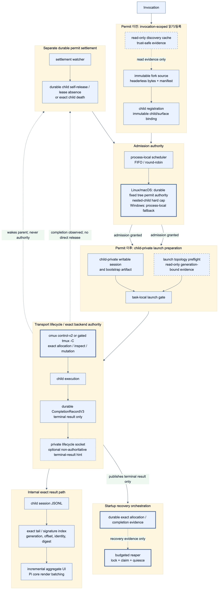

# Pi-subagent internal hot-path 성능 개선 설계

> **상태:** Phase 0A hot paths, hardened lease sub-gate, Phase 5 scheduler, Phase 6 exact tail/signature, conservative Phase 7 reaper와 Phase 8 managed-child opt-in profile이 구현됨; managed-child default 전환은 미구현이다. 이 문서는 parent/child 내부 hot path의 성능 개선과 multi-agent 사용량 가시성을 다룬다. 현재 동작의 최종 source of truth는 코드와 테스트다.

> **Authority:** lifecycle Unix socket, `CompletionRecordV3` transport schema·settlement, cmux desktop control socket v2, `tmux -C`, polling 제거, exact-target mutation/recovery/fencing 및 transport Phases 0–4의 canonical register는 [interactive runtime transport 성능 설계](./interactive-runtime-performance-design.md)가 authoritative하다. 이 문서는 아래 internal runtime 항목과 Phase 0A, Phase 2 lease sub-gate, Phases 5–8, 그리고 상세 security/test/benchmark/acceptance/status/order의 authoritative owner다.

**범위와 authority:** 이 문서가 authoritative한 internal optimization은 다음과 같다.

1. generation-scoped topology read batching
2. trust-safe session agent-discovery cache
3. launch preflight single-flight
4. parent와 child lease/check single-flight
5. aggregate state incrementalization 및 multi-agent usage/model visibility
6. headerless fork source, mode별 private writable session 및 durable ownership manifest
7. asynchronous private artifact I/O와 inherited auth overlay
8. bounded in-memory session-tail/signature state와 exact on-disk index
9. budgeted streaming reaper, process lock 및 exclusive claim

또한 process-local scheduler, managed-child profile 및 tool context는 internal runtime performance 범위에 속한다. 이 설계는 transport authority를 대체하지 않는다. 특히 lifecycle completion, `CompletionRecordV3`, cmux/tmux adapter mutation, exact-target recovery와 transport polling phase의 세부 계약은 반드시 [transport 설계](./interactive-runtime-performance-design.md)를 따른다.

아래 moved sections는 기존 anchor/section numbering의 연속성을 보존한다.

## 9. Pi-subagent 전용 hot path



_2x PNG · [SVG](./diagram/internal-hot-path-model.svg) · [Mermaid source](./diagram/internal-hot-path-model.mmd)_

이 section의 cache/batch/memo/source state는 **현재 parent Pi process/session 또는 한 invocation**에만 존재한다. child bridge lease checker는 §9.4 계약을 Phase 2에서 자기 process-local state로 구현한다. IPC cache service, cross-session reuse나 child shared mutable object를 만들지 않는다. 아래 최적화는 cmux/tmux와 existing lifecycle의 authority를 대체하지 않는 성능 보조층이다.

### 9.1 Generation-scoped topology snapshot batch

현재 safe polling을 유지하는 cmux run과 §7 gate를 통과하지 않은 tmux run은 같은 250ms generation에서 동일 workspace 또는 tmux server의 topology를 중복 조회할 수 있다. 구현된 parent active-loop batch는 generation마다 `(backend executable generation, canonical workspace ID 또는 canonical tmux socket/server PID)`로 **in-flight read-only snapshot request 하나**만 공유하고, 각 handle은 같은 raw snapshot을 자기 strict parser와 durable allocation/source fence로 독립 해석한다. cmux는 current `tree` semantics, tmux는 current `display-message`/`list-panes` safe path semantics를 그대로 사용한다. settle한 snapshot은 즉시 폐기하며, 이 단계는 cmux direct v2 또는 tmux `-C` gate의 선행 조건이 아니고 gate 통과 후의 persistent control snapshot과 섞지 않는다.

- snapshot은 generation 종료 시 폐기한다. `present`/`absent`/`unknown` raw evidence, source generation identity, fetch timestamp와 bounded parse error만 담고 run-local mutable decision을 담지 않는다.
- 같은 key의 concurrent reader는 one fetch promise를 await한다. request failure, identity mismatch, timeout 또는 malformed topology는 `unknown`으로 fan-out하며 absent로 축약하지 않고 기존 per-run safe handling을 유지한다.
- batcher는 `inspect()`/tree/list의 **read-only** call만 de-duplicate한다. allocation, respawn, interrupt, close, final absence confirmation, disconnect handling, startup reaper, rollback, recovery와 `possible-unrecorded-allocation` 판단은 이 snapshot을 authority로 사용하지 않고 기존 exact per-target operation을 수행한다.
- snapshot의 canonical key가 달라지거나 workspace/server generation이 바뀌면 result를 재사용하지 않는다. user-owned target, source identity와 allocation ownership의 판단은 각 consumer가 durable evidence와 함께 다시 수행한다.

따라서 current/ungated polling의 process spawn/RPC fan-out만 줄이며 final cleanup/recovery를 batch cache로 빠르게 만들어 잘못된 target을 닫는 위험은 만들지 않는다.

### 9.2 Session agent-discovery cache

agent 목록 cache는 trust boundary를 우회하지 않는 metadata-only/read-full-body variant로 분리한다. key는 다음 canonical tuple이다.

```text
(canonical user agents directory, canonical project root/agents directory or none,
 requested scope, metadataOnly|fullBody,
 canonical session trusted-project roots, canonical denied-project roots,
 validated trust.json generation/content digest, discovery generation)
```

project agent의 body는 trust가 확인되기 전에 읽거나 cache하지 않는다. 매 invocation에서 current `trust.json`을 다시 검증하거나, 위 key에 validated generation/content digest를 넣어 approval/deny mutation과 file replacement가 반드시 miss가 되게 한다. metadata-only entry에는 trust 전 path/name/stat처럼 body를 포함하지 않는 정보만, full-body entry에는 trust 후 secure read·parse한 data만 넣는다. user agent와 trusted project body도 서로 다른 variant/key로 재사용하지 않는다.

manifest 검증은 directory와 file마다 `lstat → no-follow open → fstat` consistency를 요구한다. `dev`, `ino`, high-resolution `ctime`, `mtime`, `size`와 membership을 비교하고, full parsed agent data 또는 ambiguous metadata change에는 content hash를 확인한다. symlink는 logical path, canonical resolved target, target containment와 target의 same consistency/hash를 모두 검증한다. open/fstat 불일치, symlink retarget, replacement, permission error 또는 hash ambiguity는 cache hit가 아니라 secure rediscovery failure로 처리한다.

`/reload`와 parent/child `session_start`는 discovery generation을 올리고 모든 entry를 폐기한다. trust approval/deny mutation은 canonical root set과 validated trust generation/digest를 갱신한다. parse failure/warning은 negative cache로 오래 보존하지 않으며, cache는 session 종료 때 메모리에서 사라진다.

### 9.3 Launch preflight collapse

sibling interactive launch는 launch 직전의 안전 증거를 공유할 수 있지만 mutation 결과를 공유하면 안 된다.

- tmux는 one invocation/generation에서 source target에 대해 **한 번의 strict snapshot**을 얻고, source pane/session/window/PID와 tmux socket/server PID-start identity fence를 immutable preflight record로 만든다. 각 child allocation은 record가 아직 같은 generation인지와 자기 task의 target disjointness를 다시 확인한다. snapshot 이후 source/generation change, allocation/close, unknown response 또는 timeout은 record를 폐기하고 fresh strict preflight가 필요하다.
- cmux control-v2 sibling launch는 canonical source `system.tree` 조회의 **동시에 진행 중인 fetch만** 공유한다. key는 shutdown generation, topology mutation generation, control socket canonical path/dev/ino, workspace UUID, surface UUID를 모두 포함한다. settle 즉시 폐기하며 mutation generation 또는 socket pathname generation이 응답 중 바뀌면 stale snapshot을 채택하지 않는다. parser는 invalid JSON, invalid shape, duplicate/cross-type identity, source absence를 구분하고 control adapter는 exit code와 bounded control code/state를 원문·credential·private socket path 없이 진단한다.
- Phase 1 direct socket adapter의 socket pathname/access/app proof는 handshake generation에 고정된다. transport failure는 그 client generation의 queued 요청도 실패시키며, 검증되지 않은 암묵적 reconnect나 mutation replay를 하지 않는다. 후속 독립 요청만 fresh auth/capabilities/identify/app/socket-generation 검증 후 새 connection을 사용할 수 있다.
- parent PID/start identity는 process identity를 한 번 검증해 immutable memo로 보관한다. PID-only value, unknown platform identity 또는 process start mismatch는 memoize하지 않고 existing fail-closed launch semantics를 사용한다.

이 collapse는 launch authorization, broker commit, task-specific argv, allocation durable publication과 exact cleanup fence를 task마다 독립적으로 유지한다.

### 9.4 Lease renewal과 child lease-check single-flight

parent writer와 child bridge checker는 `stopAndDrain(): Promise<void>`를 제공한다. 최초 parent `renew()`는 launch commit 전에, 최초 child check는 `session_start`에서 반드시 await한다. 이후 due time은 monotonic absolute schedule(`t0 + n×2초`)로 계산한다. I/O가 길어져도 성공 renewal/check 사이의 gap은 2초 cadence와 12초 stale budget을 보존하는 명시적 maximum을 넘기지 않으며, 이를 넘길 위험이면 terminal/degraded lifecycle rule로 전환한다.

실행 중에는 하나의 latest-pending marker만 남기고 missed tick을 replay하지 않는다. lease writer의 final publication과 stop/terminal/quiescence transition은 같은 lifecycle fence로 serialize한다. writer는 temporary file write+fsync 뒤 fence를 acquire해 generation/terminal/claim을 다시 확인하고, current일 때만 atomic rename한 뒤 fence를 release한다. terminal publication 또는 reaper quiesced acknowledgment는 먼저 새 due scheduling을 막고 같은 fence 아래 writer를 stop한 뒤 `stopAndDrain()`으로 in-flight stage/commit을 끝낸다. 따라서 terminal transition 뒤 late rename이 fresh lease를 publish할 수 없다. run ID hash 기반 bounded stagger(예: 0~250ms)는 initial success 뒤에만 적용하며 absolute due schedule을 밀어 stale budget을 침식하지 않는다.

write/read error는 successful renewal/check로 추정하지 않는다. stop/cancel/launch failure/terminal completion은 새 due scheduling과 pending marker를 끄고 `stopAndDrain()`으로 in-flight I/O가 끝날 때까지 기다린다. fixture는 slow I/O, I/O 중 stop, repeated failure, late completion, absolute due drift와 maximum successful-gap을 검증한다. `atomicWriteJson`의 `0600` temp file, file `fsync`, atomic rename, best-effort directory durability, parent PID/start identity와 child missing-lease grace 판단은 줄이거나 batching하지 않는다.

### 9.5 Aggregate UI state incrementalization과 existing render batching

parallel 및 parallel-chain stage의 child state change마다 public `onUpdate`/aggregate callback을 **기존 횟수·timing·순서로 동기 호출**한다. pi-subagent가 독립적으로 줄일 수 있는 비용은 callback 전 full result array/details 재생성이다. invocation-scoped slot/counter와 structural sharing으로 changed child slot만 갱신하고, callback마다 externally identical `SubagentDetails` view를 제공하되 unchanged completed result를 다시 copy/parse/render-data로 변환하지 않는다. terminal completion, terminal error, explicit cancellation과 기본 1초 `parallelHeartbeatMs`도 그대로다.

현재 Pi tool path는 각 update에서 `requestRender()`를 호출하지만 Pi TUI core가 이미 request를 합치고 최소 약 16ms 간격으로 실제 `doRender()`를 수행한다. pi-subagent는 callback이나 `requestRender()` 횟수를 줄이지 않고 이 existing core batching을 그대로 사용하며 별도 repaint scheduler를 추가하지 않는다. benchmark는 public callback 수, `requestRender()` 수와 actual `doRender()` 수를 분리해 update construction 절감과 core render coalescing을 혼동하지 않는다. single invocation, inline backend stream callback, message order, tool-result payload, background steer notification과 child terminal lifecycle event는 변경하지 않는다.

#### Multi-agent usage 가시성

현재 Phase 0A UI slice는 기존 child `onUpdate`와 기본 1초 parallel heartbeat가 전달한 `SingleResult.usage/model`만 렌더링한다. running parallel/chain도 Ctrl+O expanded renderer를 사용하며, expanded와 collapsed의 running/completed task block 모두 agent별 compact `turns ↑input ↓output Rcache Wcache $cost ctx(last) model`을 표시한다. usage가 아직 0이어도 known model은 표시하되 unknown model을 추측하지 않는다.

aggregate는 running일 때 `Total so far`, terminal일 때 `Total`을 표시하고 additive turns/input/output/cache/cost만 더한다. `ctx(last)`는 agent의 latest assistant-turn context이고 model도 agent마다 다를 수 있으므로 aggregate line에는 넣거나 합산하지 않는다.

이 UI slice는 child session/file/backend를 재조회하지 않고 timer, multiplexer query, provider API call 또는 새 heartbeat를 추가하지 않는다. update가 없을 때 usage를 얻기 위한 polling도 하지 않는다. public callback count/timing/order, 설정된 heartbeat, result/detail shape와 single/inline rendering은 그대로다. **Phase 0A renderer 및 aggregate slot/snapshot incrementalization은 구현됨**: invocation-local slot helper가 top-level parallel, chain parallel stage와 serial chain stage의 이전/새 result를 O(1)로 교체하고 running/done/success/fail 및 additive usage를 갱신한다. callback마다 outer result array만 새로 만들어 callback mutation을 격리하며, `ctx(last)`와 model은 slot별 값으로 남긴다.

### 9.6 Asynchronous private artifact I/O

`runner.ts`의 temporary root creation, prompt/fork/task file, **provider environment script**와 **agent-directory API-key config overlay**의 creation/enumeration, symlink validation, auth write와 cleanup은 비동기 API로 바꾼다. `mkdtemp`, no-follow open/write, `lstat → open → fstat` consistency, containment 재검증, `chmod`, directory handle close와 `rm`의 failure ordering은 sync implementation과 동등해야 한다. directory/file mode `0700`/`0600`, 두 artifact가 launch 전에 완전히 private 상태가 되는 순서, launch failure·normal completion·cancel·abort·session shutdown의 reverse cleanup 순서를 보존한다.

두 artifact의 lifecycle을 섞지 않는다.

1. **Provider environment script:** normative 변수 집합은 [configuration의 Interactive provider 환경 전달](./configuration.md#interactive-provider-환경-전달) allowlist와 일치한다. arbitrary parent environment는 복사하지 않고 `TMUX`, `TMUX_PANE`, `CMUX_*`, `PWD` 등 pane identity/cwd 값을 제외한다. provider secret/value는 broker environment·argv·command·evidence·console/log에 넣지 않는다. wrapper가 script를 source한 **즉시 unlink**하고 child tool 시작 전 pathname/value bootstrap environment도 제거한다.
2. **Agent-directory API-key config overlay:** source agent-directory의 non-`auth.json` entry에 대한 validated symlink와 credential value가 아닌 `$PI_SUBAGENT_INHERITED_API_KEY` 참조만 담은 private `auth.json`을 포함한다. 이 indirection의 raw value는 process environment으로만 bootstrap하며 provider script, overlay, argv 또는 durable artifact에 쓰지 않는다. Pi가 child configuration을 읽는 동안 pathname이 필요할 수 있으므로 provider script처럼 source 직후 삭제하지 않고 launch failure 또는 child process terminal까지 private temp directory를 유지한 뒤 exact cleanup한다. raw provider credential bytes나 provider environment allowlist 전체를 이 directory에 쓰지 않는다.

어느 artifact도 fork source ownership manifest/refcount/ack 대상이 아니며 sibling과 공유하지 않는다.

한 invocation에서 공유할 수 있는 것은 byte-for-byte read-only base prompt와 headerless fork branch-entry source뿐이다. inline child는 distinct private writable `0600` clone/copy를, interactive child는 fresh header+validated branch source로 조립한 distinct private session을 받는다(§13.4). task, inherited auth overlay, cmux password/capability, lifecycle token, provider credential, child session JSONL, lease/completion/intent/allocation/decision/recovery metadata와 reaper claim은 절대 공유·memoize·common temp root에 넣지 않는다. non-credential artifact의 async cleanup은 child bootstrap consumption ack 뒤, 또는 해당 child가 더 이상 launch될 수 없다는 durable proof 뒤 private refcount가 0일 때만 수행하며 `ENOENT`만 idempotent success로 취급한다; permission/containment/symlink/auth-write error는 무시하지 않고 durable recovery rule에 따라 report한다.

## 10. Process-local scheduler와 tree-wide permit authority

### 10.1 첫 구현 범위

foreground와 background가 공유하는 process-local scheduler를 `index.ts`의 모든 `runAgent()` 앞에 둔다.

구현 설정:

```text
--subagent-max-active <n>
PI_SUBAGENT_MAX_ACTIVE=<n>
```

우선순위는 CLI flag, 환경 변수, 신뢰된 프로젝트 `pi-subagent.json`, 전역 `pi-subagent.json`, default 순서다. 이 설정은 프로세스 로컬이며 매 `session_start`에서 다시 해석되어 scheduler의 새 generation에 적용되고, `SubagentParams`에는 추가하지 않는다.

기본값은 현재 호출별 상한과 같은 16으로 확정했다. focused scheduler unit tests는 cap, fairness, queued abort 및 generation fence를 검증한다.

### 10.2 Permit lifecycle

```text
queued → permit acquired → child launching/running → terminal result → released
```

- queued task는 Pi process나 pane을 만들지 않는다.
- cancel된 queued task는 permit 없이 terminal cancelled result가 된다.
- launch 실패도 permit을 즉시 반환한다.
- completion, cancellation, session shutdown race에서 release는 idempotent다.
- background job record 자체는 permit을 소비하지 않는다.

### 10.3 Fairness

하나의 parallel 호출이 모든 slot을 계속 차지하지 않도록 호출별 queue를 round-robin한다.

```text
foreground A: A1 A2 A3 A4
background B: B1 B2 B3 B4

권장 dispatch: A1 B1 A2 B2 ...
```

foreground에 최소 한 slot을 예약하는 정책은 background가 장시간 실행될 때 유용하지만 slot utilization을 낮출 수 있다. 첫 구현은 strict round-robin FIFO를 적용하고 실제 starvation 관측 후 foreground reserve를 검토한다.

### 10.4 Nested delegation과 hard cap

process-local scheduler는 각 Pi process의 FIFO/strict round-robin fairness를 담당한다. **Linux/macOS에서만** run-state root의 private `.tree-permits/<root-identity>/` authority가 process 경계를 넘는 fixed hard cap을 담당한다. 이 durable root cap은 생성 시 고정되므로 session-start 재로드 뒤의 process-local `maxActive`와 다를 수 있다. Windows에는 durable tree authority가 없으며 process-local scheduler만 적용된다. Linux/macOS authority state는 immutable generation-CAS snapshot이며 `ACTIVE|RESERVED|PARKED_WAIT` lease, exact PID/start identity, root/cap/capability binding을 기록한다.

foreground invocation은 inherited parent lease를 한 번 `PARKED_WAIT`로 전환하고 local queued/active descendant가 모두 끝날 때만 parent를 복귀시킨다. 따라서 cap 1에서도 parent가 기다리는 동안 descendant가 transfer된 slot으로 실행된다. 동시 foreground invocation은 ref-counted scope를 공유한다. background invocation은 parent가 계속 active이므로 transfer API를 노출하지 않고 spare capacity를 기다린다.

inline child는 privileged `/bin/sh -p` stopped-shell watchdog 상태에서 lease를 bind한 뒤에만 `SIGCONT`한다. watchdog은 환경 변수로 바꿀 수 없는 **15초** 고정 bound이며, PID/start identity 획득(100ms)·stopped 확인(500ms)·resume 재검증(500ms)의 전체 retry budget 1.1초보다 충분히 길다. verified resume가 없으면 absolute `/bin/sleep` 뒤 bootstrap shell 자신을 `SIGKILL`하므로 parent failure가 pre-read child를 남기지 않는다. interactive child는 production wrapper가 private PID artifact를 publish하고 Pi 시작 전에 STOP하며, parent가 wrapper identity를 bind한 뒤 continuation하고 child state의 실제 Pi PID로 durable rebind한다. crash recovery는 exact-dead identity만 회수하고 unknown/PID-reuse ambiguity는 capacity를 누수시키더라도 retain한다. 같은 UID의 의도적 조작을 막는 sandbox가 아니라 cooperative resource authority다.

## 11. Exact session-tail/signature work (Phase 6)

### 11.1 Public messages와 interactive identity

`SingleResult.messages`와 public/onUpdate callback에는 현재와 정확히 같은 모든 message와 ordering을 유지한다. 이 배열의 content RSS는 public contract에 따라 증가할 수 있으므로 bounded하다고 주장하지 않는다. terminal에만 message를 재구성하거나 callback payload를 생략하지 않는다.

interactive append-only JSONL tail은 `(generation, byte offset, entry identity)`를 authority로 사용한다. `message_end`/`turn_end`/`agent_end`의 overlap은 final JSONL boundary와 entry identity range로 결정한다. 지원 계약은 Pi의 정상 append-only write와 **관측 가능한** replacement/truncate—`(dev, ino)` change 또는 poll 시점의 `size < offset`—다. same-inode truncate-and-regrow가 poll 사이에 끝나거나 이미 읽은 prefix를 같은/더 큰 size로 in-place rewrite하는 경우는 현재 구현도 exact하게 감지할 수 없으므로 arbitrary rewrite exactness를 주장하지 않는다. 이를 지원하려면 매 poll full-prefix rehash 같은 별도 비용/계약이 필요하며 이 최적화 범위에 넣지 않는다.

관측된 generation change 뒤 과거 entry 재등장을 exact하게 판별하려면 전체 identity history가 필요하므로 O(1) state를 주장하지 않는다. run-private `0600` append-only/on-disk exact entry-ID index에 generation, entry ID, byte range와 digest를 선행 publish하고 in-memory에는 recent lookup/cache만 둔다. observed replacement/truncate 시 authoritative child JSONL과 disk index를 사용해 rebuild하므로 auxiliary **RSS**는 bounded하지만 disk index는 entry 수에 비례할 수 있다. 이 interactive path에서 full-message `__processedAssistantSignatures`는 entry identity/index로 대체할 수 있다.

### 11.2 Inline generic event path의 exact overlap

inline generic event path는 session-tail identity를 가정할 수 없다. 따라서 exact deterministic overlap mechanism을 보존한다: canonical serialization version, ordered sequence length와 cryptographic digest index로 candidate overlap을 찾고, candidate bytes 또는 authoritative in-memory source를 exact compare하여 equivalence를 확인한다. collision/ambiguity/error는 dedup을 추측하지 않고 existing exact path를 사용한다. bounded LRU/eviction을 exact inline dedup의 근거로 사용하지 않는다.

full-message signature 중복 저장을 줄일 때는 compact/on-disk exact signature index만 사용한다. index는 canonical serialization version, sequence/order, cryptographic digest, byte length와 collision-verification locator를 포함하고 public message bytes의 두 번째 raw spool을 만들지 않는다. index write+fsync/atomic publication과 read-back equivalence가 완료되기 전 source signature를 evict하지 않으며, private `0600` index는 run terminal/failed cleanup 뒤 즉시 secure cleanup한다. write/read/validation 실패 시 signature source를 보존하고 optimization만 disable한다. interactive fallback은 authoritative child JSONL boundary에서 rebuild한다.

### 11.3 효과 범위

효과는 signature calculation CPU와 duplicate signature storage 감소이며 public message array/message-content RSS 감소가 아니다. tests는 message byte/order/metadata/usage와 every public callback count/timing/order가 baseline과 정확히 동등한지, inline collision/overlap과 interactive rebuild가 exact한지, index publication-before-eviction 및 cleanup failure가 source omission을 만들지 않는지 확인한다.

## 12. Budgeted startup reaper (Phase 7)

### 12.1 Enumeration ownership과 startup budget

Phase 7 전에는 background reaping을 enable하지 않는다. `session_start`에서 monotonic budget은 root safety/lock attempt 전부터 시작한다. `fs.promises.opendir()` async iterator를 consume하다 budget/abort에 도달하면 **같은 open iterator/handle ownership을 background reaper로 transfer**한다; foreground는 이를 close하거나 synthetic cursor를 만들지 않는다. background owner만 completion/cancel/error에 `close()`를 await한다. iterator transfer를 runtime에서 제공할 수 없으면 explicit processed-name set을 durable/in-memory continuation state로 유지하고 새 `opendir`에서 restart한다; resumable directory cursor가 있다고 가정하지 않는다.

enumeration/classification이 끝날 때까지 cleanup을 dispatch하거나 target을 mutate하지 않는다. reaper는 full candidate set과 dependency graph를 완성하고, cycles/unknown dependency를 retained recovery로 남긴 뒤 descendants-first topological order를 만든다. 그 후에만 limited validation/cleanup work를 dispatch한다. production initial budget은 `200ms 또는 50개 run`으로 확정했으며, test/benchmark override는 internal 검증 seam으로만 유지한다.

### 12.2 Process lock, exclusive claim과 quiescence

`reaper.lock`은 private temp file write+fsync+no-replace publication으로 얻고 owner PID, process start identity, acquired time, random token과 lock `(dev, ino)`를 기록한다. malformed/partial lock은 age와 stable inode를 반복 관측한 뒤에만 quarantine 후보가 되며 release/reclaim은 owner token+inode exact match 때만 한다.

per-run cleanup은 two-phase CAS state machine이다.

```text
none → requested(epoch, token, expectedOwners)
  → quiesced(owner, epoch, token)*
  → acquired(epoch, token)
  → released(epoch, token)
```

reaper가 먼저 `requested`를 no-replace/CAS publish해야 parent/broker가 관찰할 claim이 생긴다. owner는 request를 보면 **release 전까지 irrevocably quiescent**해 renew/resume/new mutation/publication을 막고, 같은 lifecycle fence 아래 이미 시작한 I/O와 bridge/broker operation을 drain한 뒤 자기 process identity와 epoch/token을 담은 `quiesced` ack를 publish한다. reaper는 requested 시점의 owner set 모두가 ack했거나 각 owner가 proven-dead/terminal임을 검증한 뒤에만 `acquired`로 CAS한다. ack 뒤 owner는 release까지 재개할 수 없고, release 후 fresh ownership validation과 new owner epoch로만 reacquire한다. reaper crash 시 successor는 token/epoch/owner identity와 lock을 검증해 requested/acquired를 reclaim하거나 fail-closed retain한다. exact inspect와 cleanup dispatch 직전에도 acquired epoch, lease, owner identity, broker state, completion을 재검증하며 graph incomplete, missing ack, renewal/progress 또는 epoch change에서는 cleanup하지 않는다.

현재 enabled branch는 이 상태 기계의 보수적 부분집합이다. parent lease, broker claim, child state에서 수집한 모든 PID/start identity를 두 번 확인하고 `ownerProofs: proven-dead`로 durable 기록할 수 있을 때만 `requested → acquired`를 허용한다. 하나라도 live/unknown이면 `released` 또는 retained recovery로 끝나며 target/sensitive mutation을 시작하지 않는다. 따라서 live `quiesced` ack 없이 cleanup authority를 획득하지 않는다.

### 12.3 Prefilter, concurrency와 retention

lease mtime은 streaming enumeration의 cheap hint일 뿐 authority가 아니다. classification은 최대 concurrency 8로 수행하고, 현재 conservative branch의 multiplexer cleanup은 descendants-first 순서를 보존하도록 serial로 수행한다. 후속 cleanup 병렬화는 same workspace/server batching과 mutation-order 증거가 있을 때만 도입한다. shutdown/abort는 new mutation을 시작하지 않고 transferred iterator를 close한다. 정상 completion은 즉시 제거하고 일반 failure/orphan diagnostics는 기본 1시간 보존하되 exact unresolved allocation과 `possible-unrecorded-allocation`은 retention cap 때문에 삭제하지 않는다.

## 13. Child Pi CPU와 메모리

### 13.1 Queue가 첫 번째 최적화

가장 효과적인 절감은 child를 만들지 않고 scheduler queue에 두는 것이다.

```text
기존 최악 예: active child 약 80개
process-local limit 16 적용 후: active 16개 + 작은 queue record
```

이 수치는 가능한 호출 중첩을 단순 합산한 구조상 예시이며 실제 RSS 측정값이 아니다.

### 13.2 Managed-child profile

구현된 opt-in `managed` profile은 child에 필요한 extension과 tool만 활성화한다.

필수 구성:

- child lifecycle bridge
- nested delegation을 허용할 때 `pi-subagent`
- agent가 명시적으로 요구하는 tool과 skill
- provider/auth 설정

제외 구성:

- inherited `pi-cmux`와 `cmux_open_terminal`
- parent 전용 dashboard와 관리 handler
- child에서 사용하지 않는 review/continue workflow
- agent allowlist에 없는 대형 extension/tool schema

Pi의 `--no-extensions`와 explicit extension 조합은 installed Pi RPC integration과 live nested acceptance로 확인했다. `inherit`/`managed` 각각에서 child bridge, nested delegation, agent allowlist equivalence 및 제외된 tool 부재를 검증하며, child bridge나 nested delegation이 함께 사라지는 구성은 허용하지 않는다.

현재 다음 session-level 정책을 제공하며 기본값은 `inherit`다. `managed`로의 default 전환은 별도 benchmark와 호환성 검증 뒤에만 검토한다.

```text
PI_SUBAGENT_CMUX_CHILD_POLICY=inherit
PI_SUBAGENT_CMUX_CHILD_POLICY=managed
```

상세 정책은 [`pi-subagent`와 `pi-cmux` 연동 가이드](./pi-cmux-integration.md)를 따른다.

### 13.3 Tool context

사용하지 않는 tool을 제외하면 child model input의 tool schema와 runtime registry 비용을 줄일 수 있다. 그러나 기존 agent allowlist보다 좁혀 동작을 깨뜨리면 안 된다.

정책 순서는 다음과 같다.

1. agent의 명시적 tool allowlist
2. parent가 전달한 안전한 tool restriction
3. managed-child에서 금지한 unmanaged terminal tool
4. child bridge와 nested delegation에 필요한 extension tool

관리 UI는 별도 LLM tool 없이 root parent의 단일 `/subagents` slash command와 event-driven compact status로 구현했다. sanitized session-local registry는 foreground/background invocation의 exact ID·agent label·종류·상태·시각, 256자 이하 public-result preview와 private cancel closure만 보유하며 task·prompt·path·credential은 저장하지 않는다. list/doctor/cancel/details와 exact interactive run의 negotiated cmux focus, session keep, durable promote를 지원한다. managed title은 agent/run prefix와 bounded lifecycle suffix만 포함하고 raw child title은 노출하지 않는다. ownership action은 shutdown generation/fence와 per-run queue로 직렬화되며 promoted allocation digest는 reaper target mutation을 금지하되 sensitive artifact scrub은 유지한다.

### 13.4 Invocation-scoped fork source와 private writable child session

fork source ownership의 authoritative durable root는 run-state root의 `.fork-sources/`다. invocation마다 immutable `source.jsonl`과 `manifest.json`을 same-directory temp write·`fsync` 뒤 hard-link no-replace로 publish한다. source는 headerless branch-entry JSONL이고 manifest는 invocation ID, owner PID/start identity, SHA-256 digest, byte length, 그리고 source의 `(dev, ino)` binding을 기록한다. 이후 모든 source read는 bytes, length, digest와 inode binding을 다시 검증하므로 source path만으로 authority를 주장하지 않는다.

각 child는 `children/<child-id>/`에 immutable `registration.json`을 먼저 얻는다. 이 record는 inline/interactive surface와 interactive run ID를 bind한다. parent는 private writable child session을 만든 뒤 `bootstrap.json`에 source digest/length/path와 session path, inherited segment offset/length/digest 및 session `(dev, ino)`를 기록한다. bootstrap은 manifest-bound source bytes가 해당 private session segment와 byte-for-byte 일치하고 source/session inode가 서로 다른 경우에만 유효하다. child가 실제 process identity를 얻으면 `process.json`을, bootstrap을 소비했음을 검증하면 source·session inode와 bootstrap digest에 bound된 `bootstrap-ack.json`을 publish한다. launch하지 못했거나 ack 전에 process가 끝난 경우에는 immutable `terminal.json`이 그 terminal reason을 기록한다.

inline child는 fork snapshot semantics와 byte-equivalent한 distinct private `0600` writable session을 copy-on-write clone/reflink 또는 async copy로 만든다. interactive child는 byte-identical clone을 사용하지 않고 unique session ID/timestamp/effective cwd/lineage의 fresh header 뒤 validated source bytes를 append한다. 어느 경우도 sibling에게 writable session이나 shared source inode를 주지 않는다. benefit은 parent serialization 재사용이 아니라 per-child synchronous full write/event-loop blocking과 supported filesystem의 physical copy 비용을 줄이는 것이다.

owner가 cleanup 또는 shutdown handoff를 시작하면 더 이상 mutation을 받지 않도록 `sealed.json`을 publish하고 mutation tail을 drain한 뒤, seal digest와 owner identity에 bound된 `quiesced.json`을 publish한다. 이 seal/quiesced transfer가 startup recovery authority를 넘기는 경계다. startup reconciliation은 이 두 record, manifest/source binding, registration/bootstrap/process/ack/terminal record의 exact shape를 다시 검증한다. sealed+quiesced authority가 없거나 malformed/unknown child record, live/unknown process, unresolved interactive run, invalid ack가 있으면 source와 child record를 보수적으로 retain한다. dead owner의 recovery manager만 조건부 seal과 terminal no-launch/process-exited-before-ack 결론을 만들 수 있으며 inline bootstrap에는 짧은 no-launch grace도 적용한다.

source는 모든 child ref가 resolved된 뒤에도 manifest bytes/digest/inode를 재검증한 경우에만 unlink한다. crash window, malformed artifact, launch outcome unknown 또는 cleanup error는 삭제 근거가 아니라 retention 근거다. task, credential, auth overlay, lifecycle token, child JSONL과 run recovery artifact는 `.fork-sources` source ownership 대상이 아니다. tests는 concurrent inline/interactive fork, byte/inode binding, seal/quiesced handoff, startup reconciliation, launch-unknown retention 및 cleanup race를 다룬다.

### 13.5 Warm pool을 사용하지 않는 이유

Pi process 재사용은 startup을 줄일 수 있지만 session, extension reload, credential, agent configuration, TUI terminal ownership과 crash recovery 경계를 복잡하게 만든다. idle process의 RSS도 계속 남는다.

기본 `one-shot` interactive lifecycle에서는 bounded queue와 completion 직후 종료가 더 안전하다. `handoff`는 `/subagent-return`까지 settled child를 의도적으로 유지하는 별도 opt-in mode다.

## 14. 예상 효과

| 내부 항목 | 현재 | 제안 정상 경로 | 예상 효과 |
|---|---|---|---|
| process-local scheduler | 호출별 상한이 겹쳐 active child가 증가 | process-wide permit과 호출별 round-robin queue | child CPU/RSS peak와 launch burst 제한 |
| topology snapshot batch | 같은 workspace/server의 read-only inspect 반복 | generation/key당 immutable snapshot 하나 | current/ungated safe-path read fan-out 감소; authority 불변 |
| agent discovery | invocation마다 scan/parse | trust-safe metadata/body 분리 cache | 반복 discovery I/O 감소; trust 우회 없음 |
| launch preflight | sibling마다 source/probe/identity 재검증 | strict snapshot과 제한된 single-flight memo | launch burst I/O 감소; mutation 결과 비공유 |
| lease/check | in-flight I/O 뒤 tick 누적 가능 | absolute due, one pending, `stopAndDrain()` | sync I/O burst bound; 2초 cadence·12초 stale budget 유지 |
| aggregate UI/usage | full array/details 재생성, parallel usage 비가시 | slot/counter structural sharing과 received snapshot 표시 | parent allocation 감소 및 가시성 개선; 새 polling 없음 |
| fork/private artifact I/O | child별 synchronous write/cleanup | headerless source와 child-private async I/O | event-loop blocking·physical copy 비용 감소; writable isolation 유지 |
| tail/signature | full signature 중복 저장 | generation/entry identity와 exact on-disk index | signature CPU·중복 저장 감소; public message RSS 불변 |
| startup reaper | startup scan이 foreground를 오래 점유 | budgeted enumeration과 claim-gated cleanup | startup tail latency·FD pressure 제한 |
| managed-child profile | 불필요한 extension/tool을 child에 로드 가능 | allowlist-equivalent 최소 profile | child registry/context 비용 감소 |

## 15. 기존 계약과 호환성

변경하지 않는 public contract는 다음과 같다.

- `SubagentParams`, `single`/`tasks`/`chain`/`action` shape, `spawn | fork`, model override와 background status/cancel
- 결과 aggregation, untrusted-output wrapper, `SingleResult.messages` 및 public/onUpdate callback의 count·timing·ordering
- single/inline stream callback, 기본 1초 parallel heartbeat와 result/detail shape

내부 구현은 process/session/invocation-scoped state이며 종료 시 폐기한다. topology batch, discovery cache, preflight memo, lease state, aggregate slots, fork ownership manifest, tail/signature index와 reaper claim은 public tool argument나 cross-process shared mutable object가 아니다. child 간에 공유 가능한 것은 byte-for-byte read-only base prompt와 headerless fork branch source뿐이며, task·credential·auth overlay·child session·lifecycle/recovery metadata는 공유하지 않는다.

`maxActive`/`--subagent-max-active`/`PI_SUBAGENT_MAX_ACTIVE`는 구현된 프로세스 로컬·session-start 재로드 설정이며 기본값 16이 이미 확정되어 있다. managed-child는 구현된 session-level opt-in이고, managed default 전환만 후보로 남아 있다.

```text
--subagent-max-active <n>
PI_SUBAGENT_MAX_ACTIVE=<n>
PI_SUBAGENT_CMUX_CHILD_POLICY=inherit|managed
```

우선순위는 `--subagent-max-active`, `PI_SUBAGENT_MAX_ACTIVE`, 신뢰된 프로젝트 파일, 전역 파일, 기본값 16 순서다. managed-child 기본 전환은 benchmark 및 integration/UX 검증 뒤에만 확정한다.

## 16. Failure와 보안 경계

transport-owned lifecycle socket, multiplexer adapter, completion settlement 및 exact-target recovery fence는 [interactive runtime transport 성능 설계](./interactive-runtime-performance-design.md)가 authoritative하다.

내부 최적화는 다음 경계를 약화하지 않는다.

- topology batch의 timeout, malformed result 또는 identity mismatch는 `unknown`이며 mutation, final cleanup 또는 recovery authority가 아니다.
- discovery cache는 trust-before-body-read를 지키고 canonical path, validated trust digest, no-follow identity/hash 및 symlink containment가 모두 일치할 때만 사용한다. ambiguity와 read/validation failure는 secure rediscovery failure다.
- preflight single-flight는 read-only safety evidence만 공유한다. authorization, allocation, credential, mutation result와 durable publication은 task별로 독립적이다.
- lease/check는 `stopAndDrain()`, lifecycle-fenced final rename, absolute due, 12초 stale budget과 durability를 약화하지 않는다. write/read error를 successful renewal/check로 추정하지 않는다.
- aggregate incrementalization과 usage visibility는 public callback 또는 `requestRender()`의 count·timing·ordering을 바꾸지 않는다. 받은 `SingleResult.usage/model`만 표시하며, 사용량을 얻기 위한 child/session/backend/provider 재조회, timer 또는 polling을 추가하지 않는다.
- shared fork source는 immutable read-only branch bytes만 담는다. unknown launch는 durable proof 전 retain하고, private async cleanup의 permission, containment, symlink 또는 auth-write failure를 무시하지 않는다.
- tail/signature optimization은 public message bytes를 생략하지 않는다. exact index의 write/read/validation failure에서는 source를 보존하고 optimization만 disable한다.
- reaper는 full graph, process lock, requested/quiesced/acquired claim과 drain 증거 없이 cleanup하지 않으며 unresolved recovery authority를 retention cap 때문에 삭제하지 않는다.
- scheduler permit release는 completion, cancel 및 shutdown race에서 idempotent다. **Linux/macOS에서만** durable tree-wide hard cap이 foreground PARKED_WAIT transfer, wrapper/Pi identity bind, immutable CAS와 exact-dead crash reclaim이 모두 증명된 경로에서 capacity를 반환한다. Windows는 durable tree cap 없이 process-local scheduler로 fallback한다.

## 17. 구현 단계

Transport Phases 0–4의 owner와 cross-document dependency는 [canonical phase register](./interactive-runtime-performance-design.md#14-canonical-cross-document-phase-register)를 따른다. 이 문서의 integration scope는 다음 internal 단계에 한정한다.

### Phase 0A: parent-only 저위험 hot path

- generation-scoped read-only topology batch, trust-safe discovery cache 및 strict preflight/CLI support-probe/PID identity memo를 추가한다.
- parent lease `stopAndDrain()`, absolute due/one-pending state, aggregate structural sharing과 event-driven multi-agent usage visibility를 적용한다.
- headerless fork branch source와 child-private writable session, async artifact/auth-overlay I/O를 unit test와 함께 도입한다. **이 문단의 Phase 0A slice 경계는 역사적이다.** 현재 구현은 §13.4의 durable `.fork-sources` ownership manifest, seal/quiesced handoff와 startup reconciliation까지 포함하며, §19의 완료 상태를 따른다.
- tail/signature와 streaming reaper는 각각 Phase 6과 Phase 7까지 enable하지 않는다.

### Phase 2 lease sub-gate

Phase 2의 hard prerequisite는 Phase 0A parent lease writer와 child checker **둘 다**다. parent는 initial awaited renewal, `stopAndDrain()`과 lifecycle-fenced final rename을 먼저 완료해야 하고, child lease check에는 initial awaited check, `stopAndDrain()`, post-I/O generation/terminal check, absolute due/max-gap, one-latest-pending 및 bounded stagger를 적용한다. terminal publication은 새 scheduling을 막고 parent/child in-flight write/check를 drain한 뒤 진행하며 terminal 뒤 late lease rename이 없음을 증명한다. slow I/O, stop/quiesce, repeated failure와 late completion fixture를 통과하기 전에는 Phase 2를 enable하지 않는다.

### Phase 5: Scheduler — 구현됨

process-local shared permit pool, invocation별 FIFO/strict round-robin queue, queued cancel/shutdown 및 terminal/launch-failure 뒤 permit 반환을 적용한다. default는 16이고 CLI > environment > trusted project file > global file > default precedence이며 매 session start에 다시 적용된다. background record 자체는 permit을 소비하지 않는다. **Linux/macOS에서만 tree-wide hard cap이 구현됨**: root의 durable fixed permit authority를 nested child가 공유하며, session-start 재로드 뒤 process-local `maxActive`와 root cap은 다를 수 있다. Windows는 durable tree cap 없이 process-local scheduler로 fallback한다. foreground `PARKED_WAIT` transfer와 exact-dead crash reclaim을 포함한 Linux/macOS 계약은 §10.4와 §19를 따른다.

### Phase 6: Exact session-tail/signature work

interactive generation/offset/entry identity와 authoritative JSONL-boundary rebuild, inline generic path의 deterministic exact overlap, compact exact on-disk signature index를 적용한다. public messages와 callbacks는 그대로 보존한다.

### Phase 7: Budgeted reaper

enumeration 전 startup budget, same `opendir` iterator ownership transfer 또는 processed-name fallback, full graph 뒤 descendants-first cleanup, process lock과 exclusive claim/quiescence를 적용한다.

### Phase 8: Managed-child 경량화

installed Pi의 `--no-extensions` + explicit extension loading capability를 확인하고 최소 extension/tool profile과 `inherit`/`managed` opt-in을 도입했다. RPC session-start registry acceptance로 child bridge, allowlist equivalence와 inherited tool 부재를 검증하고, 별도 live gate는 실제 provider-backed inline nested delegation을 검증한다. extension-defined custom provider는 managed profile에서 제외되며 해당 provider 전용 model은 fail-closed한다.

재현 명령은 `PI_SUBAGENT_MANAGED_CHILD_ACCEPTANCE=1 bun run acceptance:managed-child`이며, 실제 nested provider 호출까지 실행하려면 `PI_SUBAGENT_MANAGED_CHILD_LIVE_NESTED=1`도 설정한다. 전자는 설치된 Pi binary가 현재 checkout의 explicit extension source를 로드하는 integration 범위이며 설치 tarball 자체의 package-layout 검증은 아니다. live gate는 현재 `openai-codex/gpt-5.4-mini`, 원본 agent directory의 유효한 `auth.json`, network/provider availability를 요구한다. auth는 test 전용 0700 agent directory의 0600 복사본으로만 사용하고 transcript나 credential은 결과에 출력하지 않는다.

## 18. 검증과 benchmark 계획

### 18.1 내부 기능 회귀

- topology batch는 generation/key당 하나의 read-only fetch만 공유하고 `unknown`을 final cleanup, mutation, reaper 또는 recovery authority로 사용하지 않는다.
- discovery cache는 metadata/body variant, trust context, mutation invalidation, no-follow identity/hash 및 symlink validation을 검증하며 trust 전 project body를 읽거나 cache하지 않는다.
- preflight memo는 read-only evidence만 single-flight하고 allocation/mutation/credential 결과를 공유하지 않는다.
- parent renewal과 child lease check는 `stopAndDrain()`, lifecycle-fenced rename, absolute 2초 due, 12초 stale-budget maximum successful-gap, slow I/O와 terminal race를 검증한다.
- parallel/parallel-chain은 public callback과 `requestRender()`의 count·timing·ordering을 보존하면서 changed slot만 갱신한다. multi-agent expanded/collapsed usage/model visibility는 전달된 snapshot만 사용하고 usage-display 목적의 poll/query/timer/provider call이 0건임을 계측한다.
- scheduler는 foreground/background fairness, queued cancel, active permit 상한 및 idempotent release를 검증한다.
- fork/private artifact I/O는 writable isolation, manifest transition, bootstrap ack, unknown-launch retention, async cleanup ordering과 credential/auth/session 비공유를 검증한다.
- tail/signature는 interactive rebuild, inline exact overlap, publication-before-eviction, collision equivalence 및 secure cleanup을 검증한다.
- reaper는 budget/iterator ownership, processed-name fallback, full graph ordering, lock/claim/quiescence와 unresolved retention을 검증한다.
- managed-child는 `inherit`/`managed`에서 child bridge, nested delegation, allowlist equivalence 및 excluded tool absence를 검증한다.

구현 전/후 공통 정적 gate는 다음 명령을 유지한다.

```bash
bun run check
bun test --pass-with-no-tests
```

### 18.2 제안 test와 측정값

공통 M0 evidence contract는 [transport 설계의 M0 harness](./interactive-runtime-performance-design.md#m0-harness-상태)를 사용한다. 이는 `--record-local`로 재현하는 fixed local-child `1/4/8/16` barrier matrix의 **current-source-bound local evidence**다. provider/cmux/tmux mutation 없이 duration, settlement latency, child spawn/status-polling, parent CPU/RSS/event-loop, peak child 및 exact cleanup을 기록한다. fixture에는 revision, dirty flag와 tracked/untracked content·mode digest가 포함되어 verify가 현재 worktree와 exact match를 요구한다. 이 local evidence는 transport adapter 또는 provider live matrix의 증거가 아니며 cmux/tmux contract는 `not-applicable`로 명시한다. preflight/schema declaration과 persisted baseline verify는 별도 명령/검증이다. Gated provider live contract는 schema v4 two-tier다: `routine-v1`은 15 active-1 cells/15 children(historical planning estimate 약 5.7분), `cmux-concurrency-16-v1`은 cmux short-response active-runs=16 한 cell/16 children(historical planning estimate 약 8.2분)이다. 이 estimate는 fresh capture나 SLA가 아니다. 두 fixture는 explicit record 때만 생성되고 현재 worktree에는 없으므로 live final-matrix evidence를 주장하지 않는다. evidence schema v4, checkpoint schema v3이며 routine checkpoint는 one-use prefix resume만, concurrency는 partial resume 없이 지원한다. record의 exact gates/acks, terminalization과 no-automatic-retry rule, fixed fixture paths 및 aggregate verify는 canonical transport 문서를 따른다. automatic nightly/scheduled live workflow도 없다. local/smoke/chunk의 `4/8` 지원은 이 live contract를 확대하지 않는다.

기존 `test/runtime/session-tail.test.ts`, `test/runtime/run-protocol.test.ts`, `test/runtime/child-bridge.test.ts`, `test/runtime/interactive-reaper.test.ts`, `test/runtime/runner-events.test.ts`, `test/runtime/runner-interactive.test.ts`, `test/runtime/runner-inline.test.ts`, `test/core/agents.test.ts`, `test/entrypoint/index.test.ts`를 internal behavior 범위에서 확장한다. 다음은 제안 test다.

```text
test/runtime/topology-snapshot-batch.test.ts
test/core/agent-discovery-cache.test.ts
test/runtime/launch-preflight-single-flight.test.ts
test/runtime/lease-single-flight.test.ts
test/entrypoint/parallel-ui-coalescing.test.ts
test/runtime/fork-private-copy.test.ts
test/runtime/async-artifacts.test.ts
test/runtime/interactive-tail-signature-index.test.ts
test/runtime/reaper-streaming-budget.test.ts
```

동일 환경에서 execution mode(`interactive backend | inline`), active run(`1 | 4 | 8 | 16`), workload(`idle wait | short response | long response | cancel | external close`) matrix를 측정한다. 기록값은 parent/child CPU·RSS·peak process count, topology fetch fan-out과 `unknown` fallback, discovery cache hit/miss/invalidation, preflight waiters, lease I/O/pending/stagger, aggregate incremental/full rebuild와 callback/`requestRender()`/`doRender()`/heartbeat count, usage visibility 목적 추가 poll/query/timer count, scheduler active/queued count, fork/async I/O event-loop delay, signature-index CPU/storage/equivalence failure, reaper startup blocking/iterator/claim 및 managed-child profile loading 비용이다.

### 18.3 전체 프로그램 acceptance criteria

아래 `[ ]`는 개별 phase의 구현 여부가 아니라 전체 Phase 0–8 before/after 종합 감사에서 다시 확인할 aggregate gate다. §19의 `[x]` component 상태와 구분하며, 최종 감사 전에는 의도적으로 미체크 상태를 유지한다.

- [ ] internal cache, batch 및 preflight는 trust/identity/authority boundary를 보존하고 mutation 또는 recovery를 shortcut하지 않는다.
- [ ] running multi-agent는 Ctrl+O expanded를 허용하고 collapsed/expanded running/completed 모두 agent별 available `turns/↑/↓/R/W/$/ctx(last)/model` compact line을 표시한다. `Total so far`/`Total`은 additive fields만 포함하고 agent별 `ctx(last)`/model을 합산·추측하지 않으며, existing update와 설정된 heartbeat 외 새 polling/timer/CLI/RPC/file/provider call은 0건이다.
- [ ] public callback/result/stream contract와 durable lifecycle safety가 internal optimization 전후에 동등하다.
- [ ] scheduler는 각 process-local limit을 넘지 않고, Linux/macOS에서는 root tree-wide fixed `maxActive` hard cap도 넘지 않는다. Windows에는 durable tree cap이 없고 process-local limit만 적용된다. queued cancel은 어느 플랫폼에서도 child process나 pane을 만들지 않는다.
- [ ] 100,000-entry fixture에서 tail/signature auxiliary in-memory state는 bounded recent cache를 지키며 exact on-disk index와 public message content RSS는 별도 측정한다.
- [ ] private fork/artifact cleanup은 isolation과 recovery retention을 보존한다. provider environment script는 configuration allowlist만 포함하고 arbitrary env 및 pane identity/cwd를 제외하며 broker argv/environment/log/evidence에 secret을 넣지 않고 wrapper source 즉시 unlink·bootstrap env 제거를 검증한다. 별도 agent-directory API-key config overlay는 raw credential bytes 없이 env reference만 담고 child terminal/launch failure까지 private하게 유지한 뒤 cleanup한다. 둘 다 fork refcount/ack와 sibling sharing 대상이 아니다.
- [ ] reaper는 full graph와 exclusive claim 없이 cleanup하지 않고 unresolved recovery authority를 삭제하지 않는다.
- [x] managed-child opt-in은 required bridge/delegation과 built-in allowlist를 보존하고, extension-owned allowlist·built-in override는 launch 전 fail-closed하며 installed-Pi RPC registry와 provider-backed live inline nested acceptance로 inherited unmanaged extension absence 및 실제 nested execution을 증명한다.

## 19. 현재 구현 상태

이 문서가 authoritative한 internal 개선안 중 Phase 0A, Phase 2 lease sub-gate, Phase 5 scheduler에 더해 Phase 6 exact tail/signature와 Phase 7의 conservative proven-dead reaper branch가 구현되었다. Phase 7은 live owner를 quiesced ack 없이 acquire하지 않고 retain하며, parent·broker·child의 PID/start identity가 모두 반복 검증된 dead proof일 때만 cleanup claim을 acquired로 전환한다. 이 상태는 managed-child default 전환 또는 전체 goal 완료 선언이 아니다.

- [x] generation-scoped topology snapshot batch (same generation/canonical key의 in-flight read-only fetch만 공유, settle 즉시 폐기, timeout/failure `unknown` fan-out 및 metrics focused tests)
- [x] trust-safe session agent-discovery cache (session generation/keyed trust context, metadata/full-body separation, manifest revalidation, shutdown clear 및 focused core tests)
- [x] strict tmux source preflight와 cmux control-v2 source-topology single-flight (shutdown/socket/topology generation과 workspace/surface UUID key, 응답 후 socket·mutation fence, exit/control/parser 분리 진단, parallel-3 mutation-race focused tests); parent PID/start identity memo는 별도 범위
- [x] Phase 0A parent renewal과 Phase 2 child lease-check의 `stopAndDrain`/absolute-due/one-pending/lifecycle fence; terminal 뒤 late publication 억제 (focused runtime tests)
  - Phase 2 transport/lifecycle V3와 focused/live gated acceptance는 canonical transport 문서의 완료 근거를 따른다.
- [x] aggregate incrementalization과 slot/snapshot structural sharing (invocation-local slots가 top-level parallel 및 chain stage update의 exit/usage delta와 callback-safe outer-array snapshot을 유지; focused core tests)
- [x] no-new-polling multi-agent usage/model visibility (Phase 0A UI slice; renderer 및 실제 TUI render focused tests)
- [x] process-local scheduler와 platform-gated tree-wide permit authority (CLI > env > trusted project file > global file > default 16, invocation FIFO/strict round-robin; Linux/macOS만 fixed durable root cap, foreground PARKED_WAIT transfer, background spare-only, immutable generation-CAS, inline/interactive pre-agent bind와 wrapper→Pi rebind, exact-dead crash reclaim 및 focused/E2E tests; Windows는 durable tree cap 없이 process-local fallback)
- [x] headerless fork branch source와 child-private writable sessions, async artifact/auth-overlay I/O (validated source entry만 공유, inline/interactive fresh header·0600 private session, async 0700/0600 prompt/task/auth overlay, `$PI_SUBAGENT_INHERITED_API_KEY` environment-only indirection 및 focused tests)
  - `.fork-sources`의 immutable source manifest, child별 registration/bootstrap/process/ack/terminal records, seal/quiesced handoff와 startup reconciliation이 구현되어 있다. acknowledgement나 owner quiescence가 불명확하면 source를 보수적으로 retain한다.
- [x] Phase 6 exact tail/signature index (descriptor/path-bound 0700 bucket directory·0600 append-only exact ID records, bounded recent cache/Bloom, malformed UTF-8 fail-closed, arbitrary non-message ID 제외, 100,000 unique/reverse replay exactness; public messages/callback 유지)
- [x] Phase 7 budgeted reaper conservative branch (`opendir` same-handle foreground→background transfer, 200ms/50-entry startup budget, validation concurrency 8, unified O(V+E) graph, malformed/cycle/unknown retention, private root lock reclaim, root-lock-bound per-run requested→acquired→released claim과 parent/broker/child proven-dead evidence, mutation-time lease/state/claim 재검증, cancel fences)
  - live owner는 현재 acquire하지 않으므로 live quiesced-ack 전이를 추측하지 않는다. broker claim 전 지연은 allocation-free cancel winner로 fence하고, run-directory 생성 반환 전 initial parent lease를 게시한다.
- [x] Phase 8 managed-child opt-in profile (`inherit|managed`, `--no-extensions` + self/interactive bridge, nested env propagation, unsupported extension-tool fail-closed)
- [ ] managed-child default 전환
- [x] Phase 7 local benchmark harness (`benchmark:phase7:*`): actual private marked 10,000-run enumeration/classification, 100,000-node graph, startup/total/RSS/event-loop/concurrency/mutation/cleanup을 current-source-bound local fixture로 record/verify; revision/dirty/content-mode digest mismatch는 fail-closed하며 100,000 actual filesystem override는 opt-in이고 baseline에는 명시적으로 not-run
- [ ] 전체 Phase 0–8 before/after 종합 benchmark

각 항목은 이 문서의 internal acceptance와 해당 prerequisite를 통과하기 전에는 완료로 표시하지 않는다.

## 20. 권장 구현 순서

1. current baseline과 internal regression tests를 고정하고, canonical register에서 요구하는 transport prerequisite를 확인한다.
2. Phase 0A를 작은 독립 변경으로 적용한다: topology/cache/preflight, parent lease single-flight, aggregate/usage visibility, fork/private artifact async I/O.
3. Phase 0A parent writer와 Phase 2 child checker를 함께 hard gate로 묶고 slow-I/O/terminal-race 및 terminal 뒤 late-rename 부재 evidence를 확인한다.
4. Phase 5 scheduler를 적용한 뒤 queue fairness, foreground/background overlap과 nested delegation boundary를 검증한다.
5. Phase 6 tail/signature와 Phase 7 reaper를 각각 exactness/claim evidence가 준비된 뒤 enable한다.
6. Phase 8 managed-child opt-in은 integration/acceptance을 통과했다. managed-child default 전환 여부는 별도 benchmark와 호환성 증거 뒤에만 결정한다.

각 internal milestone은 선행 transport lifecycle safety와 이 문서의 acceptance를 모두 충족한 뒤 진행한다. transport implementation 순서는 canonical register를 따른다.
